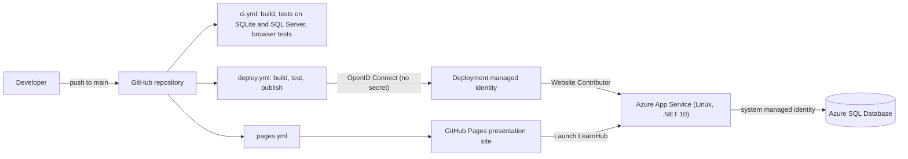

# LearnHub – Deployment Guide

LearnHub has two public parts:

- **The application** runs on **Azure App Service** (Linux, .NET 10) with **Azure SQL Database**.
- **The presentation site** in `docs/` is static and runs on **GitHub Pages**. GitHub Pages cannot run ASP.NET Core,
  so its "Launch LearnHub" buttons link to the App Service URL.

No password, connection string with credentials or publish profile is stored in GitHub:

- GitHub Actions signs in to Azure through **OpenID Connect** federation with a managed identity.
- The web app reaches Azure SQL with its own **managed identity** (Microsoft Entra authentication only).



## 1. What gets created

| Resource | Default | Purpose | Cost |
|----------|---------|---------|------|
| Resource group `rg-learnhub` | Southeast Asia | Holds everything, easy to delete | Free |
| App Service plan `plan-learnhub` | Linux **F1** | Hosts the web app | Free (60 CPU minutes/day). Use B1 for a faster, always-on demo |
| Web app `learnhub-xxxxxx` | .NET 10, HTTPS only, TLS 1.2, FTPS disabled | Runs LearnHub | Included in plan |
| Azure SQL logical server `learnhub-xxxxxx-sql` | Microsoft Entra authentication only | Database server | Free |
| Database `LearnHub` | **Free offer**, serverless GP Gen5 2 vCores, auto-pause | Production data | Free within the monthly free limit |
| Managed identity `id-learnhub-github` | Federated with GitHub environment `production` | Lets GitHub Actions deploy | Free |

Everything can be changed with environment variables when running the script (see step 2).

## 2. Provision Azure (once)

**Prerequisites:** an Azure subscription (Azure for Students works) where you are Owner, so the script can create role
assignments, and admin access to the GitHub repository settings.

1. Open [Azure Cloud Shell](https://shell.azure.com) and choose **Bash**. It is already signed in and has the Azure CLI,
   `sqlcmd`, Python and Git.
2. Clone the repository and run the script:

   ```bash
   git clone https://github.com/JahongirmirzoDv/LearnHub.git && cd LearnHub && bash infra/provision.sh
   ```

3. When asked, type the password for the administrator account (`admin@learnhub.local`). It is not shown on screen, not
   written to the shell history and goes straight into the App Service settings.

Optional settings (put them in front of the command, for example `PLAN_SKU=B1 LOCATION=eastasia bash infra/provision.sh`):

| Variable | Default | Meaning |
|----------|---------|---------|
| `LOCATION` | `southeastasia` | Azure region |
| `RESOURCE_GROUP` | `rg-learnhub` | Resource group name |
| `APP_NAME` | generated `learnhub-xxxxxx` | Globally unique web app name |
| `PLAN_SKU` | `F1` | App Service plan tier (`F1` free, `B1` paid) |
| `DATABASE` | `sqlserver` | `sqlserver` for Azure SQL, `sqlite` for a SQLite file on App Service storage (fallback if SQL cannot be created) |
| `SQL_TIER` | `free` | `free` offer or `basic` (paid) |
| `ADMIN_EMAIL` | `admin@learnhub.local` | Email of the seeded administrator |
| `GITHUB_REPOSITORY` | `JahongirmirzoDv/LearnHub` | Repository allowed to deploy (change it for a fork) |

What the script does, in order:

1. Creates the resource group, the Linux plan and the web app, and enables its system-assigned managed identity.
2. Creates the Azure SQL server with the signed-in user as Microsoft Entra administrator and Entra-only authentication,
   and allows Azure services through the firewall.
3. Creates the database on the free offer.
4. Grants the web app's identity `db_datareader`, `db_datawriter` and `db_ddladmin`. `db_ddladmin` is needed because
   migrations run at start-up. If `sqlcmd` cannot connect, the script prints the exact SQL to run once in the portal
   **Query editor**:

   ```sql
   CREATE USER [<app-name>] FROM EXTERNAL PROVIDER;
   ALTER ROLE db_datareader ADD MEMBER [<app-name>];
   ALTER ROLE db_datawriter ADD MEMBER [<app-name>];
   ALTER ROLE db_ddladmin ADD MEMBER [<app-name>];
   ```

5. Writes the application settings (see [Configuration reference](#6-configuration-reference)).
6. Creates the deployment identity, trusts GitHub's OIDC tokens for the `production` environment of the repository and
   gives it **Website Contributor** on the web app only.
7. Prints the repository variables to add.

Re-running the script is safe: existing resources are reused and settings are applied again.

## 3. Connect GitHub to Azure

Add the five variables printed by the script under **Settings → Secrets and variables → Actions → Variables**. None of
them is a secret, but they identify your Azure resources.

| Variable | Example value |
|----------|---------------|
| `AZURE_WEBAPP_NAME` | `learnhub-3f9a1c` |
| `AZURE_WEBAPP_URL` | `https://learnhub-3f9a1c.azurewebsites.net` |
| `AZURE_CLIENT_ID` | client id of `id-learnhub-github` |
| `AZURE_TENANT_ID` | your Microsoft Entra tenant id |
| `AZURE_SUBSCRIPTION_ID` | your subscription id |

With the GitHub CLI signed in, the script's `gh variable set …` lines do the same from Cloud Shell (`gh auth login`) or
any terminal.

## 4. Deploy

Run **Actions → Deploy to Azure → Run workflow**, or push to `main`. The workflow:

1. **Build, test and publish** – restores, builds, runs all 182 tests, publishes the app and uploads the idempotent
   SQL Server migration script as the `learnhub-sql` artifact.
2. **Deploy to Azure App Service** (only when `AZURE_WEBAPP_NAME` exists) – signs in with `azure/login` using OIDC,
   deploys the package with `azure/webapps-deploy`, then runs `scripts/smoke-test.sh` against `AZURE_WEBAPP_URL`. It
   waits up to five minutes for the first start, because the free tiers start slowly and the database may be resuming.

On the first start the application applies the migrations, creates the roles, creates the administrator and seeds the
demo catalogue.

The **GitHub Pages** workflow runs again after every deployment, so the "Launch LearnHub" buttons point to
`AZURE_WEBAPP_URL` from then on.

## 5. Verify production

| Check | How | Expected |
|-------|-----|----------|
| Health | Open `<AZURE_WEBAPP_URL>/health` | `Healthy` |
| Smoke test | Green "Smoke test the live site" step in the deploy run | All checks passed |
| HTTPS | Open the `http://` address | Redirects to `https://` |
| Admin login | Log in as `admin@learnhub.local` | Admin dashboard with seeded figures |
| Student journey | Register a new account, enrol, open a lesson, take a quiz | Progress and result shown |
| Upload | Admin → Resources → create a PDF resource | File opens for an enrolled student |
| Seed password removed | Run the command below after the first admin login | Setting gone; account unaffected |

After you have signed in as the administrator once, remove the seed password from the app settings:

```bash
az webapp config appsettings delete --resource-group rg-learnhub --name <app-name> --setting-names Seed__AdminPassword
```

## 6. Configuration reference

Application settings become environment variables; `__` maps to the `:` used in `appsettings.json`.

| Setting | Production value | Notes |
|---------|------------------|-------|
| `ASPNETCORE_ENVIRONMENT` | `Production` | Friendly error pages, HSTS, Secure-only cookies |
| `ASPNETCORE_FORWARDEDHEADERS_ENABLED` | `true` | Required: TLS ends at App Service's front end, and without this the app cannot see that requests are HTTPS, so form pages fail |
| `Database__Provider` | `SqlServer` | `Sqlite` in development |
| `ConnectionStrings__SqlServer` | `Server=tcp:<server>.database.windows.net,1433;Database=LearnHub;Authentication=Active Directory Managed Identity;Encrypt=True;TrustServerCertificate=False;Connection Timeout=60` | No user name or password; the managed identity authenticates |
| `Database__ApplyMigrationsOnStartup` | `true` (default) | Single-instance deployment |
| `Storage__RootPath` | `/home/data/learnhub/storage` | Persistent App Service storage outside `wwwroot`, kept across deployments |
| `Seed__DemoData` | `true` | Seeds only an empty database |
| `Seed__AdminEmail` | `admin@learnhub.local` | |
| `Seed__AdminPassword` | typed during provisioning | Remove after the first login |
| `RateLimiting__PermitLimit`, `RateLimiting__WindowSeconds` | `10`, `60` (defaults) | Form submissions per IP address per window |

Data Protection keys (used for cookies and antiforgery tokens) are stored by ASP.NET Core in App Service's persistent
`/home/ASP.NET/DataProtection-Keys` folder, so sign-ins survive restarts.

## 7. Database migrations

- **Automatic:** `InitializeDatabaseAsync` in `src/LearnHub/Data/Seed/DatabaseInitializer.cs` applies pending migrations at
  start-up. EF Core's migration lock stops two starting instances from migrating at the same time.
- **Reviewable:** every deploy run publishes `learnhub-sqlserver-migrations.sql`, an idempotent script that can be read
  or applied manually (for example in the Query editor) if start-up migrations are ever disabled with
  `Database__ApplyMigrationsOnStartup=false`.
- **Tested:** CI applies all migrations to an empty SQL Server 2022 database and runs the full test suite on it.
- **Adding a migration:** create it for both providers (see [Git workflow](Git-Workflow.md)), commit, and deploy.
  Migrations are forward-only; to undo one in production, add a new migration that reverses it.

## 8. Redeploy and roll back

- **Redeploy the current code:** Actions → Deploy to Azure → Run workflow.
- **Roll back the application:** revert the faulty commit (`git revert <sha>`) and push to `main`, or open the last good
  "Deploy to Azure" run and choose **Re-run all jobs**; this rebuilds and redeploys that commit.
- **Roll back data:** Azure SQL keeps automatic backups. Use **Restore** on the database in the Azure portal to create a
  copy from a point in time, check it, then point `ConnectionStrings__SqlServer` at the restored database.

## 9. GitHub Pages

- `pages.yml` publishes `docs/` whenever it changes, after each deployment, or on demand.
- Pages is configured to deploy from GitHub Actions (Settings → Pages → Source: GitHub Actions).
- The workflow replaces the `__LEARNHUB_APP_URL__` placeholder in `docs/index.html` with `AZURE_WEBAPP_URL`. Until that
  variable exists, the buttons open this guide.
- Site: https://jahongirmirzodv.github.io/LearnHub/

## 10. Troubleshooting

| Problem | Likely cause and fix |
|---------|----------------------|
| Deploy job fails at "Sign in to Azure" with `AADSTS70021` or "no matching federated identity" | The job must run in the `production` environment of the same repository named in the federated credential. Re-run the script with the right `GITHUB_REPOSITORY`. |
| Deploy step returns 403 | The Website Contributor role assignment can take a few minutes to apply; re-run the job. |
| Start-up error `Login failed for user '<token-identified principal>'` | The database user for the managed identity is missing. Run the SQL from step 2 in the Query editor. |
| Form pages (login, register, contact) return 500 | `ASPNETCORE_FORWARDEDHEADERS_ENABLED` is not `true`. |
| First request takes a minute or times out | F1 cold start, or the free database resuming from auto-pause. Retry; use B1 or disable auto-pause for demonstrations. |
| Database paused until next month | The free monthly limit is used up. Change the exhaustion behaviour or the tier in the portal. |
| No admin account in production | `Seed__AdminPassword` was missing or did not meet the password rules; set it and restart the web app. |
| Application logs | App Service → Log stream, or `az webapp log tail --resource-group rg-learnhub --name <app-name>` |

## 11. Removing everything

Deleting the resource group permanently deletes the web app, the database and its backups, and the deployment identity.
It cannot be undone; export anything you need first.

```bash
az group delete --name rg-learnhub
```
