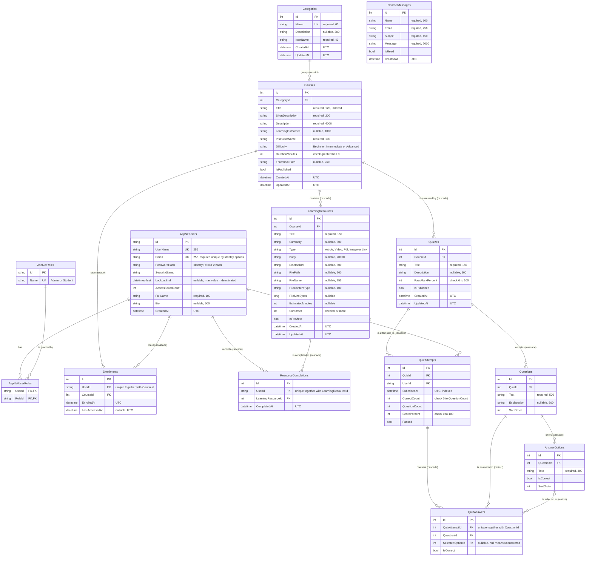

# LearnHub – Entity Relationship Diagram

This diagram is generated from the EF Core model in `src/LearnHub/Models` and the Fluent API configuration in
`src/LearnHub/Data/Configurations`. Table names are EF Core defaults, which match the `DbSet` names in
`src/LearnHub/Data/ApplicationDbContext.cs`. The same model produces both migration sets
(`Data/Migrations/Sqlite` and `Data/Migrations/SqlServer`).

Notation: `PK` primary key, `FK` foreign key, `UK` unique. Column sizes are the maximum lengths from
`src/LearnHub/Models/FieldLengths.cs`. Enum columns are stored as strings.

`ContactMessages` has no relationships: messages are stored as sent from the public contact form. ASP.NET Core
Identity also creates `AspNetUserClaims`, `AspNetUserLogins`, `AspNetUserTokens` and `AspNetRoleClaims`; they
exist in the schema but LearnHub does not use them, so they are left out of the diagram.

## Relationships and delete behaviour

| Parent → child | Cardinality | On delete | Why |
|----------------|-------------|-----------|-----|
| Categories → Courses | 1 : many | **Restrict** | Deleting a category must never delete courses silently. The admin delete page explains that the category still has courses. |
| Courses → LearningResources | 1 : many | Cascade | A course owns its lessons. |
| Courses → Quizzes | 1 : many | Cascade | A course owns its quizzes. |
| Courses → Enrollments | 1 : many | Cascade | Enrolments are meaningless without the course. |
| AspNetUsers → Enrollments, ResourceCompletions, QuizAttempts | 1 : many | Cascade | Deleting an account removes that person's learning records. |
| LearningResources → ResourceCompletions | 1 : many | Cascade | Completion records belong to the lesson. |
| Quizzes → Questions → AnswerOptions | 1 : many | Cascade | Questions and options cannot exist without their quiz. |
| Quizzes → QuizAttempts → QuizAnswers | 1 : many | Cascade | Attempts belong to the quiz. |
| Questions → QuizAnswers | 1 : many | **Restrict** | A second cascade path (Quiz → Question → QuizAnswer beside Quiz → QuizAttempt → QuizAnswer) is rejected by SQL Server. |
| AnswerOptions → QuizAnswers | 0..1 : many | **Restrict** | Same reason; an answer may also be empty (unanswered question). |

Because of the two Restrict rules, `CourseManagementService`, `QuizManagementService` and
`QuestionManagementService` delete the affected `QuizAnswers` first with `ExecuteDeleteAsync`, then the parent,
inside one transaction created through the provider's execution strategy (`Data/TransactionExtensions.cs`).

## Keys, indexes and constraints

| Table | Unique | Other indexes | Check constraints |
|-------|--------|---------------|-------------------|
| AspNetUsers | NormalizedUserName, email uniqueness enforced by Identity (`RequireUniqueEmail`) | NormalizedEmail | – |
| Categories | Name | – | – |
| Courses | – | CategoryId; Title; (IsPublished, CategoryId) | `CK_Courses_DurationMinutes`: DurationMinutes > 0 |
| LearningResources | – | (CourseId, SortOrder) | `CK_LearningResources_SortOrder`: SortOrder >= 0 |
| Enrollments | (UserId, CourseId) | CourseId | – |
| ResourceCompletions | (UserId, LearningResourceId) | LearningResourceId | – |
| Quizzes | – | CourseId | `CK_Quizzes_PassMarkPercent`: 0–100 |
| Questions | – | (QuizId, SortOrder) | – |
| AnswerOptions | – | (QuestionId, SortOrder) | – |
| QuizAttempts | – | (UserId, QuizId); SubmittedAt; QuizId | `CK_QuizAttempts_ScorePercent`: 0–100; `CK_QuizAttempts_CorrectCount`: 0 ≤ CorrectCount ≤ QuestionCount |
| QuizAnswers | (QuizAttemptId, QuestionId) | QuestionId; SelectedOptionId | – |
| ContactMessages | – | (IsRead, CreatedAt) | – |

The unique indexes are the last line of defence against double-submitted forms: for example, if two requests enrol
the same student at the same moment, the second insert fails on `(UserId, CourseId)` and `EnrollmentService`
turns the `DbUpdateException` into the message "You are already enrolled in this course."

## Design notes

- **Timestamps.** Entities implementing `IHasTimestamps` get `CreatedAt` and `UpdatedAt` set in
  `ApplicationDbContext.SaveChanges`. A value converter stores every `DateTime` as UTC, so SQLite and SQL Server
  return the same values; the browser converts them to local time.
- **Derived progress.** Course progress is not stored. It is calculated as
  (completed lessons + passed published quizzes that have questions) ÷ (lessons + published quizzes that have
  questions), so adding a lesson correctly lowers everyone's percentage.
- **Score snapshots.** `QuizAttempts` stores `CorrectCount`, `QuestionCount`, `ScorePercent` and `Passed`, and each
  `QuizAnswers` row stores `IsCorrect`, so results stay truthful even if the quiz is edited later.
- **Deactivation without a flag.** A deactivated user has `LockoutEnd` set to the maximum date. Identity already
  refuses sign-in for locked-out users, so no extra `IsActive` column can drift out of sync.
- **Leaving a course.** Removing an enrolment keeps completion records and quiz attempts, so progress returns if
  the student enrols again.
- **Files.** Uploaded files are stored outside `wwwroot`; the database keeps only the generated file name, the
  original file name, the detected content type and the size.
