# LearnHub – Final Report Content

Content for the CT050-3-2-WAPP group report. Paste each section into the university template; diagrams are Mermaid
(render them on GitHub or export them as images) and screenshots are in `docs/assets/screens/`.

---

## Title page

| | |
|---|---|
| Title | LearnHub – A Web-Based Learning Management System |
| Module | CT050-3-2-WAPP Web Applications |
| Assessment | Group assignment |
| Institution | Asia Pacific University of Technology & Innovation (APU) |
| Team members | Member 1 (TP000000), Member 2 (TP000000), Member 3 (TP000000), Member 4 (TP000000) |
| Lecturer | *Lecturer's name* |
| Intake | *Intake code* |
| Submission date | *Date* |
| Repository | https://github.com/JahongirmirzoDv/LearnHub |
| Presentation site | https://jahongirmirzodv.github.io/LearnHub/ |

## Abstract

LearnHub is a web-based learning management system for computing students, built with ASP.NET Core MVC on .NET 10,
Entity Framework Core and ASP.NET Core Identity. Guests explore a catalogue of courses and free preview lessons;
registered students enrol, study articles, videos, PDF documents and images, mark lessons complete, take quizzes with
explained answers and follow their progress on a data-driven dashboard. Administrators manage courses, categories,
learning resources, quizzes, enrolments, users and contact messages in a protected admin area. The system uses SQLite
during development and Azure SQL Database in production, with migrations for both. Security follows the OWASP Top
10:2025: role-based authorisation, antiforgery tokens, encoded output with a strict Content Security Policy, ownership
checks, validated uploads, rate limiting and passwordless cloud access. Quality is assured by 182 automated .NET tests
run on both database engines and 42 browser and accessibility checks on three screen sizes, all executed by GitHub
Actions before deployment to Azure App Service.

## 1. Introduction

### 1.1 Background

Students learning programming, web development, databases, security, networking and cloud computing usually rely on
scattered resources: slides, videos, articles and cheat sheets. The material rarely has a clear order, gives no
feedback on understanding and offers no view of progress. Lecturers who want to share structured material need a
tool that is simple to maintain and safe for students to use.

### 1.2 Problem statement

1. Learners do not know what to study next or how far they are from finishing a topic.
2. Reading and watching do not show whether a topic was understood.
3. Content managers lack one secure place to publish, update and retire courses and to see learner activity.

### 1.3 Proposed solution

LearnHub organises learning into courses made of ordered lessons and quizzes. Guests can explore freely; students
enrol, study and receive immediate, explained quiz feedback; progress is calculated from real activity and shown on a
dashboard. Administrators use a separate, protected area to manage everything. The whole interface follows one
metaphor: LearnHub is an **interchange** where each category is a coloured line, each course is a route and each lesson
is a stop.

### 1.4 Report structure

Section 2 covers planning. Section 3 presents the design (architecture, use cases, flowcharts, wireframes, navigation
and database). Section 4 explains the implementation. Sections 5 and 6 describe testing and deployment, section 7
walks through screenshots, and sections 8 to 10 evaluate the work, propose enhancements and conclude.

## 2. Project planning

### 2.1 Mission statement

> LearnHub gives every computing student a clear route through each subject, with honest feedback at every stop, and
> gives administrators one simple place to keep that route up to date.

### 2.2 Objectives

| # | Objective | Achieved | Evidence |
|---|-----------|----------|----------|
| O1 | Public catalogue with search, filters, details and preview lessons | Yes | Public site tests; screenshots 7.1–7.3 |
| O2 | Continuous student journey: register, enrol, study, quiz, result | Yes | `StudentJourneyTests`; Playwright student scenario |
| O3 | Data-driven student dashboard | Yes | Dashboard figures, progress, results, activity, recommendations (7.5) |
| O4 | Full admin CRUD for content, enrolments and users | Yes | `AdminManagementTests`; admin browser tests |
| O5 | Protection against OWASP Top 10 risks | Yes | Security review; attack-style automated tests |
| O6 | Responsive and accessible on phone, tablet and desktop | Yes | 42 browser checks at three sizes; no WCAG 2.2 A/AA violations from axe-core |
| O7 | Automated testing and cloud deployment with a presentation site | Yes (deployment pending the team's Azure sign-in) | CI and deploy workflows; GitHub Pages live |

### 2.3 Audience modelling

| Persona | Profile | Needs | How LearnHub responds |
|---------|---------|-------|-----------------------|
| Nurul, first-year student | 19, Diploma in IT, studies on a mid-range Android phone | A clear order of topics; checking understanding before tests | Ordered course routes, a Resume button, quizzes with explanations, mobile-first layout |
| Daniel, career switcher | 31, full-time job, studies in the evenings on a laptop | Practical skills and visible progress in limited time | Difficulty and duration on every course, progress bars, "Continue learning", PDF cheat sheets |
| Ms. Priya, lecturer and administrator | 42, manages networking and cloud modules on a desktop | Quick publishing, safe editing, overview of learner activity | Admin dashboard, publish/unpublish, impact-aware delete confirmations, validated uploads, quiz result reports |

### 2.4 Scope

In scope: public catalogue and pages, registration and login, student dashboard, enrolment, lessons of five types,
completion tracking, quizzes and results, profile management, a complete admin area, security controls, responsive
and accessible design, automated tests, CI/CD, Azure deployment and a GitHub Pages presentation site.

Out of scope for version 1.0: payments, certificates, chat, forums, live classes, an AI tutor, an instructor
self-service role, email delivery (confirmation and password reset), native apps and multiple languages.

### 2.5 Schedule

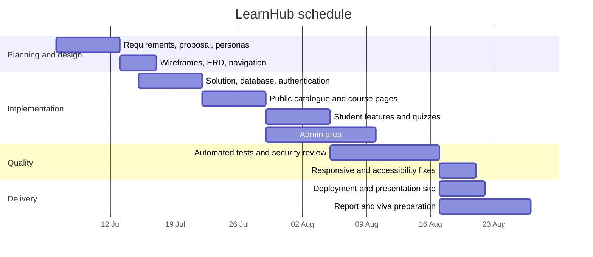

### 2.6 Team roles

Member 1 led architecture, authentication, the security review and deployment. Member 2 built the catalogue,
enrolment and student dashboard. Member 3 built lessons, uploads, quizzes, grading and progress. Member 4 built the
admin area, the automated tests, the documentation and the presentation site. Details are in
[Team-Responsibilities.md](Team-Responsibilities.md); the full proposal is in [Proposal.md](Proposal.md).

## 3. System design

### 3.1 Architecture

LearnHub is a single ASP.NET Core MVC application with clear layers. Controllers handle HTTP concerns, services contain
business rules and queries, and Entity Framework Core accesses the database. Views receive view models only, and forms
bind to view models, never to entities.

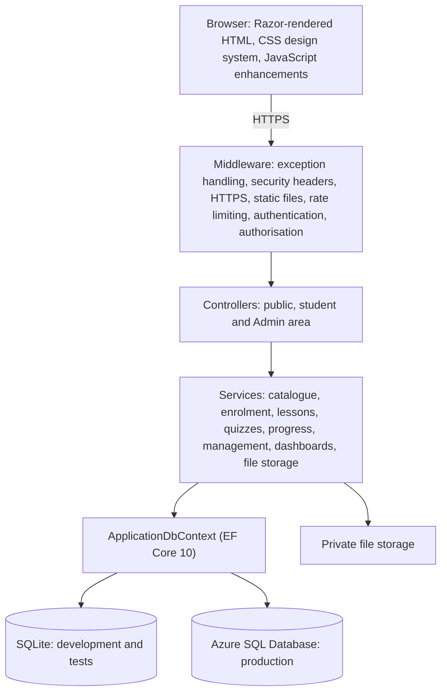

Deployment view:

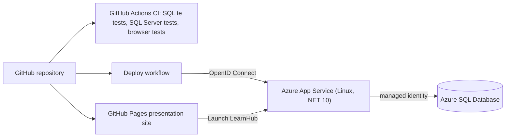

The detailed design, including every route, is in [Architecture.md](Architecture.md).

### 3.2 Use cases

| ID | Use case | Actor |
|----|----------|-------|
| UC-01–02 | Register, log in and log out | Guest, student, administrator |
| UC-03–05 | Browse, search and filter courses; view details; open a preview lesson | Guest |
| UC-06 | Send a contact message | Guest |
| UC-07–09 | Enrol, leave, study lessons and mark them complete | Student |
| UC-10–13 | Take quizzes, review results, use the dashboard, manage profile | Student |
| UC-14–22 | Admin dashboard; manage courses, categories, resources, quizzes and questions, enrolments, users, attempts and messages | Administrator |

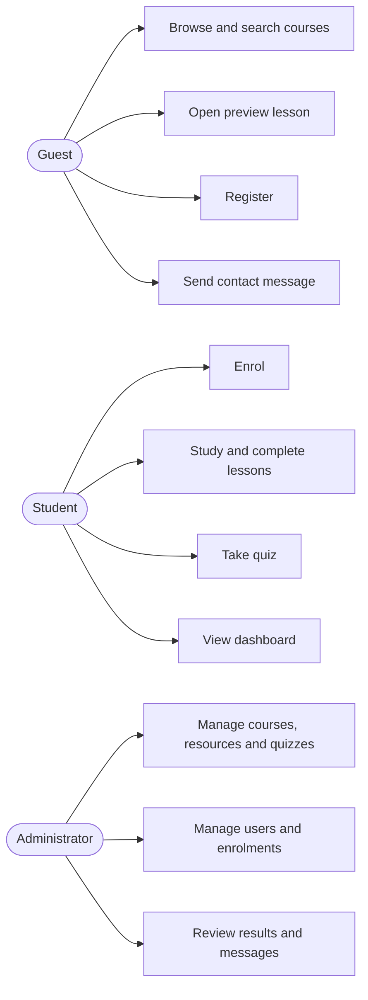

Every use case has preconditions, main and alternative flows and its implementing controller in
[Use-Cases.md](Use-Cases.md).

### 3.3 Flowcharts

Enrolment (from `CoursesController.Enroll` and `EnrollmentService`):

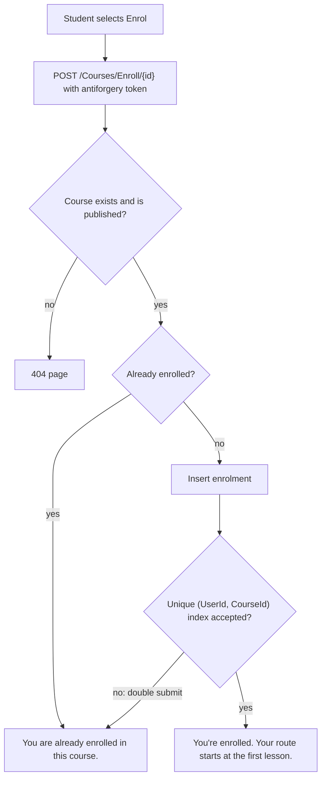

Quiz submission and grading (from `QuizzesController`, `QuizService` and `QuizGrader`):

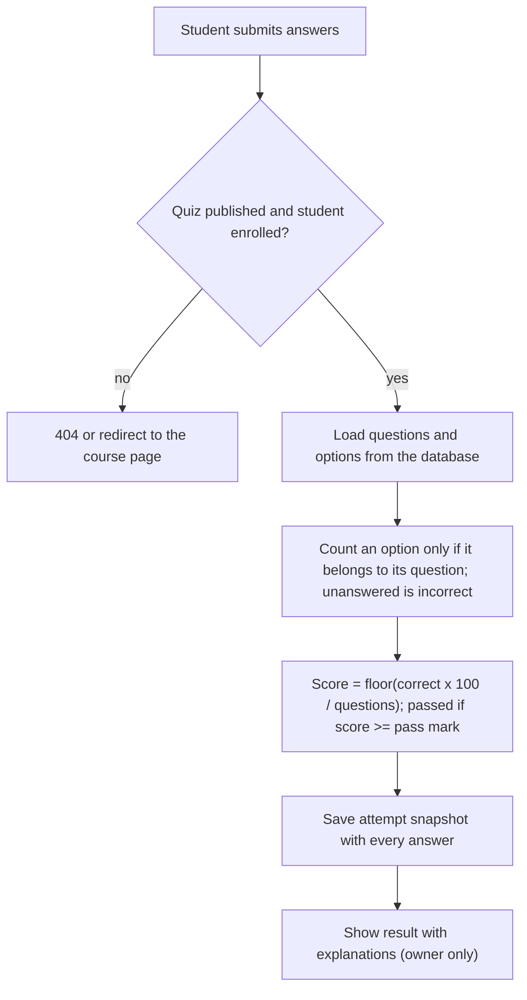

Eleven flowcharts, including the request pipeline, login, lesson access, course deletion and upload validation, are in
[Flowcharts.md](Flowcharts.md).

### 3.4 Wireframes

Low-fidelity wireframes were produced for the home page, catalogue, course details, lesson player, quiz and result,
student dashboard, authentication forms, admin dashboard, admin list pages and admin forms, each in desktop and phone
variants. They fixed the key layout decisions early: a two-column hero with the category map, a sidebar of coloured
category filters in the catalogue, a sticky enrolment panel beside the course route, a sticky lesson outline, and an
admin shell with a dark sidebar that becomes an off-canvas menu on small screens. See [Wireframes.md](Wireframes.md).

### 3.5 Navigation structure

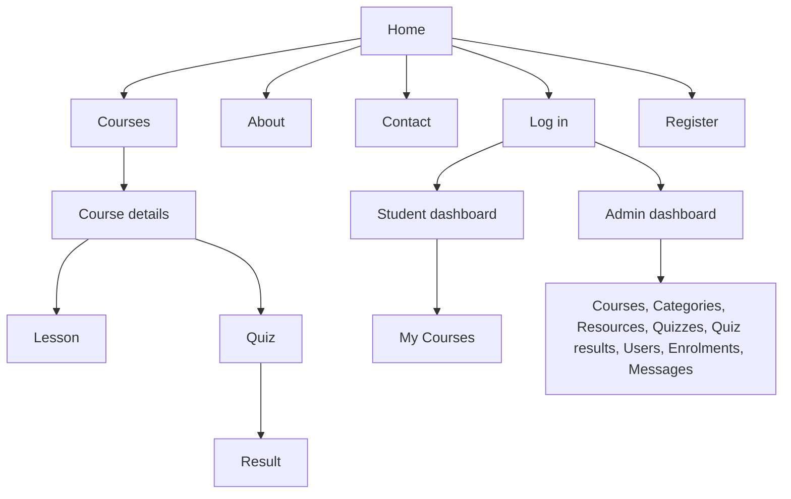

Guests see Home, Courses, About, Contact, Log in and Register; students also see My Courses, Dashboard and a user menu;
administrators see an Admin link and use the admin sidebar. Breadcrumbs appear on nested pages. The complete site map,
route table and redirect behaviour are in [Navigation.md](Navigation.md).

### 3.6 Database design

The database has eleven application tables plus the ASP.NET Core Identity tables.

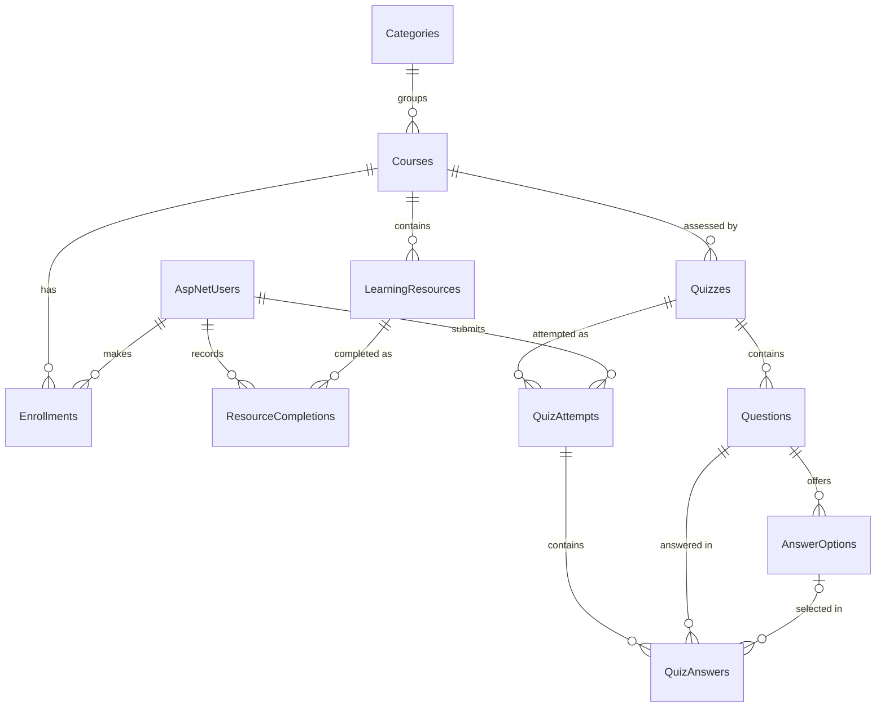

Key design decisions:

- **Integrity:** primary and foreign keys, required columns with lengths from one `FieldLengths` class, unique indexes
  (category name; one enrolment per student and course; one completion per student and lesson; one answer per question
  per attempt) and check constraints (positive duration, pass mark and score between 0 and 100, correct count not above
  question count).
- **Delete behaviour:** deleting a category is restricted while courses exist; a course cascades to its lessons,
  quizzes and enrolments; quiz answers restrict deletion of questions and options, because SQL Server forbids multiple
  cascade paths, so services remove answers first inside a transaction.
- **Truthful history:** attempts store a score snapshot; progress is calculated rather than stored; deactivation uses
  Identity lockout instead of a separate flag.
- **Time:** all dates are stored in UTC with automatic `CreatedAt` and `UpdatedAt`.

The full diagram with every column, index and constraint is in [ERD.md](ERD.md).

## 4. Implementation

### 4.1 HTML5 and Razor

Pages use semantic HTML5 landmarks (`header`, `nav`, `main`, `section`, `aside`, `footer`), headings in order, and
labelled forms. Razor layouts (`Views/Shared/_Layout.cshtml`, `Areas/Admin/Views/Shared/_AdminLayout.cshtml`) provide
the page frame; partials such as `_CourseCard`, `_Pagination` and `_QuizReview` avoid repetition. Built-in tag helpers
generate URLs, validation attributes and antiforgery tokens, and two custom tag helpers render navigation state and
course covers.

```cshtml
<div class="mb-3">
    <label asp-for="Password" class="form-label"></label>
    <input asp-for="Password" class="form-control" autocomplete="new-password" data-password-meter="password-meter" aria-describedby="password-help" />
    <div class="password-meter" id="password-meter" data-score="0" aria-hidden="true"><span></span><span></span><span></span><span></span></div>
    <div class="form-text" aria-live="polite"></div>
    <div id="password-help" class="form-text field-hint">@PasswordRules.Description</div>
    <span asp-validation-for="Password"></span>
</div>
```
*Figure: password field in `Views/Account/Register.cshtml` – the label, input type, maximum length and validation
attributes all come from the view model through tag helpers.*

### 4.2 CSS3 and the design system

`wwwroot/css/site.css` defines the design system as CSS custom properties and builds every component from them; the
admin shell in `admin.css` reuses the same tokens.

```css
--lh-ink: #1b2438;
--lh-paper: #f5f7fa;
--lh-surface: #ffffff;
--lh-rail: #dde3eb;
--lh-muted: #566076;
--lh-signal: #ffc53d;
--lh-line-0: #4b5a73;
--lh-line-1: #c9344a;
--lh-line-2: #157f8e;
--lh-font: "Overpass", "Segoe UI", system-ui, -apple-system, Roboto, "Helvetica Neue", Arial, sans-serif;
```
*Figure: an excerpt of the design tokens in `wwwroot/css/site.css`.*

Each category receives one of eight line colours from its id, used on course covers, category filters, course routes
and the home page map. Layouts are mobile-first with CSS Grid and Flexbox, and key responsive decisions are documented
in the wireframes. Accessibility is built in: a visible yellow focus halo on every interactive element, skip links,
contrast checked against WCAG AA, reduced-motion support, and focusable scroll regions for wide code and tables.

### 4.3 JavaScript

JavaScript is used only for progressive enhancement, so every feature still works when it is disabled. Examples in
`wwwroot/js/site.js`: local date formatting, character counters, a password strength meter, image previews before
upload, type-specific fields on the resource form, the answer option editor, confirmation prompts and the quiz
helper below.

```javascript
const answeredCount = () => questions.filter((q) => q.querySelector("input:checked")).length;
const update = () => {
    if (counter) {
        counter.textContent = `${answeredCount()} of ${questions.length} answered`;
    }
};

form.addEventListener("change", update);
form.addEventListener("submit", (event) => {
    const unanswered = questions.length - answeredCount();
    if (unanswered > 0) {
        const noun = unanswered === 1 ? "question is" : "questions are";
        if (!window.confirm(`${unanswered} ${noun} unanswered and will be marked incorrect. Submit anyway?`)) {
            event.preventDefault();
```
*Figure: the quiz answered counter and unanswered warning in `wwwroot/js/site.js`.*

### 4.4 Validation

Validation is defined once on view models and enforced twice: in the browser through jQuery Validation Unobtrusive and
on the server through model binding and `ModelState`.

```csharp
[Required(ErrorMessage = "Please choose a password.")]
[StringLength(PasswordRules.MaximumLength, MinimumLength = PasswordRules.MinimumLength, ErrorMessage = "Password must be between {2} and {1} characters.")]
[RegularExpression(PasswordRules.Pattern, ErrorMessage = PasswordRules.Description)]
[DataType(DataType.Password)]
public string Password { get; set; } = string.Empty;

[Required(ErrorMessage = "Please confirm your password.")]
[Compare(nameof(Password), ErrorMessage = "The passwords do not match.")]
[DataType(DataType.Password)]
```
*Figure: password rules in `ViewModels/Account/AccountViewModels.cs`.*

Custom attributes extend this: `MustBeTrueAttribute` requires the terms checkbox, and `MaxFileSizeAttribute` and
`AllowedExtensionsAttribute` check uploads; all three also emit client-side rules. Rules that need the database are
checked in services: unique category names, two to six answer options with exactly one correct, a question before
publishing a quiz, enrolment only in published courses and protection of the last administrator. Upload validation on
the server goes further than the browser can: it checks the file signature and the real number of bytes written.

### 4.5 Database and Entity Framework Core

The abstract `ApplicationDbContext` holds the model; `SqliteDbContext` and `SqlServerDbContext` inherit it and each owns
a migrations folder. Relationships and constraints use the Fluent API:

```csharp
public void Configure(EntityTypeBuilder<Enrollment> builder)
{
    // A student can enrol in a course only once.
    builder.HasIndex(e => new { e.UserId, e.CourseId }).IsUnique();

    builder.HasOne(e => e.User)
        .WithMany(u => u.Enrollments)
        .HasForeignKey(e => e.UserId)
        .OnDelete(DeleteBehavior.Cascade);

    builder.HasOne(e => e.Course)
        .WithMany(c => c.Enrollments)
        .HasForeignKey(e => e.CourseId)
        .OnDelete(DeleteBehavior.Cascade);
}
```
*Figure: enrolment configuration in `Data/Configurations/UserAndCatalogConfigurations.cs`.*

Queries use LINQ with projections to view models and `AsNoTracking` for reading. Multi-step changes run in a
transaction that works with Azure SQL's retry policy:

```csharp
public static Task InTransactionAsync(this ApplicationDbContext db, Func<Task> operation, CancellationToken cancellationToken = default)
{
    var strategy = db.Database.CreateExecutionStrategy();
    return strategy.ExecuteAsync(async () =>
    {
        await using var transaction = await db.Database.BeginTransactionAsync(cancellationToken);
        await operation();
        await transaction.CommitAsync(cancellationToken);
    });
}
```
*Figure: `Data/TransactionExtensions.cs`.*

At start-up `DatabaseInitializer` applies migrations, creates roles, creates the administrator from configuration and,
for an empty database, seeds 6 categories, 10 courses, 50 learning resources (including original PDF cheat sheets and
diagrams), 9 quizzes and realistic learner activity. All four data operations are demonstrated: insert (enrolments,
attempts, admin create forms), display (catalogue, dashboards), update (edit forms, completion toggles) and delete
(admin delete pages, leaving a course).

### 4.6 Authentication and authorisation

ASP.NET Core Identity provides password hashing, lockout (five failures, fifteen minutes), roles and cookie
authentication. The cookie is HttpOnly, SameSite=Lax and Secure in production, and the security stamp is re-validated
every five minutes so role changes and deactivations take effect quickly. A claims factory adds the user's full name
for the interface.

```csharp
[Area("Admin")]
[Authorize(Roles = AppRoles.Admin)]
public abstract class AdminControllerBase : Controller
{
    protected string CurrentUserId => User.GetRequiredUserId();

    protected void Success(string message) => TempData.SetStatus(message);

    protected void Failure(string message) => TempData.SetStatus(message, StatusKind.Danger);
```
*Figure: every admin controller inherits this base class (`Areas/Admin/Controllers/AdminControllerBase.cs`).*

Student controllers carry `[Authorize(Roles = AppRoles.Student)]`. Login redirects only to local return URLs.
Administrators cannot change, deactivate or delete their own account, and the last active administrator is protected.
No password is stored in the repository: the first administrator's password comes from user secrets or App Service
settings.

### 4.7 Security

| Threat | Control in LearnHub |
|--------|---------------------|
| Broken access control and IDOR | Role attributes, admin base class, ownership and enrolment checks in services, files streamed after access checks, 404 for other users' results |
| Cross-site request forgery | Global antiforgery validation on every unsafe request; state changes only through POST forms |
| Cross-site scripting | Razor encoding, encode-first lesson renderer, strict Content Security Policy without inline scripts |
| SQL injection | EF Core parameterised queries; escaped LIKE patterns |
| Overposting | View models only |
| Malicious uploads | Extension allow-list, size limits, file signature checks, random names, storage outside `wwwroot` |
| Brute force and spam | Lockout, generic login errors, rate limiting, contact form honeypot |
| Misconfiguration | HTTPS and HSTS, security headers, friendly error pages, secure cookies |
| Secrets exposure | User secrets locally; managed identity for Azure SQL; OpenID Connect for deployment |

The review against the OWASP Top 10:2025 with test evidence is in [Security-Review.md](Security-Review.md).

### 4.8 Multimedia

- **Images:** ten original SVG course covers built from each category's line colour and an icon, PNG teaching diagrams
  (for example the MVC request flow, CSS box model and OSI model), and administrator-uploaded course covers.
- **Video:** lessons embed YouTube or Vimeo videos through a strict URL parser and privacy-enhanced players, allowed by
  the CSP `frame-src` directive.
- **Documents:** original PDF cheat sheets (C#, HTTP status codes, SQL joins, OWASP Top 10:2025, subnetting) open
  inline for enrolled students through a protected download action.
- **Interactive graphics:** the home page category map is an accessible SVG whose lines are links.

### 4.9 Error handling and logging

Production uses the exception handler and status code pages, so users see branded 404, 403 and 500 pages without
technical details, while developers get the detailed exception page locally. Services turn expected problems (not
found, validation, unique-index races) into `OperationResult` values and friendly messages. Structured logging records
important events such as registrations, sign-ins and blocked sign-ins, administrator creation, enrolments, quiz
submissions, deletions and rejected uploads. A `/health` endpoint checks the database connection for monitoring and smoke tests.

## 5. Testing

LearnHub combines several test levels, all run by GitHub Actions on every push:

| Level | Scope | Result on 14 September 2026 (commit `5de245b`) |
|-------|-------|------------------------------------------------|
| Unit, service and integration (xUnit v3, `WebApplicationFactory`) | Grading, validation, content safety, uploads, catalogue and quiz services, public site, authentication, authorisation, student journey, admin CRUD, link crawl | 182 of 182 passed on SQLite |
| Same suite on SQL Server 2022 | Production database engine, after applying all migrations to an empty database | 182 of 182 passed |
| Smoke test | Published build in Production mode behind a simulated TLS proxy | Passed |
| Browser (Playwright) | 11 journeys on desktop, tablet and phone | 33 of 33 passed |
| Accessibility (axe-core) | WCAG 2.2 A and AA rules on 26 page views per screen size | 9 of 9 passed, no violations |

Representative test cases:

| Test case | Expected | Result |
|-----------|----------|--------|
| Register with a weak password | Field-level error with the password rule | Pass |
| Five wrong passwords | Account locked for 15 minutes | Pass |
| Login with an external return URL | Redirect to the user's own dashboard | Pass |
| Guest opens a locked lesson | Redirect to login | Pass |
| Enrol twice (including simultaneous requests) | "You are already enrolled in this course." | Pass |
| Submit a quiz option from another question | Counted as incorrect | Pass |
| Student opens another student's result | 404 | Pass |
| Student posts to an admin action with a valid token | Refused | Pass |
| Upload HTML disguised as a PDF | Rejected; nothing stored | Pass |
| Delete a category that still has courses | Refused with an explanation | Pass |
| Delete a course with quiz attempts | Everything removed in order on both databases | Pass |
| Crawl every page as guest, student and admin | No broken links or server errors | Pass |

Testing found and fixed fourteen defects, including a query that SQLite could not translate, a relationship error when
deleting courses, form pages that failed behind a TLS proxy, pages that scrolled sideways on phones and tablets, an
invisible admin sidebar, overlapping map labels, and two accessibility problems. The strategy, full inventory, defect
log and manual checklist are in [Testing.md](Testing.md).

## 6. Deployment

- **Application:** Azure App Service on Linux with .NET 10, HTTPS only. `infra/provision.sh`, run in Azure Cloud Shell,
  creates the resources on free tiers.
- **Database:** Azure SQL Database (free offer) with Microsoft Entra authentication only. The web app connects with its
  system-assigned managed identity, which has only reader, writer and DDL roles, so no database password exists.
- **Delivery:** `deploy.yml` builds, tests and publishes on every push to `main`, then signs in to Azure through OpenID
  Connect (no stored secret), deploys and smoke tests the live site. Migrations run at start-up, and an idempotent SQL
  script is kept for review.
- **Presentation site:** https://jahongirmirzodv.github.io/LearnHub/ is published from `docs/` by `pages.yml`. Its
  "Launch LearnHub" buttons point to the App Service URL once the team has provisioned Azure; GitHub Pages cannot host
  the ASP.NET Core application itself.

The step-by-step guide, configuration reference, verification checklist and rollback procedure are in
[Deployment.md](Deployment.md).

## 7. Screenshots

### 7.1 Home page


The home page introduces LearnHub, offers a server-side course search and draws each category as a line into the
LearnHub hub; every line links to that category's courses. Below are the most popular courses, how learning works
and a call to action. Requirements: GUEST-01, UI-01, UI-02.

### 7.2 Home page on a phone

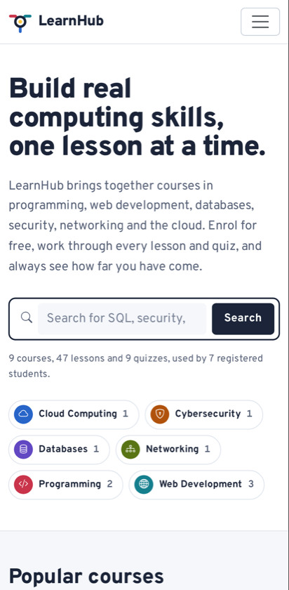

On small screens the navigation collapses behind a menu button and the map is replaced by category links, so the page
stays fast and readable. Requirement: UI-05.

### 7.3 Course details


Course details show difficulty, duration, lessons, quizzes, learners and instructor, the description and learning
outcomes, and the course route. Guests can open the free preview lesson while the other stops are locked; the panel
invites them to register or log in to enrol. Requirements: GUEST-06, GUEST-07.

### 7.4 Lesson player

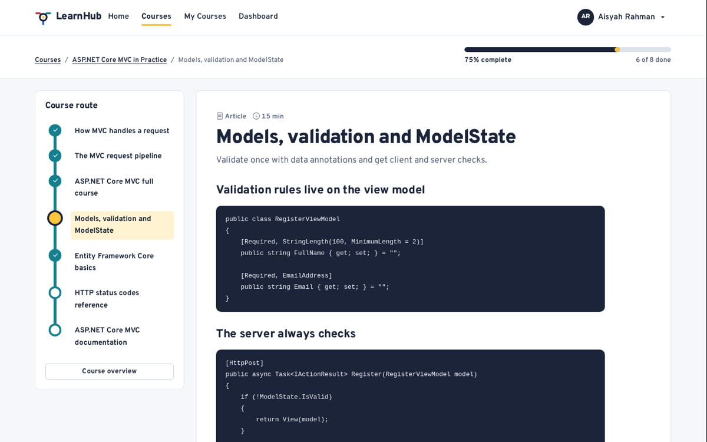

An enrolled student reads a lesson with code examples beside the course outline, which shows completed and current
stops. The course progress bar sits above the lesson, and the student can mark the lesson complete and move to the
next one. Requirements: STU-08, STU-09, TECH-09.

### 7.5 Student dashboard


The dashboard shows figures from the database (enrolled and completed courses, lessons completed, quizzes passed,
courses still available), courses in progress with Resume buttons, recent quiz results, recent activity and
recommendations. Requirements: STU-01, STU-02, STU-03.

### 7.6 Quiz result

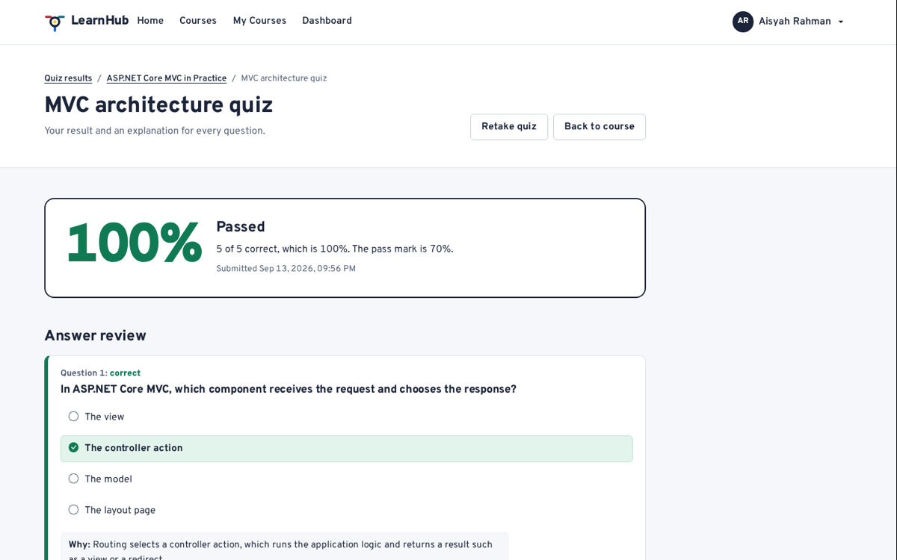

After submitting, the student sees the score, whether the pass mark was reached, and every question with the chosen
answer, the correct answer and an explanation. Requirements: STU-10, STU-11.

### 7.7 Admin dashboard

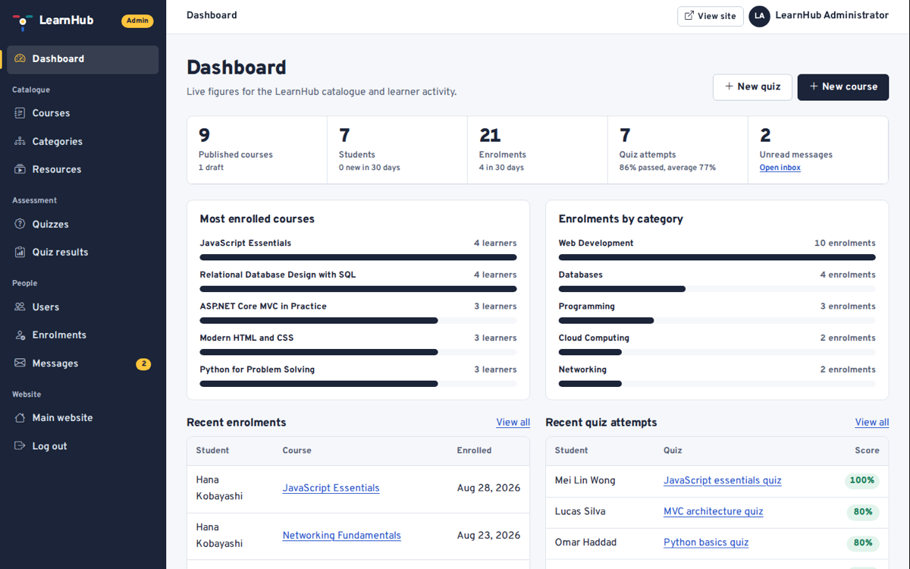

The administrator sees live platform figures, the most enrolled courses, enrolments by category and recent activity in
the protected admin area with its own navigation. Requirements: ADM-01, ADM-02.

### 7.8 Course management


The course list combines search and filters with cover thumbnails, level and publication status, counts of lessons,
quizzes and learners, and edit and delete actions. Requirement: ADM-03.

### 7.9 Further screenshots to add

*Screenshot to add:* registration form showing validation messages (VAL-02, VAL-03).
*Screenshot to add:* admin course form with cover upload (ADM-03, VAL-05).
*Screenshot to add:* admin user details with role and deactivation actions (ADM-10).
*Screenshot to add:* admin menu opened on a phone (UI-05).

Every GitHub Actions run also stores full-page screenshots of all browser scenarios on desktop, tablet and phone as the
`e2e-screenshots` artifact.

## 8. Critical evaluation

### 8.1 Strengths

- **Complete journeys:** every role's journey works end to end, and automated tests prove it on two database engines
  and three screen sizes.
- **Security by default:** access control, antiforgery, encoding, upload checks and secrets handling come from the
  framework and are tested with attack-style cases.
- **Truthful data model:** unique indexes, check constraints, deliberate delete rules, score snapshots and calculated
  progress.
- **Distinctive, accessible interface:** a consistent design system around one metaphor, with no automated
  accessibility violations.
- **Reproducible delivery:** migrations, seed data, CI checks and passwordless cloud deployment mean anyone can rebuild
  and deploy the system from the repository.

### 8.2 Limitations

- No email confirmation or password reset by email, and no multi-factor authentication.
- A single-instance design: migrations at start-up and files on App Service storage.
- Free hosting tiers start slowly after idle periods, and the free database pauses when its monthly limit is used.
- Manual keyboard, screen-reader and real-device testing still needs to be completed by the team.

### 8.3 Lessons learned

- Running tests on the production database engine early exposed differences that SQLite alone would have hidden.
- Screenshots and browser tests at several sizes found layout bugs that unit and integration tests could not see.
- Designing from real content and one clear concept produced a more coherent interface than adding styles page by
  page.
- Framework security features, used consistently, are safer and simpler than custom code.

## 9. Future enhancements

1. Email confirmation, password reset and optional multi-factor authentication.
2. Certificates when a course is completed, and a public profile of achievements.
3. An instructor role that can manage only their own courses.
4. Question banks, randomised questions and timed quizzes.
5. Discussion threads per lesson, moderated by administrators.
6. Azure Blob Storage for files, Application Insights monitoring and alerts, and scaling out.
7. Dependabot updates and vulnerability scanning in CI.

## 10. Conclusion

The team delivered LearnHub, a secure, responsive and tested learning management system that meets the assignment's
requirements for guests, students and administrators. ASP.NET Core MVC, Entity Framework Core and Identity provided a
solid, explainable foundation; a relational model with deliberate constraints keeps data correct; and a distinctive
design system makes the product easy to use on any device. Automated testing on two database engines and three screen
sizes, together with continuous integration and passwordless deployment, gives confidence that the system works as
described and can be maintained by future teams.

## References

Deque Systems. (n.d.). *axe-core* [Computer software]. GitHub. https://github.com/dequelabs/axe-core

GitHub. (n.d.). *Configuring OpenID Connect in Azure*. GitHub Docs.
https://docs.github.com/actions/security-for-github-actions/security-hardening-your-deployments/configuring-openid-connect-in-azure

Microsoft. (n.d.-a). *Configure ASP.NET Core to work with proxy servers and load balancers*. Microsoft Learn.
https://learn.microsoft.com/aspnet/core/host-and-deploy/proxy-load-balancer

Microsoft. (n.d.-b). *Integration tests in ASP.NET Core*. Microsoft Learn.
https://learn.microsoft.com/aspnet/core/test/integration-tests

Microsoft. (n.d.-c). *Introduction to Identity on ASP.NET Core*. Microsoft Learn.
https://learn.microsoft.com/aspnet/core/security/authentication/identity

Microsoft. (n.d.-d). *Migrations overview*. Microsoft Learn. https://learn.microsoft.com/ef/core/managing-schemas/migrations/

Microsoft. (n.d.-e). *Model validation in ASP.NET Core MVC and Razor Pages*. Microsoft Learn.
https://learn.microsoft.com/aspnet/core/mvc/models/validation

Microsoft. (n.d.-f). *Overview of ASP.NET Core MVC*. Microsoft Learn. https://learn.microsoft.com/aspnet/core/mvc/overview

Microsoft. (n.d.-g). *Prevent Cross-Site Request Forgery (XSRF/CSRF) attacks in ASP.NET Core*. Microsoft Learn.
https://learn.microsoft.com/aspnet/core/security/anti-request-forgery

Microsoft. (n.d.-h). *Rate limiting middleware in ASP.NET Core*. Microsoft Learn.
https://learn.microsoft.com/aspnet/core/performance/rate-limit

Microsoft. (n.d.-i). *Safe storage of app secrets in development*. Microsoft Learn.
https://learn.microsoft.com/aspnet/core/security/app-secrets

Microsoft. (n.d.-j). *Securely connect .NET apps to Azure SQL Database using managed identity*. Microsoft Learn.
https://learn.microsoft.com/azure/app-service/tutorial-connect-msi-sql-database

Microsoft. (n.d.-k). *Tag Helpers in ASP.NET Core*. Microsoft Learn.
https://learn.microsoft.com/aspnet/core/mvc/views/tag-helpers/intro

Microsoft. (n.d.-l). *Try Azure SQL Database for free*. Microsoft Learn.
https://learn.microsoft.com/azure/azure-sql/database/free-offer

Mozilla. (n.d.). *Content Security Policy (CSP)*. MDN Web Docs. https://developer.mozilla.org/en-US/docs/Web/HTTP/CSP

OWASP Foundation. (2025). *OWASP Top 10:2025*. https://owasp.org/Top10/2025/

OWASP Foundation. (n.d.-a). *Cross Site Scripting prevention cheat sheet*. OWASP Cheat Sheet Series.
https://cheatsheetseries.owasp.org/cheatsheets/Cross_Site_Scripting_Prevention_Cheat_Sheet.html

OWASP Foundation. (n.d.-b). *File upload cheat sheet*. OWASP Cheat Sheet Series.
https://cheatsheetseries.owasp.org/cheatsheets/File_Upload_Cheat_Sheet.html

Playwright. (n.d.). *Installation*. Playwright documentation. https://playwright.dev/docs/intro

The Bootstrap Authors. (n.d.). *Get started with Bootstrap* (Version 5.3). https://getbootstrap.com/docs/5.3/getting-started/introduction/

World Wide Web Consortium. (2023). *Web Content Accessibility Guidelines (WCAG) 2.2*. https://www.w3.org/TR/WCAG22/

xUnit.net. (n.d.). *xUnit.net*. https://xunit.net/

## Appendices

### Appendix A – Requirements traceability

Each requirement ID in [Requirements-Checklist.md](Requirements-Checklist.md) is mapped to its implementation, evidence
and status in [Requirements-Audit.md](Requirements-Audit.md).

### Appendix B – Test run evidence

GitHub Actions run [34799666194](https://github.com/JahongirmirzoDv/LearnHub/actions/runs/34799666194) shows the three CI
jobs for commit `5de245b`: build and test on SQLite (182 passed), SQL Server migrations, tests (182 passed) and smoke
test, and browser tests (42 passed). Each run stores TRX result files, the idempotent migration script, Playwright
reports, screenshots and application logs as artifacts.

### Appendix C – User guide

**Guest:** open the site, search or pick a category on the Courses page, open a course and try a lesson marked "Free
preview". Select **Register** to create an account.

**Student:** from the dashboard, select **Resume** on a course or open **Courses** and select **Enrol**. Work through the
course route, select **Mark as complete** after each lesson, take the quiz when ready and review the explanations. Use
**My Courses** for progress, **Quiz results** for history and **Profile** to change details or the password.

**Administrator:** log in to reach the admin dashboard. Use **Courses**, **Categories** and **Resources** to build the
catalogue (drafts stay hidden until published), **Quizzes** to add questions, **Enrolments** and **Users** to manage
people, **Quiz results** to review attempts and **Messages** for the contact inbox.

### Appendix D – Installation summary

With the .NET 10 SDK: clone the repository, set `Seed:AdminPassword` and `Seed:DemoStudentPassword` with
`dotnet user-secrets`, and run `dotnet run --project src/LearnHub`. The SQLite database is created, migrated and seeded
automatically. Full instructions are in the [README](../README.md); production deployment is in
[Deployment.md](Deployment.md).

### Appendix E – Individual contributions

| Member | Contribution summary | Signature |
|--------|----------------------|-----------|
| Member 1 (TP000000) | *to be completed* | |
| Member 2 (TP000000) | *to be completed* | |
| Member 3 (TP000000) | *to be completed* | |
| Member 4 (TP000000) | *to be completed* | |
