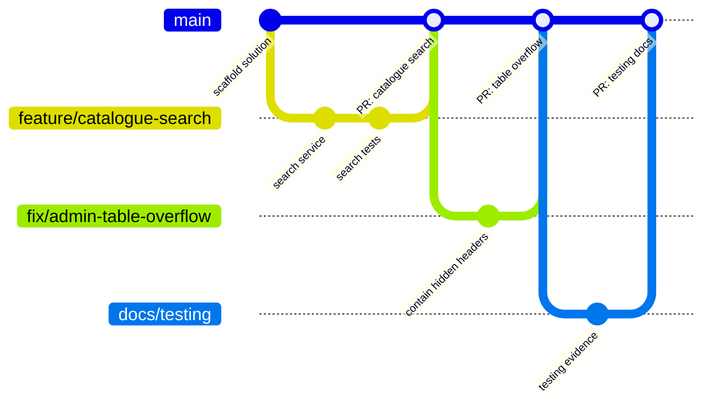

# LearnHub – Git Workflow

## 1. Branches

| Branch | Purpose | Rules |
|--------|---------|-------|
| `main` | Always deployable; every push deploys to Azure (once configured) | Changes arrive through pull requests with green CI. Enforce this with a branch protection rule (Settings → Branches → require a pull request and the three CI checks) |
| `feature/<area>-<short-name>` | New functionality, e.g. `feature/quiz-history-filter` | Branch from `main`; keep it small; delete after merge |
| `fix/<short-name>` | Bug fixes, e.g. `fix/admin-table-overflow` | Same as feature branches |
| `docs/<short-name>` | Documentation only, e.g. `docs/viva-questions` | CI skips documentation-only changes |



## 2. Day-to-day flow

```bash
git switch main && git pull
```

```bash
git switch -c feature/quiz-history-filter
```

Make the change with its tests, then commit and push:

```bash
git add -A && git commit -m "feat(quizzes): filter quiz history by course"
```

```bash
git push -u origin feature/quiz-history-filter
```

Open a pull request into `main`. It can be merged when:

1. All three CI jobs pass: **Build and test (SQLite)**; **SQL Server migrations, tests and smoke test**; **Browser
   tests (mobile, tablet, desktop)**.
2. At least one teammate has reviewed it (the owner of the area for shared files, see
   [Team-Responsibilities.md](Team-Responsibilities.md)).
3. The description explains what changed and why, with screenshots for visible changes.

Use **Squash and merge** for small branches so `main` keeps one meaningful commit per change, then delete the branch.

## 3. Commit messages

The repository uses [Conventional Commits](https://www.conventionalcommits.org/): `type(scope): summary` in the imperative
mood, with a body that explains *why* when it is not obvious.

| Type | Use for |
|------|---------|
| `feat` | New behaviour |
| `fix` | Bug fixes |
| `test` | Tests only |
| `docs` | Documentation only |
| `ci` | Workflows |
| `chore` | Maintenance such as dependencies or migrations |
| `refactor` | Code changes that do not change behaviour |

Real examples from this repository:

- `fix: avoid SQL APPLY on SQLite in admin course details, delete via ExecuteDelete, tidy upload file names`
- `fix(a11y): keyboard access to scrollable regions, link names on small screens`
- `test: run the suite on SQL Server in CI, add browser tests and a smoke test script`

## 4. Pull request checklist

- [ ] The change works for every affected role (guest, student, administrator).
- [ ] Server-side validation and authorisation are in place; forms bind to view models.
- [ ] Tests were added or updated, and all CI jobs are green.
- [ ] New pages are responsive, keyboard accessible and pass the accessibility scan.
- [ ] No secrets, personal data, `.env` files, database files or build output are committed.
- [ ] Database changes include migrations for both providers.
- [ ] Documentation is updated (README, route tables, ERD or testing evidence) when behaviour changes.

## 5. Database migrations

LearnHub has one EF Core model and two migration sets, so every schema change needs **two** migrations with the same
name.

**With the .NET SDK installed** (run from `src/LearnHub`):

```bash
dotnet tool restore
```

```bash
dotnet ef migrations add AddCourseLevel --context SqliteDbContext --output-dir Data/Migrations/Sqlite
```

```bash
dotnet ef migrations add AddCourseLevel --context SqlServerDbContext --output-dir Data/Migrations/SqlServer
```

**Without the SDK:** push your model change to your branch, open **Actions → EF Core migration (cloud) → Run
workflow**, choose your branch and enter the name in PascalCase (for example `AddCourseLevel`). The workflow creates
both migrations, checks that the solution builds and commits them to your branch.

Rules:

- Never edit a migration that is already on `main`; add a new one instead.
- If two branches add migrations at the same time, do not hand-merge the model snapshots. Remove your branch's
  migrations, merge `main` into your branch and generate them again.
- CI applies every SQL Server migration to an empty database, so a broken migration fails the pull request.

## 6. Keeping secrets out of Git

- Passwords go in user secrets locally: `dotnet user-secrets set "Seed:AdminPassword" "<password>" --project src/LearnHub`.
- `appsettings.json` keeps `Seed:AdminPassword` and `Seed:DemoStudentPassword` empty, and never holds a connection
  string with credentials.
- `.gitignore` excludes build output, `App_Data`, SQLite databases, uploaded files, `.env` files, publish profiles and
  test artefacts.
- Production uses App Service settings and managed identities; GitHub Actions uses OpenID Connect, so the repository
  has no deployment secret.
- If a secret is ever committed, treat it as leaked: rotate it immediately, then remove it from the history.

## 7. Releases and deployment

1. A pull request is merged into `main`.
2. `ci.yml` and `deploy.yml` run. The deploy workflow builds, tests and publishes the app, then deploys it to Azure
   App Service and smoke tests the live site.
3. `pages.yml` republishes the presentation site so its launch buttons point at the deployed app.
4. For the assignment milestones, tag the release so the submitted version can always be found:

```bash
git tag -a v1.0.0 -m "LearnHub 1.0 – assignment submission" && git push origin v1.0.0
```

To roll back, revert the faulty commit on `main` (`git revert <sha>`) and push; see
[Deployment.md](Deployment.md#8-redeploy-and-roll-back).
