# LearnHub – Navigation Structure

Navigation is defined in `src/LearnHub/Views/Shared/_Layout.cshtml` (public and student pages) and
`src/LearnHub/Areas/Admin/Views/Shared/_AdminLayout.cshtml` (admin area). The current section is highlighted by the
`lh-nav` tag helper, which also sets `aria-current="page"`.

## 1. Site map

```mermaid
flowchart TD
    home["Home /"]

    subgraph publicPages["Public pages (everyone)"]
        courses["Courses /Courses"]
        details["Course details /Courses/Details/{id}"]
        preview["Preview lesson /Resources/Details/{id}"]
        about["About /About"]
        contact["Contact /Contact"]
        privacy["Privacy /Privacy"]
        register["Register /Account/Register"]
        login["Log in /Account/Login"]
        errors["Error pages /Error/{code}"]
    end

    subgraph studentPages["Student pages (Student role)"]
        dashboard["Dashboard /Student/Dashboard"]
        mycourses["My Courses /Student/MyCourses"]
        lesson["Lesson /Resources/Details/{id}"]
        quiz["Take quiz /Quizzes/Take/{id}"]
        result["Quiz result /Quizzes/Result/{id}"]
        history["Quiz results /Quizzes/History"]
        profile["Profile /Profile"]
        password["Change password /Profile/ChangePassword"]
    end

    subgraph adminPages["Admin area (Admin role)"]
        adminDash["Dashboard /Admin"]
        adminCourses["Courses /Admin/Courses"]
        adminCategories["Categories /Admin/Categories"]
        adminResources["Resources /Admin/Resources"]
        adminQuizzes["Quizzes /Admin/Quizzes"]
        adminQuestions["Questions /Admin/Questions"]
        adminAttempts["Quiz results /Admin/QuizAttempts"]
        adminUsers["Users /Admin/Users"]
        adminEnrolments["Enrolments /Admin/Enrollments"]
        adminMessages["Messages /Admin/Messages"]
    end

    home --> courses --> details
    details --> preview
    details -->|enrol| lesson
    home --> about & contact & register & login
    login -->|student| dashboard
    login -->|administrator| adminDash
    register --> dashboard
    dashboard --> mycourses --> details
    dashboard -->|Resume| lesson
    details --> quiz --> result
    dashboard --> history --> result
    profile --> password
    adminDash --> adminCourses & adminCategories & adminResources & adminQuizzes & adminAttempts & adminUsers & adminEnrolments & adminMessages
    adminQuizzes --> adminQuestions
```

## 2. Main navigation by role

| Element | Guest | Student | Administrator |
|---------|-------|---------|---------------|
| Brand (LearnHub mark) | Home | Home | Home |
| Home, Courses | Yes | Yes | Yes |
| My Courses, Dashboard | – | Yes | – |
| About, Contact | Yes | In the footer | In the footer |
| Admin | – | – | Yes (opens `/Admin`) |
| Right-hand side | **Log in**, **Register** | User menu: Dashboard, Quiz results, Profile, Log out | User menu: Admin dashboard, Profile, Log out |

**Log out** is a POST form inside the user menu, so it cannot be triggered by a link on another site.

### Admin area sidebar

| Group | Links |
|-------|-------|
| – | Dashboard |
| Catalogue | Courses, Categories, Resources |
| Assessment | Quizzes (also highlighted on question pages), Quiz results |
| People | Users, Enrolments, Messages (with the unread count) |
| Website | Main website, Log out |

The admin top bar shows the page title, **View site** and the administrator's profile link.

### Footer

| Column | Links |
|--------|-------|
| Explore | All courses, About LearnHub, Contact |
| Account | Guest: Create an account, Log in, Privacy. Signed in: Profile, Privacy |
| Project | Module and university information |

## 3. Breadcrumbs

Breadcrumbs appear where pages are nested more than one level deep:

- **Public and student:** course catalogue and course details (Home / Courses / category / course), lessons
  (Courses / course / lesson), quiz and quiz result pages, and Change password.
- **Admin:** create, edit, details and delete pages for courses, categories, resources, quizzes, questions, quiz
  attempts, enrolments, users and messages, for example Courses / *course title* / Edit.

## 4. Routes

| URL | Page | Access | Methods |
|-----|------|--------|---------|
| `/` | Home | Everyone | GET |
| `/About`, `/Privacy` | About, Privacy | Everyone | GET |
| `/Contact` | Contact form | Everyone (rate limited) | GET, POST |
| `/Courses?q=&categoryId=&difficulty=&sort=&page=` | Course catalogue | Everyone | GET |
| `/Courses/Details/{id}` | Course details | Everyone (published courses) | GET |
| `/Courses/Enroll/{id}`, `/Courses/Leave/{id}` | Enrol, leave | Student | POST |
| `/Resources/Details/{id}` | Lesson | Preview: everyone; otherwise enrolled students and administrators | GET |
| `/Resources/Open/{id}` | Lesson file (PDF or image) | Same as the lesson | GET |
| `/Resources/ToggleComplete/{id}` | Mark complete or not complete | Enrolled student | POST |
| `/Quizzes/Take/{id}` | Quiz form and submission | Enrolled student | GET, POST |
| `/Quizzes/Result/{id}` | Quiz result | The student who submitted it | GET |
| `/Quizzes/History` | Quiz results history | Student | GET |
| `/Student/Dashboard`, `/Student/MyCourses` | Dashboard, My Courses | Student | GET |
| `/Profile` | Profile | Signed-in user | GET, POST |
| `/Profile/ChangePassword` | Change password | Signed-in user (rate limited) | GET, POST |
| `/Account/Register`, `/Account/Login` | Register, log in | Everyone (rate limited) | GET, POST |
| `/Account/Logout` | Log out | Signed-in user | POST |
| `/Account/AccessDenied` | Access denied (status 403) | Everyone | GET |
| `/Error`, `/Error/{statusCode}` | Friendly error pages | Everyone | GET |
| `/health` | Database health check | Everyone | GET |
| `/Admin` | Admin dashboard | Admin | GET |
| `/Admin/Courses` + `/Create`, `/Edit/{id}`, `/Details/{id}`, `/Delete/{id}`, `/TogglePublished/{id}` | Course management | Admin | GET, POST |
| `/Admin/Categories` + `/Create`, `/Edit/{id}`, `/Delete/{id}` | Category management | Admin | GET, POST |
| `/Admin/Resources` + `/Create`, `/Edit/{id}`, `/Delete/{id}` | Learning resource management | Admin | GET, POST |
| `/Admin/Quizzes` + `/Create`, `/Edit/{id}`, `/Details/{id}`, `/Delete/{id}`, `/SetPublished/{id}` | Quiz management | Admin | GET, POST |
| `/Admin/Questions/Create?quizId=` + `/Edit/{id}`, `/Delete/{id}` | Question management | Admin | GET, POST |
| `/Admin/QuizAttempts` + `/Details/{id}`, `/Delete/{id}` | Quiz results | Admin | GET, POST |
| `/Admin/Enrollments` + `/Create`, `/Delete/{id}` | Enrolment management | Admin | GET, POST |
| `/Admin/Users` + `/Details/{id}`, `/SetRole/{id}`, `/Deactivate/{id}`, `/Reactivate/{id}`, `/Delete/{id}` | User management | Admin | GET, POST |
| `/Admin/Messages` + `/Details/{id}`, `/MarkUnread/{id}`, `/Delete/{id}` | Contact messages | Admin | GET, POST |

Every state-changing action is a POST protected by an antiforgery token.

## 5. Redirects and error behaviour

| Situation | Result |
|-----------|--------|
| A guest opens a page that needs sign-in | 302 to `/Account/Login?ReturnUrl=…`; after login the user returns to that page if it is on this site |
| A signed-in user opens a page for another role | 302 to `/Account/AccessDenied`, which responds with status 403 |
| An unknown URL, a draft course or a non-existent id | Friendly 404 page ("This stop is not on the map") with links back to courses |
| Another student's quiz result | 404, so result ids cannot be probed |
| A student opens a lesson or quiz of a course they have not joined | Redirect to the course page, which offers **Enrol** |
| An unexpected error in production | Friendly 500 page without technical details; the error is logged |
| Too many form submissions | 429 Too Many Requests |

## 6. Responsive behaviour

- **Main navigation:** below 992 px the menu collapses behind a toggle button labelled "Toggle navigation".
- **Admin sidebar:** below 992 px it becomes an off-canvas panel opened from the top bar ("Open navigation").
- **Admin tables:** below 768 px they become stacked records, each value shown with its column label; wider tables
  scroll inside their own container.
- **Course grids:** one column on phones, two on tablets, and three or four on desktops.
- **Skip links:** every layout starts with "Skip to main content" for keyboard users.
