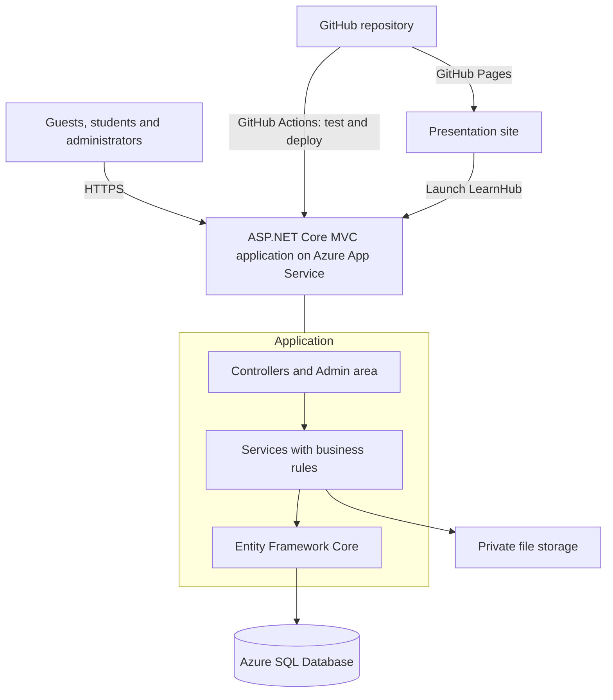
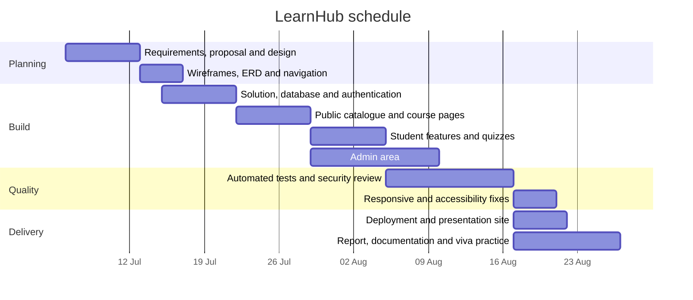

# LearnHub – Project Proposal

| | |
|---|---|
| Project title | LearnHub – Web-Based Learning Management System |
| Module | CT050-3-2-WAPP Web Applications (group assignment) |
| Institution | Asia Pacific University of Technology & Innovation (APU) |
| Team | Member 1 (TP000000), Member 2 (TP000000), Member 3 (TP000000), Member 4 (TP000000) |
| Technology | ASP.NET Core MVC on .NET 10, C#, Entity Framework Core, SQL Server / SQLite, ASP.NET Core Identity |

## 1. Background and problem

Computing students learn from many scattered sources: lecture slides, videos, blog posts and cheat sheets. Three
problems follow:

1. **No structure.** Material has no clear order, so beginners do not know what to study next or how far they are
   from finishing a topic.
2. **No feedback.** Reading and watching give no evidence of understanding. Students need short quizzes with
   explanations, not only a score.
3. **No single place to manage content.** Lecturers and teaching assistants need one tool to publish courses,
   lessons, files and quizzes, see who is learning and remove outdated material, without editing web pages by hand.

## 2. Proposed solution

LearnHub is a web application in which:

- **guests** explore a catalogue of computing courses, read course details and try free preview lessons;
- **students** register, enrol in courses, work through lessons in order, mark them complete, take quizzes with
  explained answers and follow their progress on a personal dashboard;
- **administrators** manage courses, categories, lessons, uploads, quizzes, enrolments, users and contact messages
  in a protected admin area with live statistics.

The interface uses one idea throughout: LearnHub is an **interchange**. Each subject category is a coloured transit
line, a course is a route, lessons are stops, and progress is how far along the route a student has travelled.

## 3. Mission statement

> LearnHub gives every computing student a clear route through each subject, with honest feedback at every stop, and
> gives administrators one simple place to keep that route up to date.

## 4. Objectives

| # | Objective (SMART) | Measure of success |
|---|-------------------|--------------------|
| O1 | Deliver a public catalogue in which guests can search, filter and open published courses within the first four weeks. | Search, category and difficulty filters and course details pages work, and preview lessons open without an account. |
| O2 | Let a student register, enrol, complete lessons and take a quiz in one continuous journey. | An automated end-to-end test covers register → enrol → lesson → quiz → result. |
| O3 | Show each student meaningful progress data on a dashboard built from real database records. | Dashboard shows enrolled, completed and available courses, lessons completed, quiz results, recent activity and recommendations. |
| O4 | Provide administrators with full create, read, update and delete management of all learning content, enrolments and users. | Every admin entity has working list, create, edit and delete pages, tested through the real forms. |
| O5 | Protect the application against the common web risks in the OWASP Top 10. | Security review completed; automated tests for access control, CSRF, XSS, uploads and lockout pass. |
| O6 | Make every page usable on phones, tablets and desktops and accessible to keyboard and screen-reader users. | Browser tests pass at three screen sizes with no WCAG 2.2 A/AA violations reported by axe-core. |
| O7 | Deploy the application to Azure App Service with Azure SQL Database and publish a presentation site on GitHub Pages, with automated tests before every deployment. | CI and deployment workflows run on GitHub Actions; the presentation site links to the live application. |

## 5. Target audience

### Persona 1 – Nurul, first-year computing student

| | |
|---|---|
| Age and situation | 19, Diploma in IT, lives in a hostel, studies between classes |
| Devices | Mid-range Android phone on campus Wi-Fi; shared laptop in the library |
| Goals | Understand programming and databases fundamentals before assessments; know what to study next |
| Frustrations | Long videos without structure; not knowing whether she really understood a topic |
| What LearnHub offers | Short lessons in a fixed order, a Resume button on the dashboard, quizzes that explain every answer, and a layout that works on a phone |

### Persona 2 – Daniel, career switcher

| | |
|---|---|
| Age and situation | 31, works full time in logistics, learning web development in the evenings |
| Devices | Personal laptop; phone during commutes |
| Goals | Build practical skills in HTML, CSS, JavaScript, ASP.NET Core and security; see steady progress |
| Frustrations | Limited time; losing track of where he stopped; content that assumes prior knowledge |
| What LearnHub offers | Difficulty levels and durations on every course, progress bars, "Continue learning" with the next lesson, and PDF cheat sheets for quick revision |

### Persona 3 – Ms. Priya, lecturer and course administrator

| | |
|---|---|
| Age and situation | 42, lecturer responsible for networking and cloud modules |
| Devices | Office desktop; tablet in meetings |
| Goals | Publish and update course material quickly; check enrolments and quiz performance; keep content accurate |
| Frustrations | Complex tools; accidentally deleting material; no overview of learner activity |
| What LearnHub offers | A focused admin area with a dashboard, publish and unpublish without deleting, confirmation pages that show the impact of a deletion, validated uploads and quiz result reports |

## 6. Scope

### In scope

| Role | Features |
|------|----------|
| Guest | Home, About, Contact form, Privacy; course catalogue with search, filters, sorting and pagination; course details; free preview lessons; registration and login |
| Student | Dashboard; profile and password change; enrol and leave courses; My Courses; lessons (article, video, PDF, image, link); mark complete; progress; quizzes with instant marking and explanations; result history; logout |
| Administrator | Dashboard with statistics; courses (with cover images and publishing); categories; learning resources (with uploads); quizzes, questions and answer options; enrolments; quiz results; users (roles, deactivation, deletion); contact messages |
| Platform | ASP.NET Core Identity with roles; SQLite for development and Azure SQL Database in production; migrations and demo data; security controls; responsive and accessible design; automated tests; CI/CD; GitHub Pages presentation site |

### Out of scope for version 1.0

AI tutor, live video classes, chat, payments, certificates, email delivery (email confirmation and password reset by
email), an instructor self-service role, discussion forums, native mobile apps and multiple interface languages.

## 7. Requirements summary

The complete, numbered list is in [Requirements-Checklist.md](Requirements-Checklist.md).

| Group | IDs | Examples |
|-------|-----|----------|
| Technology | TECH-01–11 | .NET 10 MVC, EF Core, Identity, Razor, Bootstrap, JavaScript, multimedia |
| Guest | GUEST-01–10 | Browse, search, filter, details, preview, register, login, contact |
| Student | STU-01–13 | Dashboard, enrolment, lessons, progress, quizzes, results, profile |
| Administrator | ADM-01–11 | Protected area, CRUD for all content, users, enrolments, results, messages |
| Database | DB-01–10 | Keys, constraints, indexes, delete rules, migrations, seed data, ERD |
| Security and validation | AUTH, VAL, SEC | Password hashing, roles, CSRF, XSS, IDOR, overposting, upload safety |
| Quality | ERR, UI, TEST | Error pages, logging, responsive and accessible UI, automated and manual tests |
| Delivery | GIT, CI, DEP, PAGES, DOC | Repository, workflows, Azure deployment, Pages site, documentation |

Non-functional requirements: pages respond within about one second on the free hosting tier after start-up; the
interface meets WCAG 2.2 AA contrast and keyboard access; no secret is stored in the repository; the application can
be rebuilt from an empty database with migrations and seed data.

## 8. Proposed technology

| Choice | Reason |
|--------|--------|
| ASP.NET Core MVC on .NET 10 (LTS) | Required .NET technology; long-term support until 2028; built-in model binding, validation, antiforgery and Razor views |
| C# | Strong typing and the language of the module |
| Entity Framework Core 10 | LINQ queries are parameterised by default; migrations keep the schema in version control; one model works with SQLite and SQL Server |
| SQLite (development) | No database server needed on student laptops; the database is a single file |
| Azure SQL Database (production) | Managed SQL Server with backups; free offer available; Microsoft Entra authentication without passwords |
| ASP.NET Core Identity | Proven password hashing, lockout, roles and cookie authentication instead of custom security code |
| Bootstrap 5.3 with a custom design system | Accessible, responsive components, restyled so the site has its own identity |
| Vanilla JavaScript and jQuery Validation Unobtrusive | Progressive enhancement; client validation generated from the same server rules |
| xUnit and Playwright | Fast automated tests of the real application, plus browser tests on several screen sizes |
| GitHub, GitHub Actions, Azure App Service, GitHub Pages | Version control, automated testing and deployment, and free hosting for the application and the presentation site |

## 9. High-level architecture

## 10. Risks and mitigations

| Risk | Likelihood | Impact | Mitigation |
|------|-----------|--------|------------|
| Team members have little disk space for the .NET SDK | High | Medium | Build, test and generate migrations in GitHub Actions; only the repository is needed locally |
| Passwords or connection strings leak into Git | Medium | High | User secrets locally; App Service settings and managed identities in production; `.gitignore`; review before merge |
| SQLite and SQL Server behave differently | Medium | High | Provider-specific migrations; run the whole test suite on both databases in CI |
| Scope creep (payments, chat, certificates) | Medium | Medium | Fixed out-of-scope list; new ideas recorded as future enhancements |
| Security weaknesses in custom code | Medium | High | Use framework features (Identity, antiforgery, Razor encoding); security review; attack-style tests |
| Uneven contribution or merge conflicts | Medium | Medium | Clear ownership per area, short-lived branches, pull requests with CI checks |
| Cloud free-tier limits or cold starts during the demonstration | Medium | Low | Warm the site before presenting; screenshots and a local run as backup; option to scale to B1 temporarily |

## 11. Schedule

## 12. Deliverables

1. Source code in the GitHub repository with a README.
2. The running application on Azure App Service and the presentation site on GitHub Pages.
3. Automated tests and CI/CD workflows.
4. Documentation: this proposal, the final report content, ERD, use cases, flowcharts, wireframes, navigation
   structure, testing and security documents, deployment guide, team responsibilities, Git workflow and viva
   preparation.
