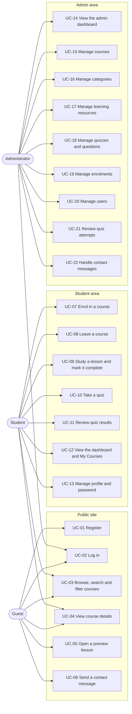

# LearnHub – Use Cases

## 1. Actors

| Actor | Description |
|-------|-------------|
| Guest | Anyone who is not signed in. |
| Student | A registered user with the `Student` role (every new registration). |
| Administrator | A user with the `Admin` role, seeded from configuration or promoted by another administrator. |
| System | Automated behaviour: migrations and seeding at start-up, grading, progress calculation. |

A signed-in student can do everything a guest can; administrators use the separate `/Admin` area.

## 2. Overview

## 3. Use case index

| ID | Use case | Primary actor | Requirements | Implemented in |
|----|----------|---------------|--------------|----------------|
| UC-01 | Register | Guest | GUEST-08, AUTH-01, AUTH-02, VAL-01–04 | `Controllers/AccountController.cs` (Register) |
| UC-02 | Log in and log out | Guest, Student, Administrator | GUEST-09, AUTH-01, AUTH-06, STU-12 | `AccountController` (Login, Logout) |
| UC-03 | Browse, search and filter courses | Guest, Student | GUEST-03–05, STU-05 | `CoursesController.Index`, `Services/CourseCatalogService.cs` |
| UC-04 | View course details | Guest, Student | GUEST-06 | `CoursesController.Details` |
| UC-05 | Open a preview lesson | Guest | GUEST-07 | `ResourcesController.Details`, `Services/LearningResourceService.cs` |
| UC-06 | Send a contact message | Guest, Student | GUEST-10 | `HomeController.Contact`, `Services/ContactService.cs` |
| UC-07 | Enrol in a course | Student | STU-06 | `CoursesController.Enroll`, `Services/EnrollmentService.cs` |
| UC-08 | Leave a course | Student | STU-06 | `CoursesController.Leave` |
| UC-09 | Study a lesson and mark it complete | Student | STU-08, STU-09 | `ResourcesController` (Details, Open, ToggleComplete) |
| UC-10 | Take a quiz | Student | STU-10 | `QuizzesController.Take` (GET and POST), `Services/QuizService.cs`, `Services/QuizGrader.cs` |
| UC-11 | Review quiz results | Student | STU-11 | `QuizzesController` (Result, History) |
| UC-12 | View the dashboard and My Courses | Student | STU-01–03, STU-07 | `StudentController`, `Services/DashboardService.cs` |
| UC-13 | Manage profile and password | Student | STU-04, STU-13 | `ProfileController` |
| UC-14 | View the admin dashboard | Administrator | ADM-01, ADM-02 | `Areas/Admin/Controllers/DashboardController.cs` |
| UC-15 | Manage courses | Administrator | ADM-03 | `Areas/Admin/Controllers/CoursesController.cs`, `Services/CourseManagementService.cs` |
| UC-16 | Manage categories | Administrator | ADM-04 | `Areas/Admin/Controllers/CategoriesController.cs`, `Services/CategoryService.cs` |
| UC-17 | Manage learning resources | Administrator | ADM-05, VAL-05 | `Areas/Admin/Controllers/ResourcesController.cs`, `Services/ResourceManagementService.cs` |
| UC-18 | Manage quizzes and questions | Administrator | ADM-07, ADM-08, VAL-06 | `Areas/Admin/Controllers/QuizzesController.cs`, `QuestionsController.cs` |
| UC-19 | Manage enrolments | Administrator | ADM-06 | `Areas/Admin/Controllers/EnrollmentsController.cs` |
| UC-20 | Manage users | Administrator | ADM-10 | `Areas/Admin/Controllers/UsersController.cs`, `Services/UserManagementService.cs` |
| UC-21 | Review quiz attempts | Administrator | ADM-09 | `Areas/Admin/Controllers/QuizAttemptsController.cs` |
| UC-22 | Handle contact messages | Administrator | ADM-11 | `Areas/Admin/Controllers/MessagesController.cs` |

Controller paths are relative to `src/LearnHub/`.

## 4. Detailed use cases

### UC-01 Register

| | |
|---|---|
| Goal | Create a student account and start learning. |
| Actor | Guest |
| Preconditions | The visitor is not signed in. |
| Trigger | The guest selects **Register** or **Create a free account**. |

**Main success scenario**
1. The system shows the registration form (full name, email, password, confirm password, terms checkbox).
2. The guest fills in the form. The browser validates it as they type and shows password strength.
3. The guest submits the form (with its antiforgery token).
4. The system validates the view model on the server again.
5. The system creates the Identity user with a hashed password and adds the `Student` role.
6. The system signs the student in and opens their dashboard.

**Alternative and exception flows**
- 2a/4a. A field is missing or invalid (email format, weak password, passwords differ, terms not accepted): the form is
  shown again with messages beside the fields and the entered values kept (except passwords).
- 5a. The email is already registered: one clear error is shown; no account is created.
- 3a. More than 10 submissions in a minute from the same address: the system returns `429 Too Many Requests`.
- 3b. The request has no valid antiforgery token: the system rejects it with `400 Bad Request`.

**Postconditions:** a new student exists and is signed in.
**Tests:** `AuthenticationTests.Registration_creates_a_student_signs_them_in_and_hashes_the_password`,
`Invalid_registration_is_rejected_by_server_side_validation`, `Registering_with_an_existing_email_shows_a_single_clear_error`.

### UC-02 Log in and log out

**Main success scenario**
1. The user opens **Log in** and enters email and password (optionally "remember me").
2. The system checks the password with Identity (failed attempts are counted).
3. On success the system redirects to the local `returnUrl` if one was given; otherwise administrators go to
   `/Admin` and students to `/Student/Dashboard`.
4. **Log out** is a POST form in the user menu; the system ends the session and shows the home page.

**Alternative and exception flows**
- 2a. Wrong email or password: a generic message is shown that does not reveal whether the email exists.
- 2b. Five failed attempts: the account is locked for 15 minutes; the same message is used for a deactivated account.
- 3a. `returnUrl` points to another site: it is ignored and the default dashboard is used.
- 1a. Rate limit exceeded: `429 Too Many Requests`.

**Tests:** `AuthenticationTests.Students_and_admins_are_sent_to_their_own_dashboards_after_login`,
`Wrong_password_shows_a_generic_error`, `Account_is_locked_after_five_failed_attempts`,
`Login_redirects_back_to_a_local_return_url_but_never_to_another_site`, `Logout_ends_the_session`.

### UC-03 Browse, search and filter courses

**Main success scenario**
1. The user opens **Courses** (or searches from the home page).
2. The system lists published courses, nine per page, with category, difficulty, duration, lesson count and
   instructor.
3. The user types a term and/or chooses a category, difficulty or sort order and submits.
4. The system runs the search in the database (title, short description, instructor and category name) and shows the matching count
   and results; filters are kept in the URL so the page can be shared or bookmarked.

**Alternative flows**
- 4a. No course matches: an empty state ("No courses match these filters") suggests a shorter term and offers **Show all courses**.
- 3a. Wildcard characters such as `%` or `_` are treated as normal text.

**Tests:** `PublicSiteTests.Search_is_performed_on_the_server`, `Category_filter_limits_results_to_that_category`,
`CatalogueServiceTests.Search_returns_only_published_courses_matching_the_term_and_filters`.

### UC-04 View course details

**Main success scenario**
1. The user opens a course from the catalogue, the home page or the dashboard.
2. The system shows the title, category, difficulty, duration, instructor, description, learning outcomes and the
   **course route**: lessons and quizzes in order.
3. For a guest, preview lessons are links and the other stops are marked as locked; the side panel offers
   **Create a free account** and **Log in to enrol**.
4. For an enrolled student, every stop is available, completed stops are ticked and progress is shown.

**Exception flows**
- 1a. The course does not exist or is a draft: the friendly 404 page is shown (administrators can still preview drafts
  in the admin area).

**Tests:** `PublicSiteTests.Course_details_show_route_and_enrolment_call_to_action`, `Draft_courses_are_not_visible_to_guests`.

### UC-05 Open a preview lesson

1. A guest selects a lesson marked **Free preview** on the course route.
2. The system shows the lesson content with a notice that it is a free preview and an invitation to enrol.
- Alternative: the guest opens a non-preview lesson URL directly → redirect to **Log in** with a return URL.

**Tests:** `PublicSiteTests.Preview_lessons_are_open_to_guests_but_other_lessons_require_login`.

### UC-06 Send a contact message

1. The user opens **Contact** and enters name, email, subject and message.
2. The browser and then the server validate the fields.
3. The system stores the message for administrators and confirms that it was sent.

**Alternative flows**
- 2a. Invalid fields: messages are shown beside them.
- 3a. The hidden honeypot field is filled in (typical of spam bots): the system shows the same confirmation but does
  not store anything.
- 1a. Rate limit exceeded: `429 Too Many Requests`.

**Tests:** `AdminManagementTests.Contact_messages_reach_the_admin_inbox`, `Spam_honeypot_submissions_are_not_stored`.

### UC-07 Enrol in a course

| | |
|---|---|
| Actor | Student |
| Preconditions | Signed in as a student; the course is published. |

**Main success scenario**
1. On the course page the student selects **Enrol**. The browser posts the form with its antiforgery token.
2. The system checks that the course exists and is published.
3. The system checks that the student is not already enrolled and stores the enrolment.
4. The course page shows "You're enrolled. Your route starts at the first lesson." and all stops become available.

**Alternative and exception flows**
- 2a. Course missing or unpublished: 404.
- 3a. Already enrolled: the page shows "You are already enrolled in this course."
- 3b. Two submissions arrive at the same moment: the unique `(UserId, CourseId)` index rejects the second insert and
  the student sees the same "already enrolled" message.
- 1a. A guest or administrator posts the form: the student role is required (login redirect or access denied).

**Tests:** `CatalogueServiceTests.Enrolling_twice_is_rejected_and_unpublished_courses_cannot_be_joined`,
`StudentJourneyTests.A_new_student_enrols_studies_takes_the_quiz_and_sees_the_result`.

### UC-08 Leave a course

1. On an enrolled course page the student selects **Leave this course** and confirms the prompt.
2. The system removes the enrolment; completed lessons and quiz attempts are kept.
3. The lessons of that course are locked again; if the student enrols again, their progress returns.

**Tests:** `StudentJourneyTests.Leaving_a_course_removes_access_to_its_lessons`,
`CatalogueServiceTests.Leaving_a_course_keeps_completed_lessons_for_later`.

### UC-09 Study a lesson and mark it complete

**Main success scenario**
1. The student opens a lesson from the course route, the dashboard (**Resume**) or the outline.
2. The system checks access (preview, enrolment or administrator) and shows the lesson: article text, an embedded
   video, a PDF or image opened through a protected link, or an external link, with the course outline and previous
   and next lessons.
3. The student selects **Mark as complete**.
4. The system records the completion, recalculates progress and moves the student to the next lesson with
   "Lesson complete. On to the next stop."

**Alternative flows**
- 3a. The lesson is already complete: the button reads **Mark as not complete** and removes the record.
- 2a. Not enrolled: redirect to the course page, which offers enrolment.
- 2b. A file link is opened without access: the file is not served.

**Tests:** `StudentJourneyTests.A_new_student_enrols_studies_takes_the_quiz_and_sees_the_result`,
`CatalogueServiceTests.Progress_counts_completed_lessons_and_passed_quizzes`,
`AdminManagementTests.Resources_are_created_validated_streamed_and_deleted`.

### UC-10 Take a quiz

| | |
|---|---|
| Actor | Student |
| Preconditions | Enrolled in the course; the quiz is published and has questions. |

**Main success scenario**
1. The student opens the quiz from the course route.
2. The system shows every question with its options; the correct answers are not part of the page.
3. The student chooses answers; a counter shows how many are answered.
4. The student submits. If some questions are unanswered, the browser asks for confirmation first.
5. The system grades on the server: only options that belong to each question count, unanswered questions are
   incorrect, and the score is rounded down.
6. The system stores the attempt with a score snapshot and every answer, and opens the result page.

**Alternative and exception flows**
- 1a/5a. Not enrolled: redirect to the course page.
- 1b. Quiz missing or unpublished: 404.
- 5b. Tampered form values (for example an option id from another question): ignored and marked incorrect.

**Postconditions:** a new attempt; a passed quiz counts towards course progress. Quizzes can be retaken.
**Tests:** `StudentJourneyTests.Tampered_quiz_answers_are_graded_on_the_server`,
`QuizAndCourseManagementTests.Submitting_answers_stores_a_graded_attempt_with_every_answer`,
`The_quiz_page_never_contains_the_correct_answers`, `LogicTests.Unanswered_questions_count_as_incorrect`.

### UC-11 Review quiz results

1. After submitting, or from **Quiz results** history, the student opens an attempt.
2. The system shows the score, pass or fail against the pass mark, submission time and, for every question, the chosen
   answer, the correct answer and the explanation.
- Exception: the attempt belongs to someone else → 404.

**Tests:** `QuizAndCourseManagementTests.Students_cannot_open_other_students_results_but_admins_can`.

### UC-12 View the dashboard and My Courses

1. After login, or from the navigation, the student opens **Dashboard**.
2. The system shows figures (enrolled courses, completed courses, lessons completed, quizzes passed, courses still
   available), courses in progress with progress bars and **Resume**, recent quiz results with the average best score,
   recent activity and three recommended courses.
3. **My Courses** lists every enrolled course with progress and the next lesson.
- Alternative: a new student with no enrolments sees empty states that link to the catalogue.

### UC-13 Manage profile and password

1. The student opens **Profile**, edits full name and bio, and saves; the system validates and saves.
2. From **Change password** the student enters the current password and a new one twice; the system checks the
   current password and the policy, changes it and refreshes the sign-in.
- Alternatives: validation errors are shown beside the fields; a wrong current password shows an error; rate limit
  applies to password changes.

**Tests:** `StudentJourneyTests.Profile_updates_are_validated_and_saved`.

### UC-14 View the admin dashboard

The administrator opens `/Admin` and sees live figures (published and draft courses, students and new students in the
last 30 days, enrolments, quiz attempts with pass rate and average score, unread messages), most enrolled courses,
enrolments by category, recent enrolments, recent quiz attempts and content warnings such as a published course
without lessons. Non-administrators are redirected to login or shown **Access denied**.

### UC-15 Manage courses

**Main success scenario (create)**
1. The administrator opens **Courses → New course**.
2. The administrator enters title, short description, description, learning outcomes, category, difficulty, duration,
   instructor and optionally a cover image, and chooses whether to publish.
3. The system validates the form and the image (type, size and signature), stores the image under a random name,
   saves the course and shows the course details.

**Other flows**
- Edit: the same form, pre-filled; replacing the cover deletes the old uploaded image.
- Publish or unpublish from the list or details page.
- Delete: the confirmation page shows how many lessons, quizzes, enrolments and attempts will be removed; on
  confirmation the system deletes the quiz answers first and then the course in one transaction, then removes files.
- Validation errors keep the form open with messages.

**Tests:** `AdminManagementTests.Course_create_with_cover_edit_publish_and_delete`,
`QuizAndCourseManagementTests.Deleting_a_course_removes_its_content_attempts_and_answers_in_the_right_order`.

### UC-16 Manage categories

1. The administrator creates or edits a category with a unique name, a description and an icon from the allowed list.
2. Deleting a category that still has courses is refused with an explanation; an empty category can be deleted.
- Alternative: a name that already exists (ignoring case) is rejected.

**Tests:** `AdminManagementTests.Category_create_edit_and_delete`, `Category_with_courses_is_protected_from_deletion`,
`CatalogueServiceTests.Creates_categories_and_rejects_duplicate_names_regardless_of_case`.

### UC-17 Manage learning resources

1. The administrator creates a resource for a course: title, summary, type, order, estimated minutes and preview flag.
2. Depending on the type, the form shows the article body, the video URL (YouTube or Vimeo), the external link, or a
   file upload (PDF or image).
3. The system validates the type-specific fields, checks the file, stores it privately and saves the resource.
- Alternatives: an unsupported video address, a wrong file type, a file whose content does not match its extension or
  a file over the limit is rejected with a message; delete removes the record and the file.

**Tests:** `AdminManagementTests.Resources_are_created_validated_streamed_and_deleted`,
`FileStorageServiceTests.Rejects_a_file_whose_content_does_not_match_its_extension`.

### UC-18 Manage quizzes and questions

1. The administrator creates a quiz for a course with a title, description and pass mark (0–100).
2. On the quiz details page the administrator adds questions with an explanation and two to six answer options, marking
   exactly one as correct.
3. The administrator publishes the quiz.
- Alternatives: fewer than two options, no or several correct options, or duplicate options are rejected; publishing a
  quiz without questions shows "Add at least one question before publishing this quiz."; deleting a question or
  quiz removes the related student answers first.

**Tests:** `AdminManagementTests.Quiz_must_have_questions_before_it_can_be_published`,
`LogicTests.Question_needs_two_answers_one_marked_correct_and_no_duplicates`,
`QuizAndCourseManagementTests.Removing_an_answer_that_students_selected_keeps_their_attempts`.

### UC-19 Manage enrolments

1. The administrator lists enrolments (search by student, filter by course), or selects **Enrol a student**, enters the
   student's email and chooses a course.
2. The system checks that the account exists and is a student and that no enrolment exists, then saves it.
3. The administrator can remove an enrolment after confirmation.
- Alternatives: "No account uses that email address.", "Only student accounts can be enrolled in courses.",
  "This student is already enrolled in that course."

**Tests:** `AdminManagementTests.Enrolments_can_be_managed_by_administrators`.

### UC-20 Manage users

1. The administrator searches the user list (filter by role) and opens a user's details (enrolments, attempts, status).
2. The administrator can change the role, deactivate or reactivate the account, or delete it after confirmation.
- Exceptions: an administrator cannot change, deactivate or delete their own account; the last active administrator
  cannot be demoted, deactivated or deleted. A deactivated user cannot sign in, and an existing session ends within
  five minutes.

**Tests:** `AdminManagementTests.User_roles_deactivation_and_self_protection`.

### UC-21 Review quiz attempts

The administrator searches attempts by student and filters by quiz, opens one to see every answer, and may delete an
attempt after confirmation (for example a test attempt).

### UC-22 Handle contact messages

The administrator sees the inbox newest first, can show unread messages only (the sidebar shows the unread count), opens
a message (which marks it read), can mark it unread again, and can delete it after confirmation.
