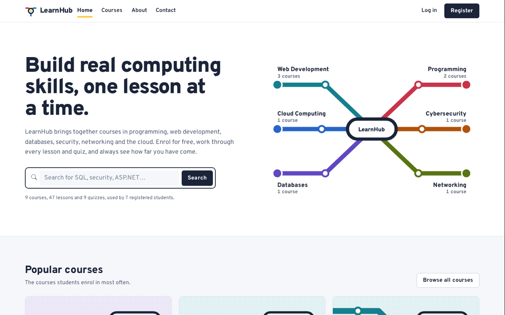
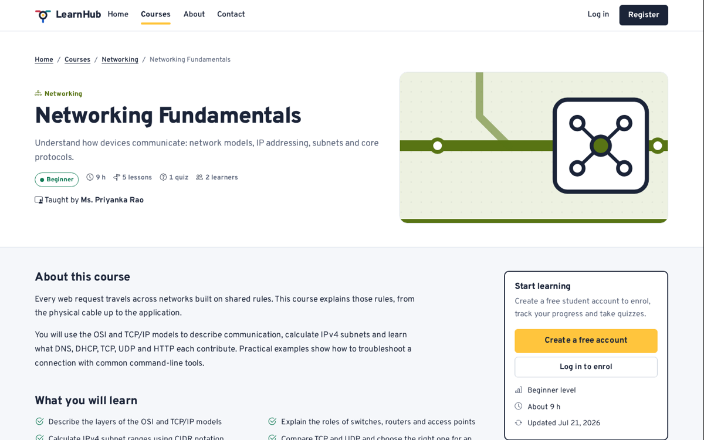
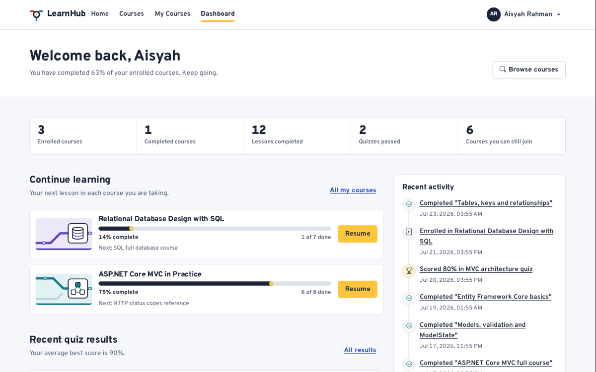
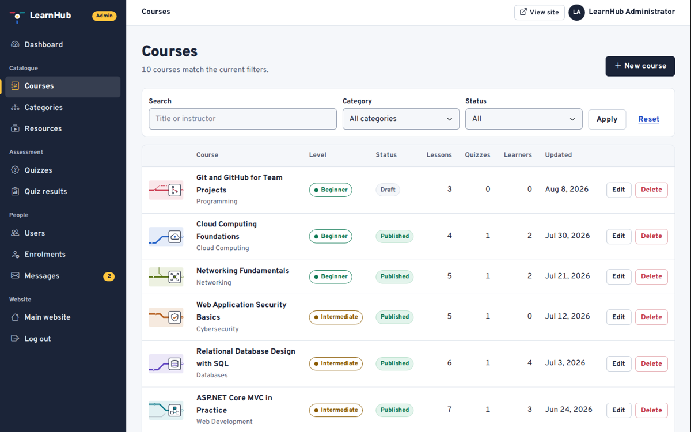
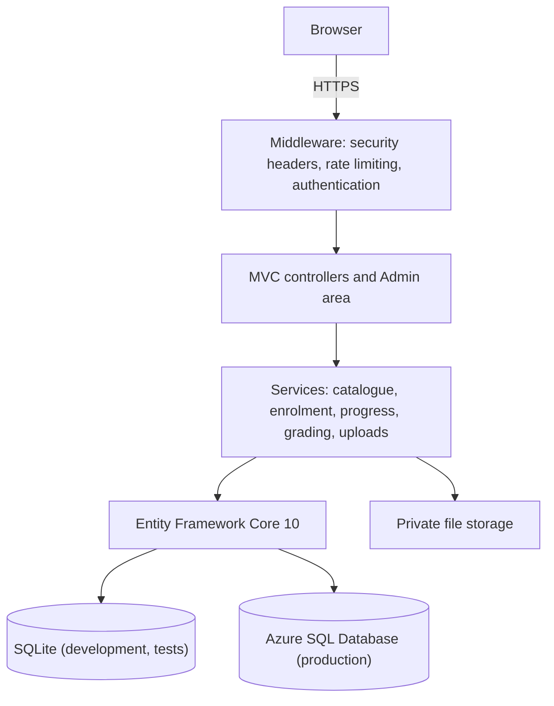

# LearnHub – Web-Based Learning Management System

[](https://github.com/KhayitOff/LearnHub/actions/workflows/ci.yml)
[](https://github.com/KhayitOff/LearnHub/actions/workflows/deploy.yml)
[](https://github.com/KhayitOff/LearnHub/actions/workflows/pages.yml)

LearnHub is an ASP.NET Core MVC learning management system built for the **CT050-3-2-WAPP Web Applications** group
assignment at Asia Pacific University of Technology & Innovation. Guests browse and search a catalogue of computing
courses, students enrol, work through lessons, take quizzes and follow their progress, and administrators manage the
whole platform from a protected admin area.

| | |
|---|---|
| Presentation site (GitHub Pages) | https://jahongirmirzodv.github.io/LearnHub/ |
| Live application (Azure App Service) | Added after provisioning – see [Deployment](Documentation/Deployment.md) |
| Repository | https://github.com/JahongirmirzoDv/LearnHub |



## Contents

- [Features](#features)
- [Technology](#technology)
- [Architecture](#architecture)
- [Database](#database)
- [Getting started](#getting-started)
- [Accounts and the first administrator](#accounts-and-the-first-administrator)
- [Resetting the local database](#resetting-the-local-database)
- [Running the tests](#running-the-tests)
- [Continuous integration and deployment](#continuous-integration-and-deployment)
- [Security](#security)
- [Project structure](#project-structure)
- [Documentation](#documentation)
- [Team and workflow](#team-and-workflow)
- [Troubleshooting](#troubleshooting)
- [Licences](#licences)

## Features

**Guest**
- Home page with the category "interchange map", course search and popular courses.
- Course catalogue with server-side search, category and difficulty filters, sorting and pagination.
- Course details with learning outcomes and the course route of lessons and quizzes.
- Free preview lessons, About, Contact form (stored for administrators) and Privacy pages.
- Registration and login with client- and server-side validation.

**Student**
- Dashboard with learning figures, courses in progress, recent quiz results, recent activity and recommendations.
- Enrol in and leave courses; My Courses with progress for each course.
- Lessons as articles, embedded videos, PDF documents, images and external links, with a course outline.
- Mark lessons complete; progress is calculated from lessons and passed quizzes.
- Quizzes with an answered-questions counter, instant marking, explanations for every answer and a result history.
- Profile editing and password change.

**Administrator**
- Dashboard with live figures, most-enrolled courses, enrolments by category, recent activity and content warnings.
- Create, edit, publish and delete courses (with thumbnails), categories and learning resources (with validated uploads).
- Quizzes with questions of two to six answer options, exactly one correct answer and publishing rules.
- Enrolment management, quiz results, and user management (roles, deactivation, deletion with safeguards).
- Contact message inbox.

| Course details | Student dashboard | Admin courses |
|---|---|---|
|  |  |  |

## Technology

| Area | Choice |
|------|--------|
| Framework | .NET 10 (LTS), ASP.NET Core MVC, C#, Razor views |
| Data | Entity Framework Core 10 – SQLite in development and tests, Azure SQL Database in production |
| Identity | ASP.NET Core Identity with `Admin` and `Student` roles |
| Interface | HTML5, CSS3, Bootstrap 5.3.8 with a custom design system, Bootstrap Icons, Overpass typeface |
| Client scripts | Vanilla JavaScript (progressive enhancement), jQuery Validation Unobtrusive for form validation |
| Tests | xUnit v3 with `WebApplicationFactory`, Playwright browser tests |
| Delivery | GitHub Actions, Azure App Service (Linux), Azure SQL Database, GitHub Pages |

All client libraries are vendored in `src/LearnHub/wwwroot/lib` (versions in its README), so the strict Content
Security Policy can stay `'self'`.

## Architecture

Controllers handle HTTP concerns only, services contain the business rules and queries, and EF Core talks to the
database. Forms always bind to view models, never to entities.



Details: [Documentation/Architecture.md](Documentation/Architecture.md).

## Database

Eleven application tables plus the ASP.NET Core Identity tables, with primary and foreign keys, unique indexes (for
example one enrolment per student and course), check constraints and deliberate delete rules. The model is
provider-agnostic with two thin contexts, `SqliteDbContext` and `SqlServerDbContext`, each with its own migrations.
Migrations are applied automatically at start-up and demo data is seeded into an empty database.

Full diagram and rules: [Documentation/ERD.md](Documentation/ERD.md).

## Getting started

### Prerequisites

- [.NET 10 SDK](https://dotnet.microsoft.com/download/dotnet/10.0)
- Git
- Optional: Node.js 22 for the browser tests

No database server is needed locally: development uses a SQLite file created automatically.

### Run locally

```bash
git clone https://github.com/JahongirmirzoDv/LearnHub.git
```

```bash
cd LearnHub
```

Choose passwords for the seeded administrator and demo student. They are stored in your user profile with
[user secrets](https://learn.microsoft.com/aspnet/core/security/app-secrets), never in the repository:

```bash
dotnet user-secrets set "Seed:AdminPassword" "<choose-a-strong-password>" --project src/LearnHub
```

```bash
dotnet user-secrets set "Seed:DemoStudentPassword" "<choose-another-password>" --project src/LearnHub
```

Passwords need at least 8 characters with an upper-case letter, a lower-case letter and a digit. Then start the app:

```bash
dotnet run --project src/LearnHub
```

Open http://localhost:5080 (or https://localhost:7080 after `dotnet dev-certs https --trust`). The first start
creates `src/LearnHub/App_Data/learnhub.db`, applies the migrations and seeds 6 categories, 10 courses, 50 learning
resources, 9 quizzes and demo learner activity.

### Working without the .NET SDK

Team members with little disk space can work entirely in the cloud: every push runs the build, all tests and the
browser tests in GitHub Actions, and the **EF Core migration (cloud)** workflow (Actions tab → Run workflow) generates
migrations for both database providers and commits them.

## Accounts and the first administrator

| Account | Email | Password |
|---------|-------|----------|
| Administrator | `admin@learnhub.local` | The value you set in `Seed:AdminPassword` |
| Demo student | `demo.student@example.com` | The value you set in `Seed:DemoStudentPassword` |

- The administrator is created at start-up whenever no account with `Seed:AdminEmail` exists and
  `Seed:AdminPassword` is configured; otherwise a warning is logged. Setting the password and restarting is enough.
- The demo student is created together with the demo data, which is seeded only into an empty database. If the data
  was seeded before `Seed:DemoStudentPassword` was set, [reset the local database](#resetting-the-local-database).
- Changing a setting later never changes an existing account's password or role.
- Anyone can register as a student. An administrator can promote a user in **Admin → Users → Change role**.
- The other seeded learners exist to make dashboards realistic and cannot sign in.
- In production the same settings come from App Service application settings (`Seed__AdminEmail`,
  `Seed__AdminPassword`), which `infra/provision.sh` asks for without showing the password.

## Resetting the local database

This deletes your **local development** data only. Stop the application, then remove the SQLite file and the
uploaded files:

```bash
rm -f src/LearnHub/App_Data/learnhub.db src/LearnHub/App_Data/learnhub.db-shm src/LearnHub/App_Data/learnhub.db-wal
```

```bash
rm -rf src/LearnHub/App_Data/storage
```

Run `dotnet run --project src/LearnHub` again: the database is recreated, migrated and seeded.

## Running the tests

```bash
dotnet test --solution LearnHub.sln
```

This runs 182 unit, service and integration tests. Integration tests start the real application in memory with an
isolated in-memory SQLite database. To run the same suite against SQL Server, point it at a disposable server (each
test class creates and drops its own database):

```bash
LEARNHUB_TEST_SQLSERVER="Server=localhost,1433;User Id=sa;Password=<password>;TrustServerCertificate=True" dotnet test --solution LearnHub.sln
```

Browser tests (Playwright) run against a running instance in three viewports:

```bash
cd tests/e2e && npm ci && npx playwright install chromium
```

```bash
E2E_BASE_URL=http://localhost:5080 E2E_ADMIN_EMAIL=admin@learnhub.local E2E_ADMIN_PASSWORD='<admin password>' E2E_STUDENT_EMAIL=demo.student@example.com E2E_STUDENT_PASSWORD='<student password>' npx playwright test
```

`scripts/smoke-test.sh <base-url>` checks any running instance (pages, links, protected areas, security headers).
Strategy, inventory and the manual checklist: [Documentation/Testing.md](Documentation/Testing.md).

## Continuous integration and deployment

| Workflow | Trigger | What it does |
|----------|---------|--------------|
| `ci.yml` | Every push and pull request | Build and test on SQLite; SQL Server 2022 container: migrations, the full test suite and a smoke test of the published app; Playwright tests on desktop, tablet and mobile |
| `deploy.yml` | Push to `main` | Build, test, publish, create the idempotent migration script, then deploy to Azure App Service through OpenID Connect and smoke test the live site (runs once the Azure variables exist) |
| `pages.yml` | Changes in `docs/`, and after each deployment | Publish the presentation site to GitHub Pages |
| `ef-migrations.yml` | Manual | Generate and commit a migration for both providers |

### Deploying or redeploying

1. Provision Azure once: open [Azure Cloud Shell](https://shell.azure.com), clone the repository and run
   `bash infra/provision.sh`. It creates the App Service, an Azure SQL database that the app reaches with its managed
   identity, and a deployment identity trusted by GitHub. No password is stored in GitHub.
2. Add the five repository variables the script prints (Settings → Secrets and variables → Actions → Variables).
3. Redeploy at any time by pushing to `main` or running **Deploy to Azure** from the Actions tab.

Step-by-step guide, configuration reference and rollback: [Documentation/Deployment.md](Documentation/Deployment.md).

## Security

- ASP.NET Core Identity password hashing, account lockout (5 attempts, 15 minutes) and role-based authorisation; every
  admin controller inherits one protected base class.
- Antiforgery tokens on every form, encoded output, strict Content Security Policy, security headers and HTTPS.
- Ownership and enrolment checks for lessons, files and quiz results; view models against overposting.
- Uploads checked by extension, size and file signature, stored outside `wwwroot` and streamed after an access check.
- Rate limiting on login, registration, password change and the contact form.
- No secrets in the repository: user secrets locally, App Service settings and managed identities in production.

Full review: [Documentation/Security-Review.md](Documentation/Security-Review.md).

## Project structure

```
LearnHub/
├── .github/workflows/     ci.yml, deploy.yml, pages.yml, ef-migrations.yml
├── src/LearnHub/          ASP.NET Core MVC application
│   ├── Areas/Admin/       admin controllers and views
│   ├── Controllers/       public and student controllers
│   ├── Data/              DbContext, configurations, migrations, seed data
│   ├── Infrastructure/    middleware, options, tag helpers, validation attributes
│   ├── Models/            entities and enums
│   ├── Services/          business logic and queries
│   ├── ViewModels/        page and form models
│   ├── Views/             Razor views
│   └── wwwroot/           design system CSS, JavaScript, images, vendored libraries
├── tests/LearnHub.Tests/  xUnit unit, service and integration tests
├── tests/e2e/             Playwright browser tests
├── scripts/               smoke test and CI helpers
├── infra/                 Azure provisioning script
├── Documentation/         assignment documentation
└── docs/                  GitHub Pages presentation site
```

## Documentation

| Document | Contents |
|----------|----------|
| [Proposal](Documentation/Proposal.md) | Mission, objectives, audience, scope, schedule |
| [Final report content](Documentation/Final-Report-Content.md) | Full report text for the submission |
| [Requirements checklist](Documentation/Requirements-Checklist.md) and [audit](Documentation/Requirements-Audit.md) | Requirements with implementation evidence |
| [Architecture](Documentation/Architecture.md) | Layers, routes, security and deployment design |
| [ERD](Documentation/ERD.md) | Entity relationship diagram and database rules |
| [Use cases](Documentation/Use-Cases.md), [Flowcharts](Documentation/Flowcharts.md), [Navigation](Documentation/Navigation.md), [Wireframes](Documentation/Wireframes.md) | Design documentation |
| [Testing](Documentation/Testing.md) | Test strategy, automated inventory and manual checklist |
| [Security review](Documentation/Security-Review.md) | Threats, controls and residual risks |
| [Deployment](Documentation/Deployment.md) | Azure and GitHub Pages deployment |
| [Team responsibilities](Documentation/Team-Responsibilities.md) and [Git workflow](Documentation/Git-Workflow.md) | How the team works |
| [Viva questions](Documentation/Viva-Questions.md) | Preparation for the viva |

## Team and workflow

Four members share the work (names and TP numbers in [Team responsibilities](Documentation/Team-Responsibilities.md)).
`main` is always deployable; work happens on short-lived `feature/`, `fix/` and `docs/` branches merged through pull
requests once CI passes. See [Git workflow](Documentation/Git-Workflow.md).

To continue development: create a branch, make the change with its tests, open a pull request, and merge when the
three CI jobs are green. Database changes need a migration for both providers (see the Git workflow document).

## Troubleshooting

| Symptom | Fix |
|---------|-----|
| "No administrator account exists" warning and you cannot log in as admin | Set `Seed:AdminPassword` with user secrets and restart the app. |
| The demo student cannot log in | The demo data was seeded before `Seed:DemoStudentPassword` was set; set it and reset the local database. |
| Browser warns about the HTTPS certificate locally | Run `dotnet dev-certs https --trust`, or use http://localhost:5080. |
| `429 Too Many Requests` after several logins | The form rate limit (10 requests per minute per address) is working; wait a minute. |
| Pages look unstyled after changing CSS | Hard-refresh; the layout adds a version hash to CSS and JavaScript URLs. |
| Production form pages return errors behind a proxy | Ensure `ASPNETCORE_FORWARDEDHEADERS_ENABLED=true` so the app sees HTTPS (set by `infra/provision.sh`). |

## Licences

The source code is coursework for CT050-3-2-WAPP. Vendored libraries keep their own licences: Bootstrap, Bootstrap
Icons, jQuery and jQuery Validation (MIT), Overpass (SIL Open Font License 1.1). Course videos are embedded from their
original YouTube channels; cheat sheets, diagrams and course covers were created for this project.
