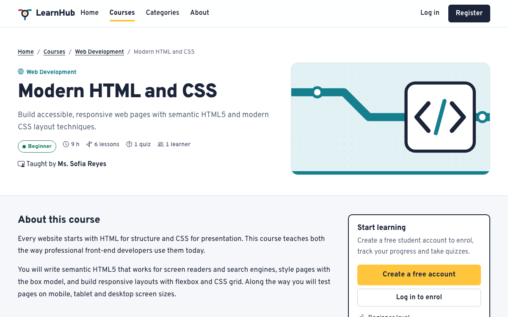
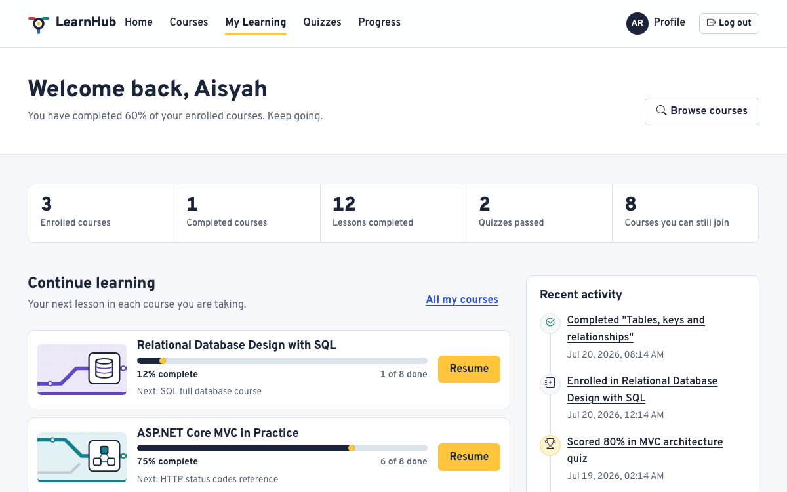
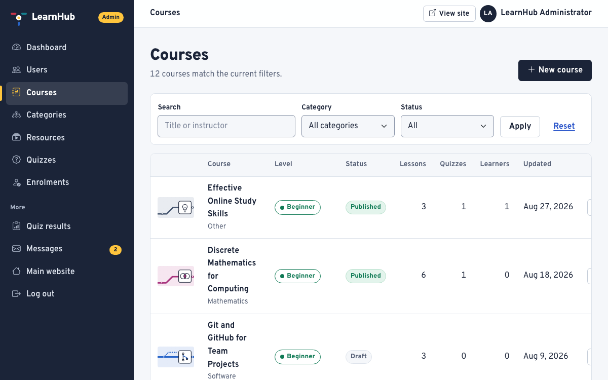
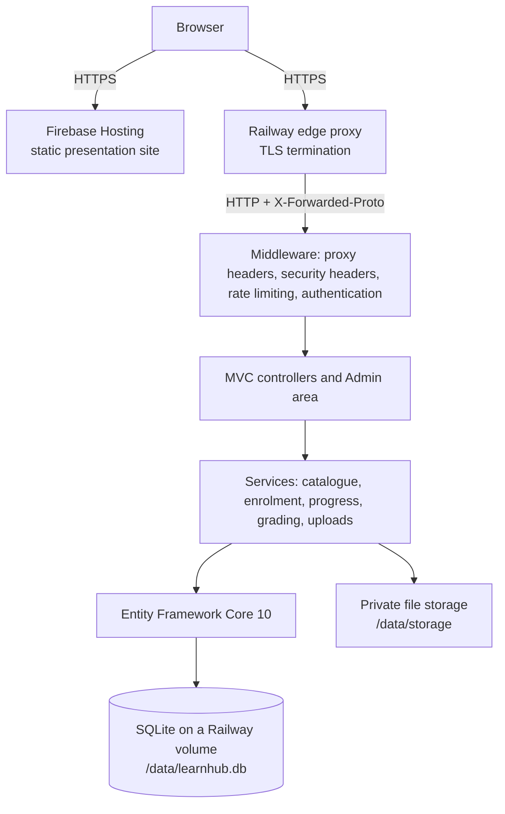

# LearnHub – Web-Based Learning System

[](https://github.com/KhayitOff/LearnHub/actions/workflows/ci.yml)

LearnHub is a web-based learning system built with **ASP.NET Core MVC** for the **CT050-3-2-WAPP Web Applications**
group assignment at Asia Pacific University of Technology & Innovation. Guests browse and search a catalogue of
computing courses, students enrol, work through lessons, take quizzes and follow their progress, and administrators
manage the whole platform from a protected admin area.

| | |
|---|---|
| Presentation site (Firebase Hosting) | **https://learnhub-wapp.web.app** |
| Live application (Railway) | Added after the first deploy – see [Deployment](docs/DEPLOYMENT.md) |
| Repository | https://github.com/KhayitOff/LearnHub |


## Contents

- [Features](#features)
- [Technology](#technology)
- [Architecture](#architecture)
- [Database](#database)
- [Getting started](#getting-started)
- [Accounts and the first administrator](#accounts-and-the-first-administrator)
- [Resetting the local database](#resetting-the-local-database)
- [Running the tests](#running-the-tests)
- [Continuous integration](#continuous-integration)
- [Deployment](#deployment)
- [Security](#security)
- [Project structure](#project-structure)
- [Documentation](#documentation)
- [Team and workflow](#team-and-workflow)
- [Troubleshooting](#troubleshooting)
- [Licences](#licences)

## Features

**Guest**
- Home page with the category map, course search and popular courses.
- Course catalogue with server-side search, category and difficulty filters, sorting and pagination.
- Course details with learning outcomes and the course route of lessons and quizzes.
- Free preview lessons, About, Contact form (stored for administrators) and Privacy pages.
- Registration and login with client- and server-side validation.

**Student**
- Dashboard with learning figures, courses in progress, recent quiz results, recent activity and recommendations.
- Enrol in and leave courses; My Courses with progress for each course.
- Lessons as articles, embedded videos, PDF documents, images and external links, with a course outline.
- Mark lessons complete; progress is calculated from lessons and passed quizzes.
- Quizzes with an answered-questions counter, instant marking, explanations for every answer and a result history.
- Profile editing and password change.

**Administrator**
- Dashboard with live figures, most-enrolled courses, enrolments by category, recent activity and content warnings.
- Create, edit, publish and delete courses (with thumbnails), categories and learning resources (with validated uploads).
- Quizzes with questions of two to six answer options, exactly one correct answer and publishing rules.
- Enrolment management, quiz results, and user management (roles, deactivation, deletion with safeguards).
- Contact message inbox.

| Course details | Student dashboard | Admin courses |
|---|---|---|
|  |  |  |

## Technology

| Area | Choice |
|------|--------|
| Framework | .NET 10 (LTS), ASP.NET Core MVC, C#, Razor views |
| Data | Entity Framework Core 10 with **SQLite** – one provider for development, tests and production |
| Identity | ASP.NET Core Identity with `Admin` and `Student` roles |
| Interface | HTML5, CSS3, Bootstrap 5.3.8 with a custom design system, Bootstrap Icons, Overpass typeface |
| Client scripts | Vanilla JavaScript (progressive enhancement), jQuery Validation Unobtrusive for form validation |
| Tests | xUnit v3 with `WebApplicationFactory`, Playwright browser tests |
| Delivery | GitHub for source control and CI, **Railway** for the application, **Firebase Hosting** for the presentation site |

All client libraries are vendored in `src/LearnHub/wwwroot/lib` (versions in its README), so the strict Content
Security Policy can stay `'self'`.

**No Azure.** The assignment forbids Azure services, so the project uses Railway and Firebase Hosting instead. There
is no Azure resource, package, workflow or credential anywhere in the repository.

## Architecture

Controllers handle HTTP concerns only, services contain the business rules and queries, and EF Core talks to the
database. Forms always bind to view models, never to entities.



Two hosting services, each doing what it is good at:

| Service | Role |
|---|---|
| **Railway** | Runs the ASP.NET Core MVC application from the project's `Dockerfile`, on the port Railway supplies in `PORT`. |
| **Firebase Hosting** | Serves the static project presentation site from `FirebaseLanding/`. Firebase cannot execute a server-side ASP.NET Core application, so this site presents the project and links to the live application. |
| **GitHub** | Source control and the CI workflow that builds, tests and smoke-tests the container image. |

Details: [docs/ARCHITECTURE.md](docs/ARCHITECTURE.md).

## Database

Eleven application tables plus the seven ASP.NET Core Identity tables, with primary and foreign keys, unique indexes
(for example one enrolment per student and course), check constraints and deliberate delete rules. The model is
code-first with a **single provider (SQLite)**, so there is one migration set and no provider-specific code paths.

Migrations are applied automatically at start-up and the demonstration catalogue is seeded into an empty database.

Full diagram and rules: [docs/ERD.md](docs/ERD.md). Design notes and constraints: [docs/DATABASE.md](docs/DATABASE.md).

## Getting started

### Prerequisites

- [.NET 10 SDK](https://dotnet.microsoft.com/download/dotnet/10.0)
- Git
- Optional: Node.js 22 for the browser tests

No database server is needed: development uses a SQLite file created automatically.

### Run locally

```bash
git clone https://github.com/KhayitOff/LearnHub.git
```

```bash
cd LearnHub
```

```bash
dotnet run --project src/LearnHub
```

Open http://localhost:5080 (or https://localhost:7080 after `dotnet dev-certs https --trust`).

The first start creates `src/LearnHub/App_Data/learnhub.db`, applies the migrations and seeds **8 categories,
12 courses, 64 learning resources, 11 quizzes, 54 questions and 216 answer options**, together with realistic learner
activity so the dashboards are not empty.

**Passwords are never committed.** On the first Development run, LearnHub generates strong random passwords for the
seeded administrator and demo student and writes them to `src/LearnHub/App_Data/demo-credentials.json`, which is
git-ignored. Read that file to sign in. To choose your own passwords instead, set them with
[user secrets](https://learn.microsoft.com/aspnet/core/security/app-secrets) before the first run:

```bash
dotnet user-secrets set "Seed:AdminPassword" "<choose-a-strong-password>" --project src/LearnHub
```

```bash
dotnet user-secrets set "Seed:DemoStudentPassword" "<choose-another-password>" --project src/LearnHub
```

In production the same settings come from environment variables (`Seed__AdminPassword`,
`Seed__DemoStudentPassword`) — see [`.env.example`](.env.example).

### Working without the .NET SDK

You can work entirely in the cloud: every push runs the build and all tests in GitHub
Actions, and the **EF Core migration (cloud)** workflow (Actions tab → Run workflow) generates a migration and commits it.

## Accounts and the first administrator

| Account | Email | Password |
|---------|-------|----------|
| Administrator | `admin@learnhub.local` | Generated into `App_Data/demo-credentials.json`, or the value you set in `Seed:AdminPassword` |
| Demo student | `demo.student@example.com` | Generated into `App_Data/demo-credentials.json`, or the value you set in `Seed:DemoStudentPassword` |

> These are **DEMO ONLY** accounts for demonstrating and marking the assignment. They must not be used for anything
> real.

- The administrator is created at start-up whenever no account with `Seed:AdminEmail` exists and
  `Seed:AdminPassword` is configured; otherwise a warning is logged explaining what to set.
- The demo student is created together with the demo data, which is seeded only into an empty database. If the data
  was seeded before `Seed:DemoStudentPassword` was set, [reset the local database](#resetting-the-local-database).
- Changing a setting later never changes an existing account's password or role.
- Anyone can register as a student. An administrator can promote a user in **Admin → Users → Change role**.
- The other seeded learners exist to make dashboards realistic and cannot sign in.

## Resetting the local database

This deletes your **local development** data only. Stop the application, then remove the SQLite file, the generated
credentials and the uploaded files:

```bash
rm -rf src/LearnHub/App_Data
```

Run `dotnet run --project src/LearnHub` again: the database is recreated, migrated, seeded and fresh demo passwords
are generated.

## Running the tests

```bash
dotnet test --solution LearnHub.sln
```

This runs **211 unit, service, data-model and integration tests**. The integration tests start the real application in
memory against an isolated in-memory SQLite database, and a crawler follows every link as a guest, a student and an
administrator.

Browser tests (Playwright) run against a running instance in three viewports — desktop, tablet and phone:

```bash
cd tests/e2e && npm ci && npx playwright install chromium
```

```bash
E2E_BASE_URL=http://localhost:5080 E2E_ADMIN_EMAIL=admin@learnhub.local E2E_ADMIN_PASSWORD='<admin password>' E2E_STUDENT_EMAIL=demo.student@example.com E2E_STUDENT_PASSWORD='<student password>' npx playwright test
```

`scripts/smoke-test.sh <base-url>` checks any running instance (pages, links, protected areas, security headers).

Strategy, inventory and the manual checklist: [docs/TESTING.md](docs/TESTING.md).

## Continuous integration

| Workflow | Trigger | What it does |
|----------|---------|--------------|
| `ci.yml` → `build-and-test` | Every push and pull request | Restore, build with warnings as errors, run the full test suite |
| `ci.yml` → `container` | Every push and pull request | Build the Docker image, run it the way Railway does (Production, `PORT`, a volume at `/data`), smoke-test it, check the log for migrations/seed/admin, then **restart the container and confirm migrations are not re-applied** — proving the volume really persists the database |
| `ci.yml` → `e2e` | Every push and pull request | Playwright across desktop, tablet and phone viewports with axe-core accessibility scans |
| `ef-migrations.yml` | Manual | Generate an EF Core migration and commit it |

## Deployment

| Part | Host | Notes |
|------|------|-------|
| Application | **Railway** | Builds the `Dockerfile`, listens on `$PORT`, configured by `railway.json` with a `/health` check |
| Database and uploads | **Railway volume** | Mounted at `/data`: the SQLite file, the Data Protection key ring and administrator uploads, so a redeploy keeps its data |
| Presentation site | **Firebase Hosting** | The static site in `FirebaseLanding/`, live at https://learnhub-wapp.web.app |

```bash
# Application
railway login
railway init          # or: railway link
railway up

# Presentation site
firebase deploy --only hosting
```

After the first Railway deploy, point the presentation site's buttons at the real domain and redeploy:

```bash
scripts/set-app-url.sh https://<your-service>.up.railway.app
firebase deploy --only hosting
```

Step-by-step instructions, the full variable list and rollback: [docs/DEPLOYMENT.md](docs/DEPLOYMENT.md).

## Security

- ASP.NET Core Identity password hashing, account lockout (5 attempts, 15 minutes) and role-based authorisation; every
  admin controller inherits one protected base class.
- Antiforgery tokens on every form, encoded output, strict Content Security Policy, security headers and HTTPS.
- Ownership and enrolment checks for lessons, files and quiz results; view models against overposting.
- Uploads checked by extension, size and file signature, stored outside `wwwroot` and streamed after an access check.
- Rate limiting on login, registration, password change and the contact form.
- No secrets in the repository: user secrets locally, environment variables in production, and an explicitly
  documented `.env.example` that holds placeholders only.

Full review, including the trust decision behind reading the platform proxy's forwarded headers:
[docs/SECURITY.md](docs/SECURITY.md).

## Project structure

```
LearnHub/
├── .github/workflows/     ci.yml, ef-migrations.yml
├── src/LearnHub/          ASP.NET Core MVC application
│   ├── Areas/Admin/       admin controllers and views
│   ├── Controllers/       public and student controllers
│   ├── Data/              DbContext, configurations, migrations, seed data
│   ├── Infrastructure/    middleware, options, tag helpers, validation attributes
│   ├── Models/            entities and enums
│   ├── Services/          business logic and queries
│   ├── ViewModels/        page and form models
│   ├── Views/             Razor views
│   └── wwwroot/           design system CSS, JavaScript, images, vendored libraries
├── tests/LearnHub.Tests/  xUnit unit, service, data and integration tests
├── tests/e2e/             Playwright browser tests
├── FirebaseLanding/       static presentation site deployed to Firebase Hosting
├── scripts/               smoke test, app-URL helper and CI helpers
├── docs/                  assignment documentation
├── Dockerfile             image Railway builds
├── railway.json           Railway build and health-check configuration
├── firebase.json          Firebase Hosting configuration
└── .env.example           every environment variable, with placeholders only
```

## Documentation

| Document | Contents |
|----------|----------|
| [Proposal](docs/PROPOSAL.md) | Mission, objectives, audience, scope, schedule |
| [Report notes](docs/REPORT_NOTES.md) | Full report text for the submission |
| [Requirements checklist](docs/REQUIREMENTS_CHECKLIST.md) and [traceability](docs/REQUIREMENT_TRACEABILITY.md) | Requirements with implementation evidence |
| [Architecture](docs/ARCHITECTURE.md) | Layers, routes, security and deployment design |
| [Database](docs/DATABASE.md) and [ERD](docs/ERD.md) | Schema design, constraints and the entity relationship diagram |
| [User guide](docs/USER_GUIDE.md) | Step-by-step walkthrough of every feature |
| [Use cases](docs/USE_CASES.md), [Flowcharts](docs/FLOWCHARTS.md), [Navigation](docs/NAVIGATION.md), [Wireframes](docs/WIREFRAMES.md) | Design documentation |
| [Testing](docs/TESTING.md) | Test strategy, automated inventory and manual checklist |
| [Security review](docs/SECURITY.md) | Threats, controls and residual risks |
| [Deployment](docs/DEPLOYMENT.md) | Railway, Firebase Hosting and local setup |
| [Team](docs/TEAM.md) and [Git workflow](docs/GIT_WORKFLOW.md) | How the team works |
| [Viva questions](docs/VIVA.md) | Preparation for the viva |

## Team and workflow

**Khaytboy Khayrullaev** (TP072305) — carried out individually; every area of the system was built by the single
author. See [Team](docs/TEAM.md) for the areas covered and how the work was organised. `main` is always deployable;
work happens on short-lived `feature/`, `fix/` and `docs/` branches merged once CI passes. See
[Git workflow](docs/GIT_WORKFLOW.md).

To continue development: create a branch, make the change with its tests, open a pull request, and merge when the CI
jobs are green. Database changes need a migration (see the Git workflow document).

## Troubleshooting

| Symptom | Fix |
|---------|-----|
| "No administrator account exists" warning and you cannot log in as admin | Set `Seed:AdminPassword` with user secrets (or `Seed__AdminPassword` in production) and restart. |
| You do not know the demo passwords | Read `src/LearnHub/App_Data/demo-credentials.json`, generated on the first Development run. |
| The demo student cannot log in | The demo data was seeded before a password was set; delete `src/LearnHub/App_Data` and run again. |
| Browser warns about the HTTPS certificate locally | Run `dotnet dev-certs https --trust`, or use http://localhost:5080. |
| `429 Too Many Requests` after several logins | The form rate limit (10 requests per minute per address) is working; wait a minute. |
| Pages look unstyled after changing CSS | Hard-refresh; the layout adds a version hash to CSS and JavaScript URLs. |
| Redirect loop, or HSTS missing, behind the platform proxy | The application already reads `X-Forwarded-Proto` through `UsePlatformProxyHeaders()`. Check that requests really arrive through the Railway proxy and that no other proxy strips the header. |
| Everyone is signed out after a redeploy | The Data Protection key ring is not on the persistent volume. Set `DataProtection__KeysPath=/data/keys`. |
| `SQLite Error 1: no such table` in production | Migrations did not run, or `DATABASE_CONNECTION_STRING` points somewhere unexpected. Check the start-up log for "Applying migration". |
| The database is empty after every redeploy | No Railway volume is mounted at `/data`, so the container starts with an empty filesystem. |

## Licences

The source code is coursework for CT050-3-2-WAPP. Vendored libraries keep their own licences: Bootstrap, Bootstrap
Icons, jQuery and jQuery Validation (MIT), Overpass (SIL Open Font License 1.1). Course videos are embedded from their
original YouTube channels; cheat sheets, diagrams and course covers were created for this project.
