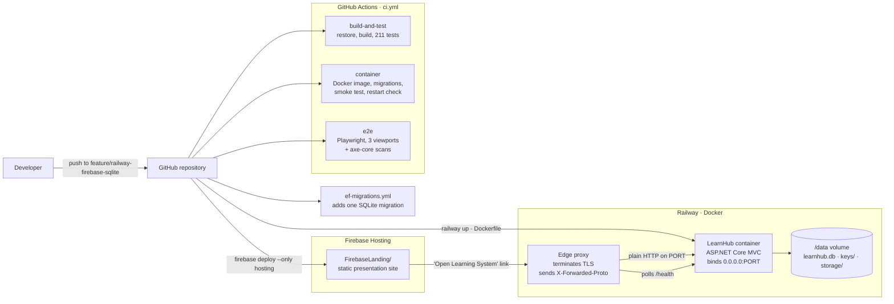

# LearnHub – Architecture and Design

## 1. Architectural style

LearnHub is a single ASP.NET Core MVC application (.NET 10 LTS) organised in clear,
conventional layers. We deliberately avoided Clean Architecture / CQRS / microservices:
the goal is a maintainable application whose every part can be explained.

```
Browser (HTML5, CSS3, Bootstrap 5, JavaScript)
        │  HTTP(S) requests, forms with anti-forgery tokens
        ▼
Razor views  ◄── ViewModels (strongly typed, DataAnnotations)
        │  HTML only: no queries, no business rules
        ▼
Controllers (public/student) + Areas/Admin controllers
        │  HTTP concerns only: binding, ModelState, authorisation, redirects
        ▼
Services (business rules, queries)      ← enrolment, progress, grading, uploads, reports
        │  LINQ, OperationResult
        ▼
EF Core ApplicationDbContext (+ ASP.NET Core Identity)
        │  one provider, one migration set
        ▼
SQLite database file (App_Data/learnhub.db locally, /data/learnhub.db on Railway)
```

| Layer | Folder | Responsibility |
|-------|--------|----------------|
| Models | `Models/` | EF Core entities and enums (the database shape) |
| Data | `Data/` | DbContext, Fluent API configurations, migrations, seeding |
| Services | `Services/` | Business logic and queries; returns ViewModels or `OperationResult` |
| ViewModels | `ViewModels/` | Strongly typed page and form models with DataAnnotations |
| Controllers | `Controllers/`, `Areas/Admin/Controllers/` | Thin HTTP layer, authorisation attributes |
| Views | `Views/`, `Areas/Admin/Views/` | Razor markup only – no business logic |
| Infrastructure | `Infrastructure/` | Cross-cutting: proxy headers, security headers, options, validation attributes |
| Static assets | `wwwroot/` | CSS design system, JavaScript, images, vendored libraries |

Three rules keep the layering honest:

1. **Controllers stay thin.** A controller binds a ViewModel, checks `ModelState`, calls one
   service method and chooses a view or a redirect. Anything that decides an outcome lives in
   `Services/`. Admin controllers inherit `AdminControllerBase`, which contributes only the area,
   the role requirement and small helpers for status messages.
2. **Entities are never bound directly from forms** (overposting protection). Controllers receive
   ViewModels; services map them onto entities.
3. **Views never query.** A view renders what its ViewModel already contains.

## 2. Solution structure

```
LearnHub/
├── .github/workflows/        ci.yml · ef-migrations.yml
├── src/LearnHub/             ASP.NET Core MVC application
├── tests/LearnHub.Tests/     xUnit unit + integration tests (WebApplicationFactory)
├── tests/e2e/                Playwright browser and accessibility tests (mobile / tablet / desktop)
├── scripts/                  smoke test for any running instance, CI helpers, set-app-url.sh
├── FirebaseLanding/          static presentation site (Firebase Hosting)
├── docs/                     assignment documentation (this folder)
├── Dockerfile                multi-stage image built by Railway
├── railway.json              Railway build and deploy (health check) settings
├── firebase.json             Firebase Hosting settings for FirebaseLanding/
├── .env.example              every environment variable, placeholders only
├── LearnHub.sln              solution: application + test projects
└── README.md
```

`src/` and `tests/` are separated because an SDK-style web project compiles every `*.cs`
file below its folder; keeping tests outside the web project folder avoids accidental
compilation of test code into the application.

## 3. HTTP request pipeline

`src/LearnHub/Program.cs` is the composition root. `builder.Services` registers the database,
Identity, the application services and the web concerns in four grouped extension methods
(`AddLearnHubDatabase`, `AddLearnHubIdentity`, `AddLearnHubApplicationServices`,
`AddLearnHubWeb`), then the pipeline is built in this exact order. Order matters: each
component sees the request after everything above it has already run.

| # | Middleware | Why it is here |
|---|------------|----------------|
| 1 | `UsePlatformProxyHeaders()` | Replaces the request scheme and the client address from `X-Forwarded-Proto` / `X-Forwarded-For` **before** anything inspects them. Everything below depends on it. |
| 2 | `UseExceptionHandler("/Error")` · `UseHsts()` *(Production only)* | Friendly error page instead of a stack trace, and HSTS tells browsers to use HTTPS from now on. Both are skipped in Development so the developer exception page and local HTTP keep working. |
| 3 | `UseStatusCodePagesWithReExecute("/Error/{0}")` | Turns a bare status code (for example 404) into the styled error page by re-executing the request through `ErrorController`. |
| 4 | `UseSecurityHeaders()` | Adds `Content-Security-Policy`, `X-Content-Type-Options`, `X-Frame-Options`, `Referrer-Policy`, `Permissions-Policy` and `Cross-Origin-Opener-Policy` to every response via `OnStarting`. |
| 5 | `UseHttpsRedirection()` | Sends `http://` requests to `https://`. Meaningful only because step 1 has already established that the original request was plain HTTP. |
| 6 | `UseResponseCompression()` | Compresses static text assets (CSS, JavaScript, SVG). HTML is deliberately not compressed because pages carry anti-forgery tokens next to user-controlled text. |
| 7 | `UseLearnHubStaticFiles()` | Serves `wwwroot` (with a one-year immutable cache for `?v=` fingerprinted files) and the uploaded course thumbnails. Uploaded lesson documents are **not** static: `ResourcesController` streams them after an access check. |
| 8 | `UseRouting()` | Matches the request to an endpoint so the rate limiter and authentication can see endpoint metadata. |
| 9 | `UseRateLimiter()` | Applies the `forms` policy (fixed window per client IP address) to login, registration, password change and contact posts. |
| 10 | `UseAuthentication()` | Reads the `LearnHub.Auth` cookie and builds `HttpContext.User`. |
| 11 | `UseAuthorization()` | Enforces the role requirements declared on controllers. |
| 12 | `MapLearnHubRoutes()` | Maps `/health`, the `areas` route for `/Admin`, friendly top-level `/About`, `/Contact`, `/Privacy` routes and the default `{controller}/{action}` route. |
| 13 | `InitializeDatabaseAsync()` | Applies migrations, creates the roles, creates the administrator and seeds demo data. Runs once, before the first request. |
| 14 | `RunAsync()` | Starts Kestrel on `http://0.0.0.0:$PORT`. |

### 3.1 Why `UsePlatformProxyHeaders` must come first

Railway terminates TLS at its **edge proxy** and forwards plain HTTP into the container,
describing the original request in the `X-Forwarded-Proto` and `X-Forwarded-For` headers.
ASP.NET Core does **not** read those headers by itself: without the middleware the application
would see every request as `http://` and would believe the client address was the proxy.

That has three visible consequences, and all of them are fixed by step 1:

* `UseHttpsRedirection` would treat every request as plain HTTP. Behind a proxy that already guarantees
  HTTPS, each redirect it issues is offered again as HTTP inside the container, so the browser bounces
  between the two schemes instead of reaching a page – the classic redirect loop.
* `UseHsts` would never send `Strict-Transport-Security`, so browsers would keep trying plain HTTP.
* In Production the identity and anti-forgery cookies are `Secure`-only, so form posts
  (login, registration, contact) would fail.

The switch used on Azure App Service, `ASPNETCORE_FORWARDEDHEADERS_ENABLED=true`, was a hosting-startup
feature of that platform, **not** part of ASP.NET Core; it does not exist in the framework and cannot be
reused here. Hence the explicit middleware. It clears `KnownProxies` and `KnownIPNetworks` because the
platform proxy is the only route into the container and arrives from a private-network address, which the
default loopback-only allow-list would reject.

### 3.2 Port binding

Railway chooses the port at run time and passes it in the `PORT` variable. `UsePlatformPort()` reads it
and binds `http://0.0.0.0:$PORT`, so the container is reachable from the proxy on every interface. The
`PORT=8080` in the image is only a fallback for running the container locally; when `PORT` is absent the
usual ASP.NET Core URL settings apply. `/health` (a `DatabaseHealthCheck` over
`ApplicationDbContext.Database.CanConnectAsync`) is the endpoint Railway polls.

## 4. Database design decisions

The full, code-accurate ERD is in [ERD.md](ERD.md).

### 4.1 One provider, one migration set

SQLite is the **only** database provider. `Data/DatabaseServiceCollectionExtensions.cs` calls
`UseSqlite` unconditionally, there is a single `ApplicationDbContext`, and there is a single
migrations folder:

| Concern | Location |
|---------|----------|
| Context | `Data/ApplicationDbContext.cs` (Fluent API split into `Data/Configurations/`) |
| Migrations | `Data/Migrations/` – currently `20260914100832_InitialCreate`, creating 18 tables |
| Design-time factory | `Data/DesignTimeDbContextFactory.cs` |
| Registration | `Data/DatabaseServiceCollectionExtensions.AddLearnHubDatabase` |

The initial migration creates the eleven application tables (`Categories`, `Courses`,
`LearningResources`, `Enrollments`, `ResourceCompletions`, `Quizzes`, `Questions`,
`AnswerOptions`, `QuizAttempts`, `QuizAnswers`, `ContactMessages`) together with the seven
ASP.NET Core Identity tables (`AspNetUsers`, `AspNetRoles`, `AspNetUserRoles`,
`AspNetUserClaims`, `AspNetRoleClaims`, `AspNetUserLogins`, `AspNetUserTokens`).

An earlier design carried two providers (SQLite for development, SQL Server for production)
with two contexts and two migration folders. EF Core migrations are provider-specific, so
that meant generating and maintaining every schema change twice. Removing it left one model,
one history and one place where schema drift can hide.

### 4.2 Connection-string resolution

Resolution happens in `SqliteConnectionStrings` and follows one rule:

| Priority | Source | Typical value |
|----------|--------|---------------|
| 1 | Environment variable `DATABASE_CONNECTION_STRING` | `Data Source=/data/learnhub.db` (Railway volume) |
| 2 | `ConnectionStrings:DefaultConnection` | `Data Source=App_Data/learnhub.db` (local default) |

A relative `Data Source` path is made absolute against the **content root** – not the current
working directory – and its folder is created if it does not exist. The database location
therefore does not depend on how the process was started, and an empty volume works on the
first start. In-memory SQLite (`:memory:`) is recognised and left untouched, which is how the
integration tests isolate themselves.

`DesignTimeDbContextFactory` resolves the connection string the same way for the `dotnet ef`
tools, so a migration is always generated against the schema the running application uses.

### 4.3 Migrations and seeding at start-up

`Data/Seed/DatabaseInitializer.cs` runs once before the first request:

1. if `Database:ApplyMigrationsOnStartup` (default `true`) is set, apply every pending migration;
   if it is `false` and migrations are pending, log a clear warning and skip seeding instead of
   failing;
2. create the `Admin` and `Student` roles;
3. create the first administrator from `Seed:AdminEmail` / `Seed:AdminPassword`, only when no user
   with that email exists – roles and passwords of existing accounts are never re-applied;
4. seed the demonstration catalogue when `Seed:DemoData` is true and the database is still empty.

Seeding one empty database produces 8 categories, 12 courses (11 published, 1 draft),
64 learning resources, 11 quizzes, 54 questions, 216 answer options and 7 learners. Those
accounts are DEMO ONLY and exist so dashboards and progress pages look realistic.

### 4.4 Delete behaviour (intentional)

| Relationship | Behaviour | Reason |
|--------------|-----------|--------|
| Category → Courses | **Restrict** | Deleting a category must never silently delete courses. The admin must move or delete courses first. |
| Course → Resources, Quizzes, Enrolments | Cascade | A course owns its content; the delete page shows the full impact before confirmation. |
| Quiz → Questions → AnswerOptions | Cascade | Questions cannot exist without their quiz. |
| Quiz → QuizAttempts → QuizAnswers | Cascade | Attempts are meaningless without the quiz. |
| QuizAnswer → Question / AnswerOption | **Restrict** | Keeps the schema portable and deterministic. Removing a question or an answer option is an explicit service operation that deletes or clears dependent answers first, in one transaction (`Data/TransactionExtensions.cs`). |
| User → Enrolments, QuizAttempts, ResourceCompletions | Cascade | Removing an account removes that person's learning records. |
| LearningResource → ResourceCompletions | Cascade | Completion records belong to the resource. |

### 4.5 Derived rather than duplicated state

* **Course progress** is calculated, not stored: completed resources + passed published
  quizzes divided by total resources + published quizzes. Adding a new lesson therefore
  correctly lowers progress, and there is no stale `ProgressPercent` column.
* **Quiz attempts** store a score snapshot (`CorrectCount`, `QuestionCount`, `ScorePercent`,
  `Passed`) because the quiz may be edited after the attempt; history must stay truthful.
* **Deactivated users** use Identity's built-in lockout (`LockoutEnd = DateTimeOffset.MaxValue`)
  rather than a duplicate `IsActive` flag.
* **Timestamps** are stored as UTC through a value converter (`Data/UtcDateTimeConverter.cs`) and
  rendered in the visitor's local time by a small progressive-enhancement script.

## 5. Roles and authorisation

| Role | How obtained | Scope |
|------|--------------|-------|
| Guest | Not signed in | Public pages, published courses, preview resources |
| Student | Automatically on registration | Dashboard, enrolment, resources of enrolled courses, quizzes, profile |
| Admin | Seeded from configuration or promoted by another admin | Everything in `/Admin` plus preview of all content |

Authorisation is declarative: `[Authorize(Roles = AppRoles.Student)]` on student
controllers and a shared `AdminControllerBase` with `[Area("Admin")]` and
`[Authorize(Roles = AppRoles.Admin)]` (the literal role `"Admin"`) that every admin controller
inherits, so a new admin controller cannot be added without protection. Ownership checks (IDOR)
are done in services (for example a quiz result is only returned when
`attempt.UserId == currentUserId`).

## 6. Routes

### Public and student

| Route | Controller.Action | Access |
|-------|-------------------|--------|
| `/` | Home.Index | Everyone |
| `/About`, `/Contact`, `/Privacy` | Home.About / Contact / Privacy | Everyone |
| `/Courses?q=&categoryId=&difficulty=&sort=&page=` | Courses.Index | Everyone |
| `/Courses/Details/{id}` | Courses.Details | Everyone (published courses) |
| `POST /Courses/Enroll/{id}` · `POST /Courses/Leave/{id}` | Courses.Enroll / Leave | Student |
| `/Resources/Details/{id}` | Resources.Details | Preview: everyone · otherwise enrolled student or admin |
| `/Resources/Open/{id}` | Resources.Open (file stream) | Same rule as above |
| `POST /Resources/ToggleComplete/{id}` | Resources.ToggleComplete | Enrolled student |
| `/Quizzes/Take/{id}` · `POST /Quizzes/Take/{id}` | Quizzes.Take | Enrolled student |
| `/Quizzes/Result/{attemptId}` · `/Quizzes/History` | Quizzes.Result / History | Owner student |
| `/Student/Dashboard` · `/Student/MyCourses` | Student.Dashboard / MyCourses | Student |
| `/Profile` · `/Profile/ChangePassword` | Profile.Index / ChangePassword | Signed-in user |
| `/Account/Register` · `/Account/Login` · `POST /Account/Logout` · `/Account/AccessDenied` | Account.* | Everyone |
| `/Error/{statusCode}` · `/Error` | Error.* | Everyone |
| `/health` | Health check (database connectivity) | Everyone |

### Admin area (`[Authorize(Roles = "Admin")]`)

| Route | Purpose |
|-------|---------|
| `/Admin` | Dashboard |
| `/Admin/Courses` (+ `/Create`, `/Edit/{id}`, `/Details/{id}`, `/Delete/{id}`) | Course CRUD |
| `/Admin/Categories` (+ Create/Edit/Delete) | Category CRUD |
| `/Admin/Resources` (+ Create/Edit/Delete) | Learning resource CRUD |
| `/Admin/Quizzes` (+ Create/Edit/Details/Delete) | Quiz CRUD |
| `/Admin/Questions/Create?quizId=` (+ Edit/Delete) | Question and answer option CRUD |
| `/Admin/QuizAttempts` (+ Details/Delete) | Quiz results |
| `/Admin/Enrollments` (+ Create/Delete) | Enrolment management |
| `/Admin/Users` (+ Details, role change, deactivate, Delete) | User management |
| `/Admin/Messages` (+ Details/Delete) | Contact message inbox |

## 7. Configuration and secrets

Options classes are bound from configuration sections, and every one of them can be overridden by
an environment variable: ASP.NET Core maps `Seed__AdminPassword` onto `Seed:AdminPassword` using a
double underscore for the section separator, so no code change is needed to move between
environments.

| Options class | Section | Purpose |
|---------------|---------|---------|
| `DatabaseOptions` | `Database` | `ApplyMigrationsOnStartup`, and the name of the connection-string variable |
| `SeedOptions` | `Seed` | Demo data switch, administrator and demo-student accounts |
| `StorageOptions` | `Storage` | Private folder for uploaded files and thumbnails |
| `RateLimitingOptions` | `RateLimiting` | Permit limit and window for the form rate limiter |
| `SiteOptions` | `Site` | Repository and presentation-site links shown in the footer and on the About page |

Two values sit outside those sections: `DATABASE_CONNECTION_STRING` (see 4.2) and
`DataProtection:KeysPath`, which persists the Data Protection key ring that encrypts the
sign-in and anti-forgery cookies.

`.env.example` lists every variable with a placeholder value and a comment, and is the only
file of its kind in Git. `.env` itself, `App_Data/`, `*.db` and local user secrets are
git-ignored, and the Docker build excludes them too (`.dockerignore`), so neither the image
nor the repository can contain a real credential. In Development the demo passwords are
generated on first start into `App_Data/demo-credentials.json`, which is also git-ignored;
in Production they must come from `Seed__AdminPassword` / `Seed__DemoStudentPassword`.

## 8. Security design

| Threat | Control |
|--------|---------|
| SQL injection | Only EF Core LINQ (parameterised). Search uses `EF.Functions.Like` with escaped wildcards. |
| XSS | Razor HTML-encodes all output. Lesson text is encoded first, then a fixed allow-list of tags is applied (`LessonContentRenderer`). Strict Content-Security-Policy without inline scripts. |
| CSRF | Global `AutoValidateAntiforgeryTokenAttribute`; all state changes are POST forms with tokens. |
| IDOR | Services check ownership/enrolment for attempts, resources and files. Resource files are streamed by a controller after an access check, never exposed as static files. |
| Overposting | Forms bind to ViewModels only. |
| File uploads | Extension allow-list (`.jpg`, `.jpeg`, `.png`, `.webp`, `.pdf`), size limit (2 MB image / 10 MB document), magic-byte signature check, random file names, storage outside `wwwroot`, SVG/HTML never accepted. |
| Video embeds | URLs parsed with strict host/ID rules and rebuilt as `youtube-nocookie.com` / `player.vimeo.com` embed URLs; CSP `frame-src` allow-list. |
| Brute force | Identity lockout (5 failed attempts, 15-minute lockout) and a fixed-window rate limit (10 per minute per IP address) on login, registration, password change and contact; honeypot field on the contact form. |
| Session security | HttpOnly, SameSite=Lax cookies, `Secure`-only outside Development; security stamp re-validated every 5 minutes so role changes and deactivation take effect; 8-hour sliding expiry. |
| Secrets | Nothing sensitive is committed: the administrator password is a Railway service variable (or user-secrets locally), and `.env`, `App_Data/` and connection strings never reach Git. |
| Information disclosure | Developer exception page only in Development; friendly error pages elsewhere; security headers (`X-Content-Type-Options`, `Referrer-Policy`, `X-Frame-Options`, `Permissions-Policy`, HSTS in Production). |

The full threat model and residual risks are in [SECURITY.md](SECURITY.md).

## 9. Front-end design

* Bootstrap 5.3 provides the grid, utilities and accessible components.
* `wwwroot/css/site.css` defines the LearnHub design system (colour tokens, typography,
  spacing, radii, shadows) and component styles (navbar, hero, course cards, dashboard,
  tables, forms, empty states). `admin.css` adds the admin shell.
* JavaScript is progressive enhancement only: validation styling and ARIA wiring,
  password strength meter, character counters, image preview, quiz answered-count and
  unanswered warning, local-time formatting, confirm dialogs. Every feature works without
  JavaScript because validation and processing are repeated on the server.
* Libraries are vendored in `wwwroot/lib` (no runtime CDN), which keeps the CSP strict.

## 10. Deployment architecture



* **Railway** builds `Dockerfile` (multi-stage: .NET 10 SDK build stage → ASP.NET Core 10 runtime
  stage), runs the container with the variables from `.env.example` and polls `/health`.
  `railway.json` holds the builder, the health-check path and timeout, and the restart policy.
* **A Railway volume mounted at `/data`** carries all persistent state: the SQLite file, the Data
  Protection key ring and admin uploads. Without it, a redeploy would start from an empty database
  and invalidate every signed-in session. This is the deliberate answer to "SQLite on an ephemeral
  filesystem", and the CI `container` job proves it by restarting the container and asserting that
  migrations are not re-applied.
* **Firebase Hosting** serves the static presentation site in `FirebaseLanding/` (a landing page,
  a 404 page, the design system, the Overpass webfont and eight real screenshots). Firebase cannot
  execute ASP.NET Core, so this part only presents the project and links to the Railway application
  through its "Open Learning System" call to action. It is live at
  <https://learnhub-wapp.web.app>.

Step-by-step commands are in [DEPLOYMENT.md](DEPLOYMENT.md).

### 10.1 Why not Azure

The assignment for this project does not permit it, and the replacement stack is a better fit
anyway:

* **No vendor lock-in.** The application is an ordinary container built from a public
  `Dockerfile`; it can run on any container host, or locally with `docker run`. Nothing in the
  code names a cloud provider.
* **One database engine everywhere.** SQLite needs no server, no credentials and no network
  hop, so local development, CI and production run the same provider and the same migrations.
  The trade-off – a single writer and no horizontal scaling – is acceptable for a single-instance
  teaching application, and it is covered by the volume described above.
* **Static hosting stays static.** Firebase Hosting serves the presentation site from a CDN;
  the dynamic application lives where it can actually run.
* **Fewer moving parts to explain.** Three services, one image, one environment-variable file –
  which matters when the deployment has to be defended in a viva.

## 11. Cloud-based development workflow

Development machines with little free disk space do not need the .NET SDK locally: GitHub Actions
restores, builds, runs the whole test suite, builds and exercises the container the way Railway
does, runs the browser and accessibility tests, and generates EF Core migrations
(`ef-migrations.yml`). With the SDK installed you can use the normal local commands
documented in the README and in [DEPLOYMENT.md](DEPLOYMENT.md).
