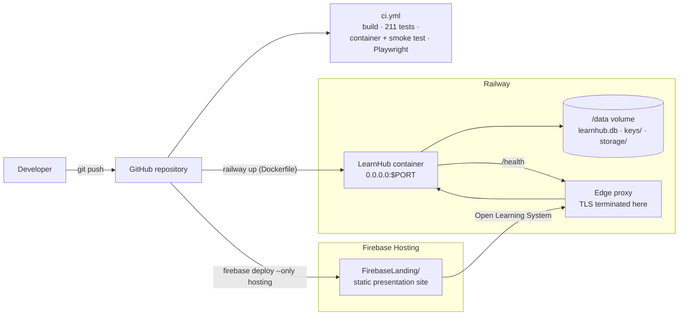

# LearnHub – Deployment Guide

## 1. Overview

LearnHub is delivered by three services, each doing one job:

| Part | Service | What it does |
|------|---------|--------------|
| Source and automation | **GitHub** (`JahongirmirzoDv/LearnHub`) | Holds the code, runs `ci.yml` on every push and can add a migration with `ef-migrations.yml` |
| Application | **Railway** (Docker) | Runs the ASP.NET Core MVC application from `Dockerfile`, with a volume at `/data` holding the SQLite database, the Data Protection keys and uploads |
| Presentation | **Firebase Hosting** | Serves the static site in `FirebaseLanding/` (landing page, screenshots, design system) |

**Firebase Hosting cannot run ASP.NET Core.** It serves static files from a CDN and has no server-side
runtime, so it cannot execute a .NET application, open a database or keep a session. It therefore
*presents* the project – what it is, who it is for, screenshots and links – and its "Open Learning System"
call to action points at the Railway deployment, which is where the working application lives.



**Current state of the deployment:**

* **Firebase Hosting is live:** <https://learnhub-wapp.web.app> (verified: `/` returns 200,
  `/assets/site.css` returns 200, `/assets/screens/home-desktop.png` returns 200, an unknown path
  returns 404).
* **Railway has not been deployed yet.** The `Dockerfile`, `railway.json` and `.env.example` are in place
  and the CI `container` job builds the image and exercises it the way Railway would, but the Railway CLI
  on this machine is not authenticated (`railway whoami` reports `Unauthorized`). Everything in section 2
  is therefore a set of steps to follow, not a description of a running service. Set
  `Site__PresentationUrl` and run the `set-app-url.sh` step after the first deploy, once the real domain
  exists.
* No credential, connection string or token is stored in the repository. Railway holds the secrets as
  service variables.

## 2. Deploy to Railway, step by step

### 2.1 Prerequisites

* A Railway account (<https://railway.com>) and the CLI: `npm install -g @railway/cli`
  (or `brew install railway`).
* The repository cloned locally, on the branch that holds the container files.
* An administrator password you generate yourself and keep out of Git (a password manager or the
  Railway dashboard).

### 2.2 Sign in and create (or link) the project

Run these from the repository root, so the CLI picks up the working directory.

```bash
cd LearnHub

# 1. Sign in (opens a browser; `railway login --browserless` prints a code instead)
railway login
railway whoami          # confirms the account

# 2a. First time: create the project and the service
railway init --name learnhub

# 2b. Already created the project in the dashboard: link this directory to it instead
railway link            # or: railway link --project <project-id>
```

`railway init` uploads nothing by itself; it creates the project and links the current directory to it.
If you create the service in the Railway dashboard instead, run `railway service` afterwards to link
the directory to that service.

### 2.3 Create the volume first

Create the volume **before** the first deploy, so the very first start already writes to persistent
storage:

```bash
railway volume add --mount-path /data
railway volume list      # shows the volume, its mount path and the service it is attached to
```

### 2.4 Set the variables

Every variable is listed in `.env.example`. Either paste them into
**Railway → your service → Variables**, or use the CLI (add `--service <name>` when the project has
more than one service):

```bash
railway variables --set "ASPNETCORE_ENVIRONMENT=Production" \
                  --set "DATABASE_CONNECTION_STRING=Data Source=/data/learnhub.db" \
                  --set "DataProtection__KeysPath=/data/keys" \
                  --set "Storage__RootPath=/data/storage" \
                  --set "Seed__AdminEmail=admin@learnhub.local" \
                  --set "Seed__AdminPassword=<a strong password you choose>" \
                  --set "Seed__DemoStudentEmail=demo.student@example.com" \
                  --set "Seed__DemoStudentPassword=<another strong password>" \
                  --set "Seed__DemoData=true"
```

| Variable | Example / placeholder | Purpose |
|----------|-----------------------|---------|
| `ASPNETCORE_ENVIRONMENT` | `Production` | Turns on the friendly error page, HSTS and the `Secure`-only cookie policy. Development is for local work only. |
| `DATABASE_CONNECTION_STRING` | `Data Source=/data/learnhub.db` | The SQLite file on the volume. Overrides `ConnectionStrings:DefaultConnection` from `appsettings.json`. |
| `DataProtection__KeysPath` | `/data/keys` | Where the Data Protection key ring lives. It encrypts the sign-in and anti-forgery cookies, so it must persist. |
| `Storage__RootPath` | `/data/storage` | Private folder for administrator uploads and generated thumbnails, outside `wwwroot`. |
| `Seed__AdminEmail` | `admin@learnhub.local` | Email of the administrator created on the first start of an empty database. |
| `Seed__AdminPassword` | `<a strong password you choose>` | **Required for the admin area to be usable.** See the warning below. |
| `Seed__DemoStudentEmail` | `demo.student@example.com` | Email of the demonstration student. |
| `Seed__DemoStudentPassword` | `<another strong password>` | Without it the demo student exists (so the dashboards look realistic) but cannot sign in. |
| `Seed__DemoData` | `true` | Seeds the demonstration catalogue into an empty database. Set to `false` for a clean installation. |

The remaining optional variables:

| Variable | Example / placeholder | Purpose |
|----------|-----------------------|---------|
| `Site__RepositoryUrl` | `https://github.com/JahongirmirzoDv/LearnHub` | Repository link shown in the footer and on the About page. |
| `Site__PresentationUrl` | `https://learnhub-wapp.web.app` | Link from the application back to the presentation site. |
| `Database__ApplyMigrationsOnStartup` | `true` (default) | Leave `true` for the single-instance deployment used here. |
| `RateLimiting__PermitLimit` / `RateLimiting__WindowSeconds` | `10` / `60` (defaults) | Form submissions per IP address per window. |

> **Without `Seed__AdminPassword`, no administrator exists.** The application creates the administrator
> only on the first start of an empty database, and only when that variable is set. Without it, start-up
> logs a warning, the `Admin` role exists but nobody holds it, and `/Admin` is unreachable – there is no
> default password and no back door. Set the variable (a strong one: it must satisfy the Identity rules,
> so at least 8 characters with upper case, lower case and a digit) and restart. If the account was
> already created with different credentials, the initialiser deliberately does not touch it; promote a
> user from an existing administrator account instead.

### 2.5 Deploy

```bash
railway up                    # builds Dockerfile on Railway and deploys, streaming the build log
railway up --detach           # the same, without attaching to the log stream
railway logs                  # follow the application log afterwards
```

Then generate the public domain and check the result:

```bash
railway domain                # creates/prints the *.up.railway.app domain
railway status                # linked project, service and environment
curl -fsS https://<service>.up.railway.app/health
```

The first start applies the migration, creates the roles, creates the administrator (when
`Seed__AdminPassword` is set) and seeds the demo catalogue, so it can take a minute on a cold start.
Railway waits for the health check before it routes traffic to the new deployment.

**Port binding.** Railway injects `PORT` at run time and the application binds `http://0.0.0.0:$PORT`
(`UsePlatformPort`). Do not set `PORT` yourself on Railway. The `PORT=8080` in the image is only a
fallback for running the container locally; if `PORT` is absent, the normal ASP.NET Core URL settings
apply.

**Health check.** `railway.json` configures `/health` with a 300-second timeout and a restart-on-failure
policy. `/health` runs `DatabaseHealthCheck`, which reports whether the SQLite file is reachable – so a
deployment only goes live once the database really works. A push to the connected branch redeploys
automatically; `railway up` deploys the working directory as it is on disk.

## 3. Why the volume matters

A container filesystem is **ephemeral**: it is recreated from the image on every deploy, restart or
crash. Anything written inside the container is lost at that moment. A Railway volume is a disk that is
mounted back into the container at the same path every time, so the three things LearnHub writes are
placed there:

| Path on the volume | What it holds | What is lost without the volume |
|--------------------|---------------|---------------------------------|
| `/data/learnhub.db` | The whole SQLite database | Every redeploy starts from an empty database: courses, enrolments, attempts and registered accounts disappear, and the seeder runs again from scratch |
| `/data/keys` | The Data Protection key ring | The keys that encrypt the authentication cookies are regenerated, so **every signed-in user is signed out** and any pending anti-forgery token becomes invalid |
| `/data/storage` | Uploaded resource files and thumbnails | Files uploaded through the admin area vanish while their database rows survive, leaving broken resources |

This is also the deliberate, easy-to-explain answer to the question **"is SQLite not a bad choice on an
ephemeral filesystem?"** – it would be, if the file lived inside the container. It does not: the image is
disposable and the volume is the database. The CI `container` job proves the point mechanically: it runs
the image with `--mount type=volume,source=learnhub-data,target=/data`, then restarts the container and
asserts that the log does **not** contain `Applying migration` a second time, because the schema was
already there. It then keeps the data across rollbacks too (section 8).

Deleting a volume is the destructive equivalent of dropping the database: do it only deliberately, from
the Railway dashboard, and expect a fresh seed on the next start.

## 4. Deploy the Firebase Hosting site

The presentation site in `FirebaseLanding/` is deployed with the Firebase CLI. `firebase.json` sets
`"public": "FirebaseLanding"` and `.firebaserc` sets the default project to `learnhub-wapp`.

```bash
# 1. Sign in and check which project is selected
firebase login
firebase projects:list

# 2a. Use the existing project (already the default in .firebaserc)
#     -> nothing to do; continue with step 3

# 2b. Or create your own project and point .firebaserc at it
firebase projects:create learnhub-wapp --display-name "LearnHub"
firebase use learnhub-wapp

# 3. Deploy only the hosting site
firebase deploy --only hosting
```

The site is already live at <https://learnhub-wapp.web.app>.

**Point the call to action at the real Railway domain.** The landing page ships with a conventional
Railway address as a placeholder, because Railway generates the domain when the service is created.
Once the application is deployed, rewrite it and redeploy:

```bash
scripts/set-app-url.sh https://<service>.up.railway.app
firebase deploy --only hosting
```

The script replaces every `https://<something>.up.railway.app` link on the landing page, refuses to run
if it cannot find one, and prints how many links it changed. It is safe to run repeatedly. The static
site contains no secrets and no server-side code, so a hosting deploy cannot break the application.

## 5. Local development

```bash
dotnet restore                                   # restore NuGet packages
dotnet build LearnHub.sln                        # build
dotnet run --project src/LearnHub                # run the application
```

The default address is printed on start-up (Kestrel's `http://localhost:5xxx`). Development uses
SQLite in `App_Data/learnhub.db`; no database server is needed. Migrations, roles and the administrator
are applied on the first start exactly as in production, and the demo catalogue is seeded so the
dashboards are not empty.

**Demo credentials.** In Development, when no demo passwords are configured, `DevelopmentSeedPasswords`
generates strong random ones and writes them to:

```
App_Data/demo-credentials.json     (git-ignored – generated on the first Development start)
```

Read the administrator and demo-student passwords there and sign in. The file is deliberately ignored by
Git, so a password is never committed; the accounts are DEMO ONLY. If you would rather choose the
passwords yourself, set them with user-secrets or environment variables and the generator leaves them
alone:

```bash
dotnet user-secrets set "Seed:AdminPassword" "<a strong password>" --project src/LearnHub
dotnet user-secrets set "Seed:DemoStudentPassword" "<another strong password>" --project src/LearnHub
```

**Resetting local state.** Stop the application, delete `App_Data/`, and start again: the folder holds
the SQLite file, the generated credentials and the storage folder. The next start recreates the database
and reseeds it, so any local accounts, enrolments or uploads are gone.

For a Railway-like run on your own machine – Production settings, the image's own variables and a
volume-like mount – use the same shape the CI `container` job uses:

```bash
docker build --tag learnhub:local .
docker run --rm --publish 8080:8080 \
  --mount type=volume,source=learnhub-local,target=/data \
  --env Seed__AdminPassword="<a strong password>" \
  learnhub:local
# then: curl -fsS http://127.0.0.1:8080/health
```

## 6. Database migrations

The `dotnet-ef` tool is pinned in `.config/dotnet-tools.json`, so restore it once per clone:

```bash
dotnet tool restore

# Add a migration after changing an entity or a Fluent API configuration
dotnet ef migrations add <Name> --project src/LearnHub --output-dir Data/Migrations

# Apply it to the local App_Data database
dotnet ef database update --project src/LearnHub
```

Use a PascalCase name that says what changed, for example `AddCourseLevel`. There is exactly one
migration folder (`src/LearnHub/Data/Migrations`) because there is exactly one provider: SQLite.
`DesignTimeDbContextFactory` resolves the connection string the same way the application does, so a
migration is always generated against the right schema, and `dotnet ef` does not need the web application
to start.

**Migrations also run automatically at start-up.** `DatabaseInitializer` applies every pending migration
when `Database:ApplyMigrationsOnStartup` is `true` (the default, and the right setting for the
single-instance Railway deployment), then creates the roles, the administrator and the demo data. That is
why the image needs no separate migration step and why a deploy can go from "image pulled" to "schema
current" on its own. If you ever set the flag to `false`, start-up logs a warning and skips seeding
instead of failing – run `dotnet ef database update` against the deployed database first.

**Without the .NET SDK**, run the **Actions → EF Core migration (cloud)** workflow
(`.github/workflows/ef-migrations.yml`). Give it a PascalCase name; it restores the tools, adds the
migration to `Data/Migrations`, verifies the solution still builds and commits the result to the
selected branch. Pushing that commit redeploys the application, which applies the migration on start-up.

Migrations are forward-only. To undo one in production, add a new migration that reverses it rather than
editing history.

## 7. Verify the deployment

Run these after a deploy, in order. The first two catch a broken image; the rest confirm the
application really works as a signed-in user.

| # | Check | How | Expected |
|---|-------|-----|----------|
| 1 | Health | `curl -fsS https://<domain>/health` | HTTP 200 with `Healthy` |
| 2 | Home page | Open `https://<domain>/` | The catalogue page loads with seeded courses |
| 3 | Register and sign in | Register a new account, sign out, sign in again | Redirected to the student dashboard; the name shows in the navbar |
| 4 | Admin sign-in | Sign in with `Seed__AdminEmail` and `Seed__AdminPassword` | `/Admin` dashboard with seeded figures |
| 5 | Admin CRUD | For example Admin → Categories → create a category, edit it, delete it | The change is saved and shown; the success message appears |
| 6 | Smoke test | `scripts/smoke-test.sh https://<domain>` | "All smoke checks passed for https://<domain>" |
| 7 | HTTPS and headers | Open the `http://` address, or inspect the response headers | Redirected to `https://`; `Content-Security-Policy`, `X-Content-Type-Options` and `Referrer-Policy` present |
| 8 | Persistence | Redeploy (or `railway redeploy`) and sign in again | The account and its data are still there and the session survives |

The smoke test covers the guest journey and needs no credentials:

```bash
SMOKE_WAIT_SECONDS=300 scripts/smoke-test.sh https://<service>.up.railway.app
```

It waits for `/health`, loads every public page, follows the course and preview-lesson links it finds,
asserts that the protected areas redirect to the login page (302), and checks the security headers.
`SMOKE_WAIT_SECONDS` covers a cold start.

## 8. Rollback

**Roll back the application.** Railway keeps the deployment history, so no rebuild is needed:

* **Dashboard:** open the service → **Deployments**, find the last good deployment and choose
  **Redeploy**.
* **CLI:** `railway redeploy` redeploys the most recent deployment of the linked service, or pick a
  specific one from `railway deployment list` / the dashboard.
* **From Git:** revert the faulty commit (`git revert <sha>`) and push, or run `railway up` from a
  checked-out good commit.

**The volume preserves the data across a rollback.** The volume is attached to the service, not to a
deployment, so rolling the code back does not touch `/data`: the SQLite file, the Data Protection key
ring and the uploads stay exactly as they are. Signed-in users therefore stay signed in.

One caveat is worth stating plainly: rolling back **code** does not roll back the **schema**. Migrations
are forward-only, so if the bad deployment added a migration, the old code now runs against a newer
schema. SQLite tolerates an extra table or an added nullable column, but a destructive migration (a
dropped or renamed column) needs a new forward migration that restores it, or a restore of the database
file from a backup you took before deploying.

## 9. Troubleshooting

| Symptom | Likely cause and fix |
|---------|----------------------|
| Redirect loop, or HSTS never sent, or login and other form posts fail over HTTPS | The application is not reading the proxy headers, so it thinks every request is plain HTTP. `UsePlatformProxyHeaders()` must be the first middleware in `Program.cs`; `ASPNETCORE_FORWARDEDHEADERS_ENABLED` is an Azure App Service feature and does nothing here. Check that `ASPNETCORE_ENVIRONMENT=Production` and that the container is reached through Railway's proxy, not port-forwarded directly. |
| Everyone is signed out after a redeploy | The Data Protection key ring is not on the volume. Set `DataProtection__KeysPath=/data/keys`, confirm the volume is mounted at `/data`, and redeploy. Sign-ins made before the fix cannot be recovered – the old keys are gone with the container. |
| `SqliteException: no such table: Courses` (or any other table) | The migrations did not run, or the application is looking at the wrong file. Check `Database__ApplyMigrationsOnStartup=true`, look for the `Applying database migrations` line in the log, and confirm `DATABASE_CONNECTION_STRING=Data Source=/data/learnhub.db` matches the volume mount path. A relative path resolves against the content root, which is `/app` in the image – not the volume. |
| No administrator account; `/Admin` always redirects to access denied | `Seed__AdminPassword` was missing on the first start of an empty database, so no administrator was created. Set it (and `Seed__AdminEmail`), restart, and read the `Administrator account … created` line in the log. The account is only created when it does not already exist. |
| The build fails, or the image cannot be built on Railway | The .NET SDK version. `global.json` pins SDK `10.0.100` with `rollForward: latestFeature` and `Directory.Build.props` targets `net10.0`: an older SDK cannot build the project, and the Docker build stage uses `mcr.microsoft.com/dotnet/sdk:10.0`. Run `dotnet --version` locally and install .NET 10 if it reports an older one. |
| `/health` never returns 200 and Railway keeps restarting the deployment | The database file is unreachable: the volume is missing or not mounted at `/data`. Run `railway volume list`, re-attach the volume, and check `railway logs` for the migration error. |
| HTTP 429 on login, registration or contact | The form rate limiter: 10 submissions per minute per IP address by default. Wait for the window to pass, or raise `RateLimiting__PermitLimit` for a demonstration. |
| The first request times out | A cold start: the image is starting, the migration is running and the demo catalogue is being seeded. Railway waits for the health check (300 s in `railway.json`); retry, and use `SMOKE_WAIT_SECONDS=300` with the smoke test. |
| The presentation site still opens the placeholder Railway URL | Run `scripts/set-app-url.sh https://<service>.up.railway.app` and then `firebase deploy --only hosting`. |
| Need the log | `railway logs` (or the Railway dashboard → service → **Logs**). Start-up prints migrations, seed counts and the administrator creation result. |

## 10. Environment variables

Every variable is documented with placeholder values in `.env.example`, which is the only such file in
Git. Copy it for local use, or paste the values into the Railway dashboard. **Never commit a filled-in
`.env`, and never put a real password in this document, in `.env.example` or anywhere else in the
repository**: the `.gitignore` excludes `.env`, `.env.*` (keeping only `.env.example`), `App_Data/`,
`*.db` and `appsettings.*.local.json`, and `.dockerignore` keeps them out of the image as well.

| Variable | Required | Example / placeholder | Purpose |
|----------|----------|-----------------------|---------|
| `ASPNETCORE_ENVIRONMENT` | Yes | `Production` | Error handling, HSTS and cookie policy |
| `DATABASE_CONNECTION_STRING` | Yes | `Data Source=/data/learnhub.db` | SQLite file on the volume; wins over `ConnectionStrings:DefaultConnection` |
| `DataProtection__KeysPath` | Yes | `/data/keys` | Persistent key ring for the sign-in and anti-forgery cookies |
| `Storage__RootPath` | Yes | `/data/storage` | Private folder for uploads and thumbnails |
| `Seed__AdminEmail` | Yes | `admin@learnhub.local` | Administrator to create on the first start |
| `Seed__AdminPassword` | Yes | `<a strong password you choose>` | Without it there is no administrator and the admin area is unreachable |
| `Seed__DemoStudentEmail` | Recommended | `demo.student@example.com` | Demonstration student |
| `Seed__DemoStudentPassword` | Recommended | `<another strong password>` | Without it the demo student cannot sign in |
| `Seed__DemoData` | Recommended | `true` | Seed the demonstration catalogue into an empty database |
| `Database__ApplyMigrationsOnStartup` | Optional | `true` (default) | Apply pending migrations at start-up |
| `RateLimiting__PermitLimit` / `RateLimiting__WindowSeconds` | Optional | `10` / `60` (defaults) | Form submissions per IP address per window |
| `Site__RepositoryUrl` | Optional | `https://github.com/JahongirmirzoDv/LearnHub` | Footer and About-page link |
| `Site__PresentationUrl` | Optional | `https://learnhub-wapp.web.app` | Link back to the presentation site |
| `PORT` | No – set by Railway | `8080` (image fallback only) | The port the application binds on `0.0.0.0` |

A variable name uses a double underscore for each `:` in `appsettings.json`: `Seed__AdminPassword` is
`Seed:AdminPassword`, and `DataProtection__KeysPath` is `DataProtection:KeysPath`. Both
`appsettings.json` and `appsettings.Development.json` are committed and contain no secrets.
