# LearnHub – Flowcharts

Each flowchart follows the real code path. File paths are relative to `src/LearnHub/`.

## 1. Request pipeline

Every request passes through the middleware configured in `Program.cs`. Railway terminates TLS at its edge proxy and
forwards plain HTTP with `X-Forwarded-Proto` and `X-Forwarded-For`, so `UsePlatformProxyHeaders()` runs first and
turns those headers into `Request.IsHttps` and the real client address.

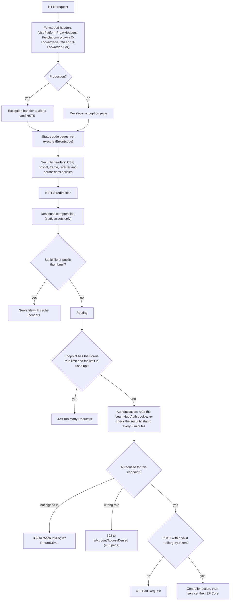

## 2. Start-up: database initialisation

`Data/Seed/DatabaseInitializer.cs` runs once before the application starts listening.

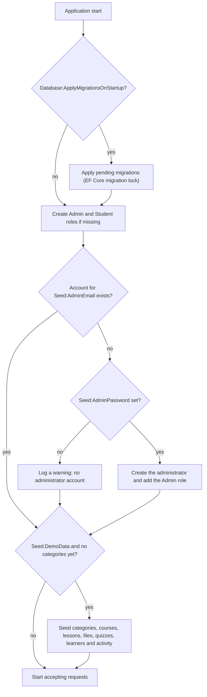

## 3. Registration

`Controllers/AccountController.cs` (Register) and `ViewModels/Account/AccountViewModels.cs`.

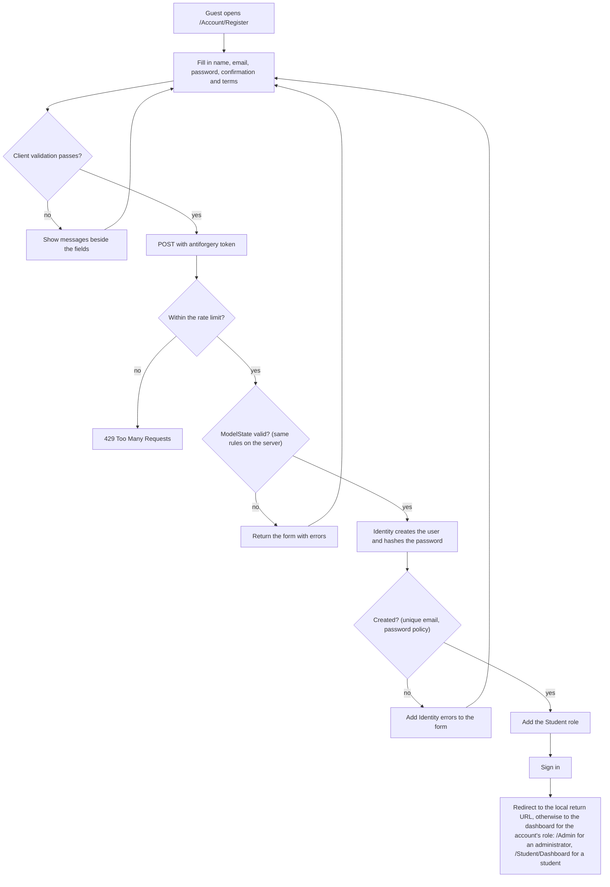

## 4. Login

`Controllers/AccountController.cs` (Login). Identity options: 5 failed attempts lock the account for 15 minutes.

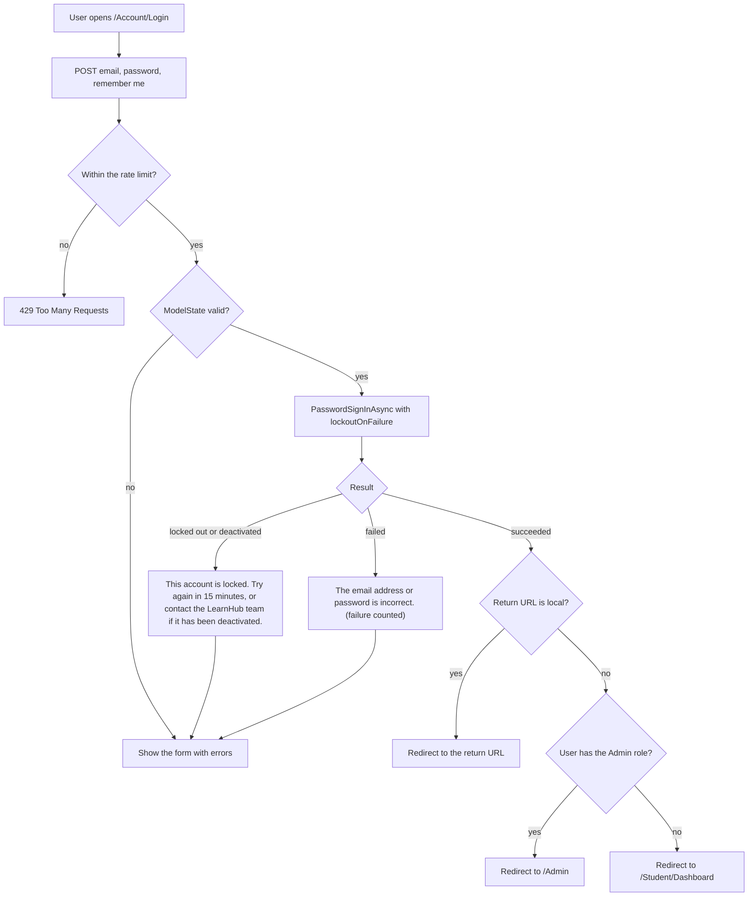

## 5. Enrolling in a course

`Controllers/CoursesController.cs` (Enroll) and `Services/EnrollmentService.cs`.

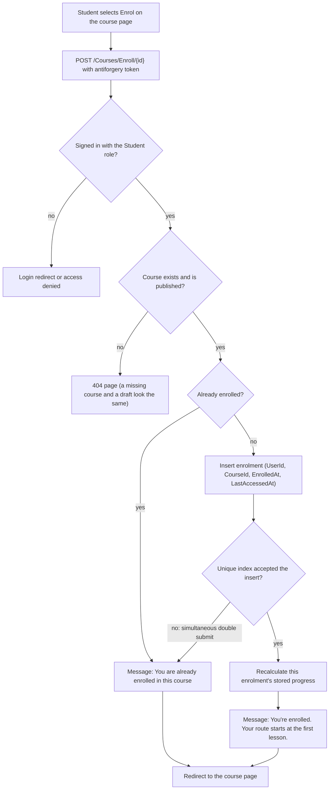

## 6. Opening a lesson or a lesson file

`Controllers/ResourcesController.cs` (Details, Open) and `Services/LearningResourceService.cs`.

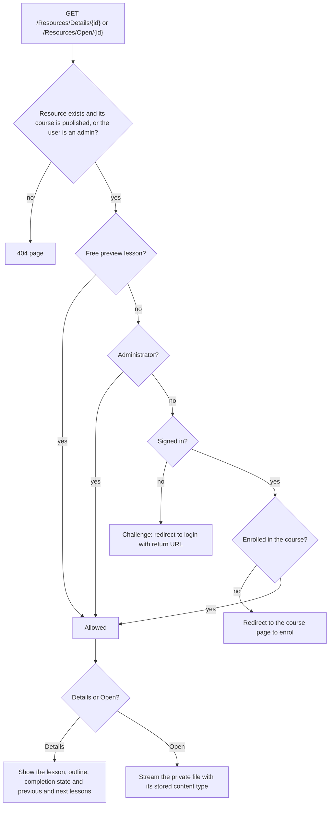

## 7. Marking a lesson complete and calculating progress

`Controllers/ResourcesController.cs` (ToggleComplete), `Services/LearningResourceService.cs` and
`Services/ProgressService.cs`.

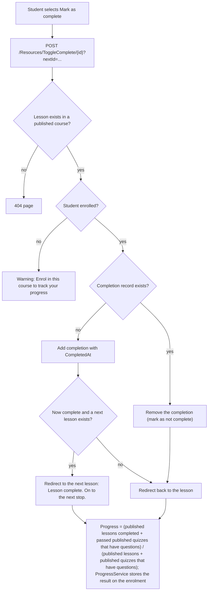

## 8. Taking and grading a quiz

`Controllers/QuizzesController.cs` (Take, Result), `Services/QuizService.cs` and `Services/QuizGrader.cs`.

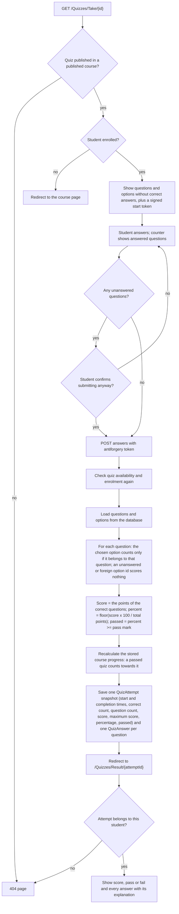

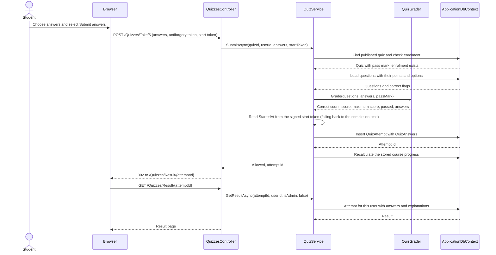

## 9. Admin: creating, editing and deleting a course

`Areas/Admin/Controllers/CoursesController.cs` and `Services/CourseManagementService.cs`.

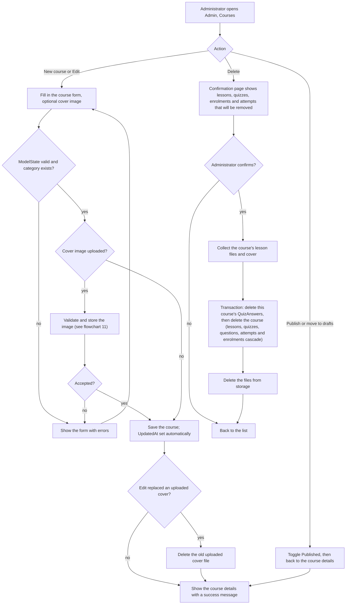

## 10. Admin: saving a question

`Areas/Admin/Controllers/QuestionsController.cs`, `ViewModels/Admin/AdminLearningViewModels.cs` and
`Services/QuestionManagementService.cs`.

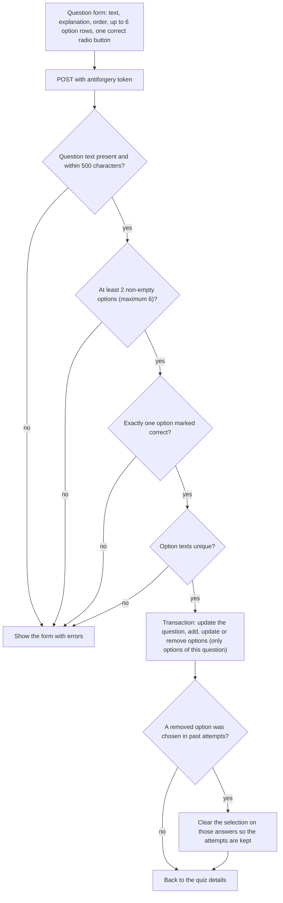

## 11. File upload validation

`Services/Storage/FileStorageService.cs` and `Services/Storage/UploadRules.cs`. For learning resources,
`Services/ResourceManagementService.cs` first checks that the file suits the resource type (a PDF for a PDF resource,
an image for an image resource).

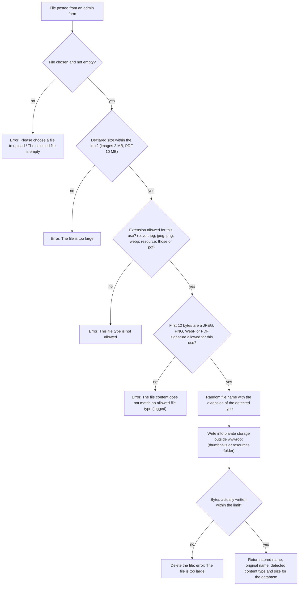
