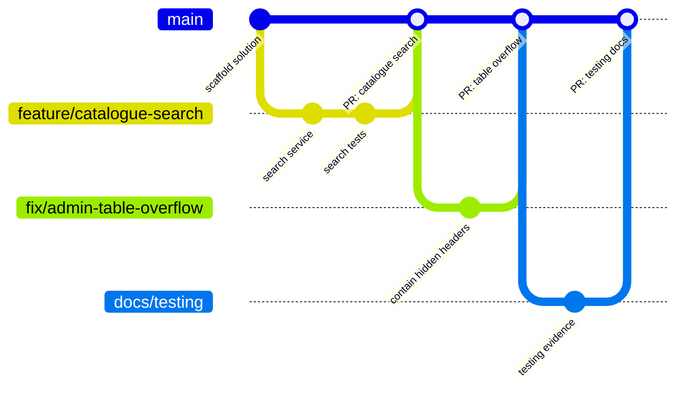

# LearnHub – Git Workflow

## 1. Branches

| Branch | Purpose | Rules |
|--------|---------|-------|
| `main` | Always deployable; Railway builds and redeploys the service from this branch once the project is linked | Changes arrive through pull requests with green CI. Enforce this with a branch protection rule (Settings → Branches → require a pull request and the three CI checks) |
| `feature/<area>-<short-name>` | New functionality, e.g. `feature/quiz-history-filter` | Branch from `main`; keep it small; delete after merge |
| `fix/<short-name>` | Bug fixes, e.g. `fix/admin-table-overflow` | Same as feature branches |
| `docs/<short-name>` | Documentation only, e.g. `docs/viva-questions` | CI skips documentation-only changes |

The current working branch is `feature/railway-firebase-sqlite`, which moves hosting to **Railway** (Docker), storage
to **SQLite** on a persistent volume and the presentation site to **Firebase Hosting**. It is still merged into `main`
through a pull request like any other branch.



## 2. Day-to-day flow

```bash
git switch main && git pull
```

```bash
git switch -c feature/quiz-history-filter
```

Make the change with its tests, then commit and push:

```bash
git add -A && git commit -m "feat(quizzes): filter quiz history by course"
```

```bash
git push -u origin feature/quiz-history-filter
```

Open a pull request into `main`. It can be merged when:

1. All three CI jobs pass: **Build and test** (`build-and-test`); **Railway image, migrations and smoke test**
   (`container`); **Browser tests (mobile, tablet, desktop)** (`e2e`).
2. The change has been reviewed against the requirement it serves (see
   [REQUIREMENT_TRACEABILITY.md](REQUIREMENT_TRACEABILITY.md)); with a single author the CI jobs and that check stand in
   for a second reviewer, which is why they are treated as mandatory rather than advisory.
3. The description explains what changed and why, with screenshots for visible changes.

Use **Squash and merge** for small branches so `main` keeps one meaningful commit per change, then delete the branch.

## 3. Commit messages

The repository uses [Conventional Commits](https://www.conventionalcommits.org/): `type(scope): summary` in the imperative
mood, with a body that explains *why* when it is not obvious.

| Type | Use for |
|------|---------|
| `feat` | New behaviour |
| `fix` | Bug fixes |
| `test` | Tests only |
| `docs` | Documentation only |
| `ci` | Workflows |
| `chore` | Maintenance such as dependencies or migrations |
| `refactor` | Code changes that do not change behaviour |

Real examples from this repository:

- `fix: avoid SQL APPLY on SQLite in admin course details, delete via ExecuteDelete, tidy upload file names`
- `fix(a11y): keyboard access to scrollable regions, link names on small screens`
- `fix(tests): opt into Microsoft Testing Platform for xUnit v3 on .NET 10`

## 4. Pull request checklist

- [ ] The change works for every affected role (guest, student, administrator).
- [ ] Server-side validation and authorisation are in place; forms bind to view models.
- [ ] Tests were added or updated, and all CI jobs are green.
- [ ] New pages are responsive, keyboard accessible and pass the accessibility scan.
- [ ] No secrets, personal data, `.env` files, database files or build output are committed.
- [ ] Database changes add one SQLite migration (see section 5) and the ERD is updated.
- [ ] Documentation is updated (README, route tables, ERD or testing evidence) when behaviour changes.

## 5. Database migrations

LearnHub has one EF Core model, one provider (SQLite) and one migration folder, `src/LearnHub/Data/Migrations`, so
every schema change needs **one** migration. The design-time factory that `dotnet ef` uses is
`src/LearnHub/Data/DesignTimeDbContextFactory.cs`.

**With the .NET SDK installed** (run from the repository root):

```bash
dotnet tool restore
```

```bash
dotnet ef migrations add AddCourseLevel --project src/LearnHub --output-dir Data/Migrations
```

**Without the SDK:** push your model change to your branch, open **Actions → EF Core migration (cloud) → Run
workflow**, choose your branch and enter the name in PascalCase (for example `AddCourseLevel`). The workflow creates
one SQLite migration in `Data/Migrations`, checks that the solution still builds and commits it to your branch.

Rules:

- Never edit a migration that is already on `main`; add a new one instead.
- If two branches add migrations at the same time, do not hand-merge the model snapshots. Remove your branch's
  migrations, merge `main` into your branch and generate them again.
- The `container` job starts the image against a fresh volume and asserts that the migration was applied, so a broken
  migration fails the pull request before anything reaches Railway.

## 6. Keeping secrets out of Git

- In Development, demo passwords are generated into `App_Data/demo-credentials.json`, which is git-ignored; a fixed
  local password can be set instead with `dotnet user-secrets set "Seed:AdminPassword" "<password>" --project src/LearnHub`.
- `appsettings.json` keeps `Seed:AdminPassword` and `Seed:DemoStudentPassword` empty, and its connection string is only
  the path of the SQLite file, so it holds no credential.
- Production takes `Seed__AdminPassword` and `Seed__DemoStudentPassword` from environment variables (Railway service
  variables). `.env.example` documents every variable with placeholders only, while `.env` is git-ignored.
- `.gitignore` excludes build output, `App_Data`, SQLite databases, uploaded files, `.env` files, publish profiles and
  test artefacts.
- The repository holds no deployment secret: Railway builds the image from the repository and Firebase Hosting is
  deployed from the same checkout.
- If a secret is ever committed, treat it as leaked: rotate it immediately, then remove it from the history.

## 7. Releases and deployment

1. A pull request is merged into `main`.
2. `ci.yml` runs the three jobs — `build-and-test`, `container` and `e2e` — on the merge commit.
3. Railway builds the same `Dockerfile` for the pushed commit and redeploys the service once the project is linked to
   the repository; the volume at `/data` keeps the database and the Data Protection keys across the restart (see
   [DEPLOYMENT.md](DEPLOYMENT.md)).
4. The presentation site is republished from the same commit when it changes:
   `firebase deploy --only hosting` from the repository root. It is deployed to Firebase Hosting and live at
   <https://learnhub-wapp.web.app>.
5. For the assignment milestones, tag the release so the submitted version can always be found:

```bash
git tag -a v1.0.0 -m "LearnHub 1.0 – assignment submission" && git push origin v1.0.0
```

To roll back, revert the faulty commit on `main` (`git revert <sha>`) and push; see
[DEPLOYMENT.md](DEPLOYMENT.md#8-rollback).
