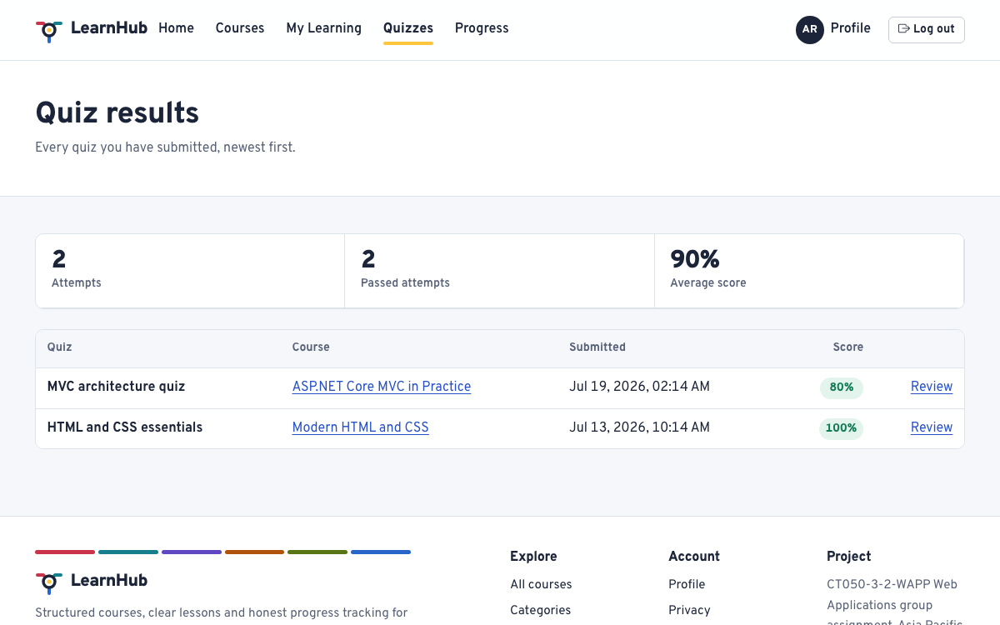
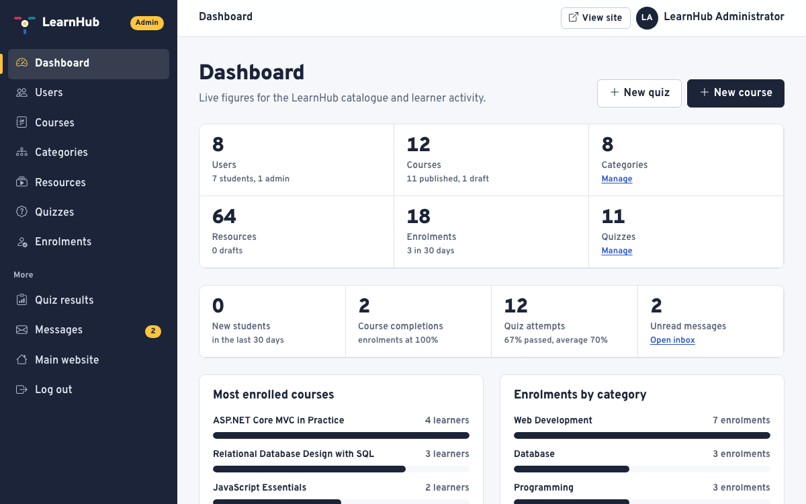
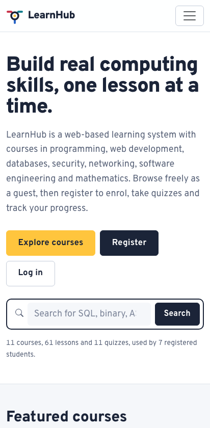

# LearnHub — User Guide

A practical walkthrough of every part of the system, for demonstrating it and for writing the "User Guidance"
section of the report.

Real screenshots of the running application are in [`FirebaseLanding/assets/screens/`](../FirebaseLanding/assets/screens)
and on the project site at <https://learnhub-wapp.web.app>. Where a screenshot is named below, that file shows the
page being described.

> **DEMO ONLY accounts.** The administrator is `admin@learnhub.local` and the demonstration student is
> `demo.student@example.com`. Passwords are never committed: locally they are generated into
> `src/LearnHub/App_Data/demo-credentials.json` on the first run, and in production they come from the
> `Seed__AdminPassword` and `Seed__DemoStudentPassword` environment variables.

There are three kinds of user:

| Role | Can do |
|---|---|
| **Guest** — not signed in | Browse and search the catalogue, read course details and free preview lessons, read the About, Contact and Privacy pages, register and log in. |
| **Student** — signed in | Everything a guest can, plus enrol, work through lessons, mark them complete, take quizzes, see results and progress, and manage their profile. |
| **Administrator** | Everything above, plus the whole administration area: users, courses, categories, resources, quizzes, questions, answers, enrolments, quiz results and the contact inbox. |

---

## 1. Opening the website

Go to the application address. Locally that is `http://localhost:5080`; on Railway it is the service's public
domain.

The home page is the start of everything:

- **Hero** — the title, a short description of the platform, and the main call to action.
- **Search box** — searches course titles, descriptions, categories and lesson titles from any page.
- **Featured courses** — the courses students enrol in most often.
- **Browse by category** — every category with the number of courses in it, drawn as lines into the LearnHub hub.
- **Why learn with LearnHub** — what the platform offers.
- **Register call to action** — for visitors who are not signed in yet.

The navigation bar changes with who you are: a guest sees Home, Courses, Categories, About, Contact, Log in and
Register; a signed-in student also sees My learning, Quizzes, Progress and Profile; an administrator sees a link to
the administration area. Items a user may not use are not shown, and the pages behind them are protected on the
server as well.

---

## 2. Registering

Select **Register** in the navigation bar, or the register button on the home page.

> *Screenshot placeholder — registration page.* Run the application and capture `Account/Register` to complete the
> report; the automated browser tests already exercise this page on three screen sizes.

1. Enter your full name, email address and a password.
2. Confirm the password.
3. Accept the terms, then select **Create account**.

The form validates as you type (client-side) **and** again on the server, which is what actually protects the
database:

| Field | Rule |
|---|---|
| Full name | Required, 2–80 characters |
| Email | Required, must be a valid address, and must not already be registered |
| Password | Required, at least 8 characters with an upper-case letter, a lower-case letter, a digit and a non-alphanumeric character |
| Confirm password | Must match the password exactly |
| Terms | Must be accepted |

Mistakes are shown next to the field that caused them. A duplicate email is reported clearly rather than creating a
second account. New accounts receive the **Student** role; a visitor can never register themselves as an
administrator. Registration is rate-limited, so the form cannot be used to create accounts in bulk.

---

## 3. Logging in

Select **Log in** and enter your email address and password.

> *Screenshot placeholder — login page.* Run the application and capture `Account/Login` to complete the report.

- On success a student lands on their dashboard and an administrator lands on the administration dashboard.
- On failure the page reports invalid credentials without revealing whether the email address exists.
- After several failed attempts the account is locked temporarily, which slows down password guessing.
- **Log out** in the navigation bar ends the session.

If you try to open a page you are not allowed to see while signed out, you are sent to the login page and returned
to the page you asked for afterwards. If you are signed in but lack the role — a student opening an administration
page, for example — you see a friendly "access denied" page instead.

---

## 4. Browsing courses

Select **Courses** in the navigation bar.

Every published course is listed as a card showing its cover, category, difficulty, duration, instructor and short
description. Draft courses are never shown to guests or students.

**Search** — type into the search box and submit. The search runs on the server against course titles, descriptions,
categories and lesson titles. When a match comes from a lesson title, those lessons are listed under the result, so
it is never a mystery why a course appeared. Search terms are escaped before they reach the database.

**Filter and sort** — narrow by category and difficulty, and sort by newest, title, shortest or most popular. The
filters combine with the search term and survive paging. The result count is always visible, and when nothing
matches you get an empty state that explains what to try instead of a blank page.

**Paging** — the catalogue shows nine courses per page with pager links.

---

## 5. Course details and course route

Open any course to see its details: full description, what you will learn, instructor, difficulty, duration and the
complete route of lessons and quizzes in order.

Each lesson shows its type (article, video, PDF, image, exercise, external link) and how long it takes. Lessons
marked **Preview** are free for guests; the rest require enrolment. Selecting a locked lesson invites you to enrol
or log in.

---

## 6. Enrolling

Enrol from the course details page with the **Enrol** button.

- You must be signed in; if you are not, you are sent to log in and returned to the course afterwards.
- Enrolling twice is impossible: the application checks first and the database enforces a unique index on
  `(UserId, CourseId)` as the final guarantee.
- A confirmation message appears and the course joins your learning list.
- **Leave course** removes the enrolment after a confirmation step. Progress and quiz history for that course are
  removed with it.

---

## 7. Working through learning resources

Open **My learning** to see your enrolled courses, then open a lesson from the course route.

Learning resources come in several formats, and each is handled properly:

| Type | How it is presented |
|---|---|
| **Article** | Formatted lesson text with headings, lists, code samples and tables. |
| **Video** | Embedded from a public provider, with a privacy-friendly embed and a fallback link. |
| **PDF** | Served through the application after an access check, with a download link. |
| **Image** | Displayed with alternative text. |
| **Exercise** | A task with a solution that can be revealed once you have attempted it. |
| **External link** | Opens the linked documentation in a new tab, marked as an external site. |

A course outline sits beside the lesson so you always know where you are and what comes next. Select **Mark as
complete** when you finish a lesson; the button then shows the completed state and the course progress bar updates
immediately. Marking the same lesson complete twice is prevented by a unique index.

Uploaded files are **not** served as ordinary static files: they are streamed by the application after checking that
you are enrolled (or that the lesson is a free preview). That is what stops a locked lesson being fetched by
guessing its address.

---

## 8. Taking a quiz

Open **Quizzes** to see the quizzes available for the courses you are enrolled in, or start one from the course
route.

1. Select **Start quiz**. The attempt start time is recorded in a signed token posted with your answers, so it
   cannot be tampered with.
2. Answer each question by choosing one option. A counter shows how many you have answered.
3. Select **Submit answers**. The form is protected against cross-site request forgery, and the server re-checks
   every answer.
4. Your attempt is marked immediately.

The result page shows your score, the pass or fail decision against the quiz pass mark, and a review of every
question: the option you chose, the correct option and an explanation. Your whole result history is on the same
page, so you can see improvement over time.

Scores are stored on the attempt as a snapshot — the points earned, the points available and the percentage — so a
later edit to the quiz never rewrites a result you already received. Passing a quiz counts towards the course
completion percentage.

---

## 9. Checking your progress

Open **Progress** for the full picture, or **My learning** for the per-course list.

The dashboard summarises your learning: courses in progress, lessons completed, quizzes taken and recent activity.
Each course shows a progress bar calculated from the lessons you have marked complete and the quizzes you have
passed, and the progress page breaks that down course by course with the counts behind the percentage.

A course reaches 100% when every published lesson is complete and every published quiz has been passed. Filters on
**My learning** let you switch between all, in-progress and completed courses.

---

## 10. Updating your profile

Open **Profile** to view and change your details:

- Full name, email address and short biography.
- **Change password** asks for your current password and the new one twice, and applies the same strength rules as
  registration.

Your email address must remain unique, and the server re-validates everything it receives.

You **cannot** change your own role. Roles are managed by an administrator, so a student cannot promote themselves.

---

## 11. Administrator: signing in and the dashboard

Log in with an administrator account. The navigation bar shows a link to the administration area, and signing in
takes you straight to the dashboard.

The dashboard reports live figures straight from the database — total users, courses, categories, resources,
enrolments and quizzes — along with the most-enrolled courses, enrolments by category, recent activity and warnings
about content that needs attention (a published course with no lessons, for example). Nothing on it is hard-coded.

Every administration controller carries `[Authorize(Roles = "Admin")]`. Hiding the menu is a convenience; the server
is what actually refuses access, so a student who types an admin address is turned away.

---

## 12. Administrator: managing courses and categories

Open **Courses** in the administration area.

- **Create** a course with its title, short and full description, learning outcomes, instructor, category,
  difficulty, duration, cover image and published state.
- **Edit** any of those values at any time.
- **Publish or unpublish** — a draft is invisible to guests and students but stays in the administration area.
- **Delete** a course after a confirmation page that names what will be removed with it (lessons, quizzes,
  enrolments and attempts).

**Categories** works the same way: create, edit and delete, each with a name, description and an icon chosen from a
validated list. A category that still has courses cannot be deleted — the database restricts it and the page
explains why rather than failing with an error.

Validation is enforced on the server as well as in the browser: required fields, length limits, a duration greater
than zero, a valid category, and an uploaded cover image checked for type, size and a genuine image signature.

---

## 13. Administrator: managing learning resources

Open **Resources** to see every lesson, filterable by course and type.

For each resource you can set the title, summary, type, estimated minutes, order in the course, whether it is a free
preview and whether it is published, and then supply the body appropriate to the type:

- **Article** — the lesson text.
- **Video** — the address of a public video, which is parsed and validated before being embedded.
- **PDF or image** — an uploaded file, validated for extension, content type, size and file signature.
- **External link** — a URL that must be a valid absolute http or https address.
- **Exercise** — the task and an optional solution.

Uploaded files are stored outside `wwwroot` and streamed only to users entitled to see them.

---

## 14. Administrator: managing quizzes, questions and answers

Open **Quizzes** to see the quizzes for each course.

- **Create a quiz** with a title, description, pass mark between 0 and 100, and a published state.
- **Add questions** with the question text, an optional explanation, points and their order.
- **Add answer options** to each question — between two and six, with exactly one marked correct. The form refuses to
  save a question that breaks either rule.
- **Edit or delete** any of them. Deleting a question that students have already answered is handled explicitly:
  the application tells you what will happen to that answer history instead of destroying it silently.

---

## 15. Administrator: users, enrolments, results and messages

**Users** lists every account with its roles. You can:

- View a user's details, enrolments and quiz results.
- Change a user's role between Student and Administrator.
- Deactivate an account so it can no longer sign in, or reactivate it.
- Delete an account, with safeguards: you cannot delete your own account or remove the last administrator, so the
  system can never be left without somebody able to administer it.

**Enrolments** lists who is enrolled in what, with progress, and allows an enrolment to be created or removed on a
student's behalf.

**Quiz results** lists every submitted attempt with its score, pass or fail state and the answers given, and allows
an individual attempt to be removed.

**Messages** is the inbox for the public contact form, with read and unread states.

---

## 16. Quick demonstration route

A short sequence that shows every requirement in a few minutes:

| # | Do this | Shows |
|---|---|---|
| 1 | Open the home page and search for `sql`. | Public landing page, server-side search |
| 2 | Filter the catalogue by category and open a course. | Categories, filtering, course details |
| 3 | Open a free preview lesson as a guest. | Multimedia resources, guest access |
| 4 | Register a new account with a weak password first. | Client and server validation, duplicate prevention |
| 5 | Register properly, then enrol in the course. | Registration, authentication, enrolment |
| 6 | Open a lesson, mark it complete, watch the progress bar move. | Resources, progress tracking |
| 7 | Take a quiz, submit, and read the explained result. | Quiz, grading, results |
| 8 | Open Progress and Profile, change the profile, change the password. | Member area, profile, validation |
| 9 | Try to open `/Admin/Dashboard` as the student. | Authorisation is enforced on the server |
| 10 | Log in as the administrator and open the dashboard. | Role-based access, live statistics |
| 11 | Create a category, a course, a lesson and a quiz question. | Full CRUD, validation, database writes |
| 12 | Edit and delete what you created, and manage a user's role. | Update, delete, user management |

---

## 17. Error pages

The application never shows a stack trace, a connection string or a file path to a visitor:

| Situation | What the user sees |
|---|---|
| A page does not exist | A friendly "not found" page, still returning HTTP 404 so search engines and monitoring are not misled. |
| Signed in without the right role | An "access denied" page explaining that the account lacks permission. |
| A form fails validation | The same page with the values preserved and a clear message beside each problem field. |
| An unexpected server error (production) | A generic error page with a reference; the detail goes to the server log only. |
| The database is unreachable | `/health` reports unhealthy so the platform can react, and users get the error page rather than a hang. |

---

## 18. Accessibility and smaller screens

- Every page is keyboard navigable, with a **skip to content** link and a visible focus outline.
- Form controls have real labels, images carry alternative text, and headings follow a sensible order.
- Text and interface colours meet WCAG 2.2 AA contrast, and animation is disabled for visitors who ask for reduced
  motion.
- The layout is responsive across desktop, tablet and phone. On a narrow screen the navigation collapses into a
  menu and the category map is replaced by a list of category links.

The Playwright browser tests check these journeys at 1440×900, 768×1024 and a phone viewport, and run axe-core
accessibility scans on every page.
